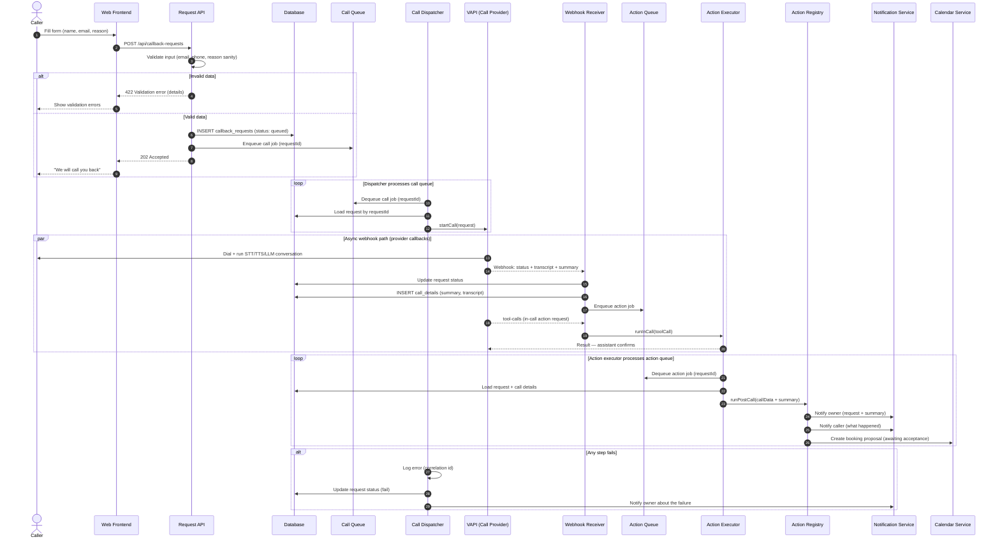
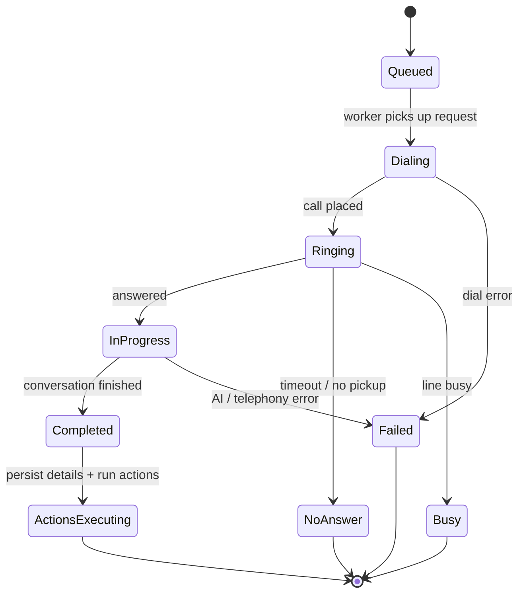

# Callback Assistant

Automated call-back system: a website visitor requests a call-back through a form, the
backend stores and validates the request, then a call worker initiates an AI-driven phone
call, processes the results and executes configurable follow-up actions.

## 1. Architecture Decision

| Area | Choice | Rationale |
|---|---|---|
| Call handling + AI (STT/TTS/LLM) | **VAPI** (managed voice-AI provider) | Fastest time-to-market; one provider covers telephony and the whole AI conversation chain |
| Everything else | **Self-hosted backend** | Data, state and business logic stay under our control |
| Provider coupling | **`CallProvider` interface** | VAPI is wrapped behind an adapter, so it can be swapped (Vocode, Retell, BYO) without touching core logic |

Key principle: external services are **executors**, the backend is the **decision maker**.
All meaningful data (transcripts, summaries, statuses, recordings) is written back into our
own database via webhooks; the provider never becomes the source of truth.

## 2. Components

| Component | Responsibility |
|---|---|
| Web Frontend | Call-back request form (name, email, reason) |
| Request API | Receive + validate the submission (email, phone, reason sanity) |
| Database | `callback_requests`, `call_details`, plus audit tables (`call_events`, `actions`, `notifications`, `bookings`) |
| Call Queue + Action Queue | Two separate queues: call jobs (initiate calls) and action jobs (run actions) |
| Call Dispatcher | Consumes the call queue: loads a request and starts the call via the CallProvider |
| VAPI (Call Provider) | Outbound call + real-time STT/TTS/LLM conversation; emits webhook events, transcript and summary |
| Webhook Receiver | Receives provider events (status, transcript, summary); updates status; saves call details |
| Action Executor | Runs actions — in-call (tool-calls, synchronous) and post-call (via the action queue) |
| Action Registry | Extensible registry of actions (notify, calendar, ...) |
| Notification Service | Email / SMS / push to owner and caller |
| Calendar Service | Booking proposals (e.g., Google Calendar / Microsoft Graph) |
| Admin Dashboard | Owner-facing view of requests, calls, recordings and stats |

## 3. Data Flow – Sequence Diagram



## 4. Call Lifecycle State Machine



## 5. Error Handling Strategy

- Every step is logged with a **correlation id** so a single request can be traced from the
  form through the call to the actions.
- Request status is always driven to a terminal state (`done`, `fail`, `no_answer`, `busy`);
  a failed step never leaves a request hanging in an intermediate state.
- Failures during call handling mark the request as `fail` and notify the owner.
- Partial action failures are logged and retried; each action reports its own result.
- Retries use exponential backoff; permanently failed calls land in a dead-letter review queue.

## 6. Extensible Action Engine

Actions are registered behind a uniform interface so the list can grow without changing the
core flow:

```
interface Action {
    name: string
    execute(context: CallContext): ActionResult
}

CallContext = {
    request: Request          // original call-back request
    callDetails: CallDetails  // outcome, transcript, summary
}
```

Planned actions:

- Notify owner (email / SMS / push)
- Notify caller (what happened, next steps)
- Calendar booking proposal (awaiting acceptance)
- CRM update, ticket creation, follow-up reminders (future)

## 7. Next Steps / Open Items

- The design uses two separate queues (call + post-call); add idempotent call initiation
  and dead-letter review once call volume grows.
- GDPR: recording consent prompt at call start, retention policy, DPA with providers.
- Working-hours and timezone handling (never call outside business hours).
- Observability: structured logging, metrics (success rate, latency, cost/call), alerting.
- Security: rate limiting on the form, input sanitization, secrets management, TLS.
- Admin dashboard for owners.
- Testing: unit tests for validation/actions, integration tests with mocked VAPI.

## 8. Implementation References

- Framework-agnostic implementation specification: [`03-implementation-general.md`](03-implementation-general.md)
- Process diagram: [`02-flowchart.md`](02-flowchart.md)
