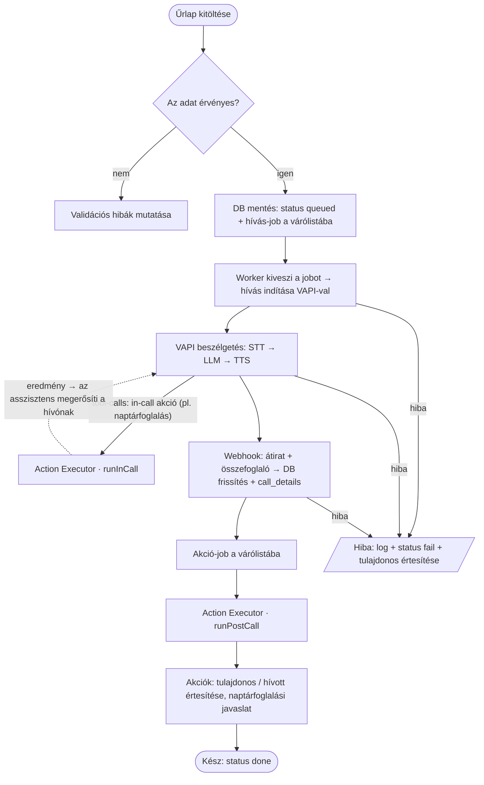

# Callback Assistant – Egyszerűsített folyamatábra

A rendszer egyszerűsített, magas szintű folyamata — a részletes, keretrendszer-független
specifikáció a [`03-implementation-general.md`](03-implementation-general.md) fájlban van.

## Az elemek leírása

| Elem | Mit jelent |
|---|---|
| **Űrlap kitöltése** | A látogató megadja a nevét, email címét és hogy miért keres (visszahívási kérés) |
| **Az adat érvényes?** | Validáció: rossz email, rossz telefonszám, értelmetlen kérés kiszűrése |
| **DB mentés** | Az érvényes kérés mentése `callback_requests` táblába `queued` státusszal, majd hívás-job a várólistába |
| **Worker → hívás indítása** | A várólista feldolgozója kiveszi a jobot, és a VAPI-on keresztül tárcsázza a hívottat |
| **VAPI beszélgetés** | A hívás élőben zajlik: STT (beszéd→szöveg), LLM (válasz), TTS (szöveg→beszéd) |
| **In-call akció (tool-calls)** | Ha a beszélgetés közben akciónak kell történnie (pl. naptárfoglalás), a VAPI `tool-calls` webhookot küld; az **Action Executor · runInCall** azonnal végrehajtja, és az asszisztens megerősíti az eredményt a hívónak |
| **Webhook** | A hívás után a szolgáltató visszaküldi az átiratot és az összefoglalót; a DB frissül, a `call_details` elmentődik |
| **Akció-job** | A lezárt hívás után egy várólistai job, ami az **Action Executor · runPostCall**-t hívja |
| **Akciók (hívás utáni)** | Bővíthető akciók: tulajdonos értesítése, hívott értesítése, naptárfoglalási javaslat (elfogadásra) |
| **Kész** | A kérés `done` állapotba kerül |
| **Hibakezelés** | Bármely lépés hibája esetén: naplózás (korrelációs azonosító), `fail` státusz, tulajdonos értesítése |

## Kiegészítő megjegyzések

- Az **Action Executor** egységesen futtatja az akciókat: *in-call* (a `tool-calls` webhookra, szinkron, az asszisztens azonnal megerősíti a hívónak) és *post-call* (a hívás után, a várólistából).
- A **várólista** valójában két logikai queue: *hívás-jobok* (a worker indítja a hívást) és *akció-jobok* (az akciókat futtatják) — az MVP-hez Postgres-alapú megoldás is elég (Laravel database driver / pg-boss), Redis nélkül.
- Az **akciók** regisztráció alapján bővíthetők anélkül, hogy a fő folyamat változna.
