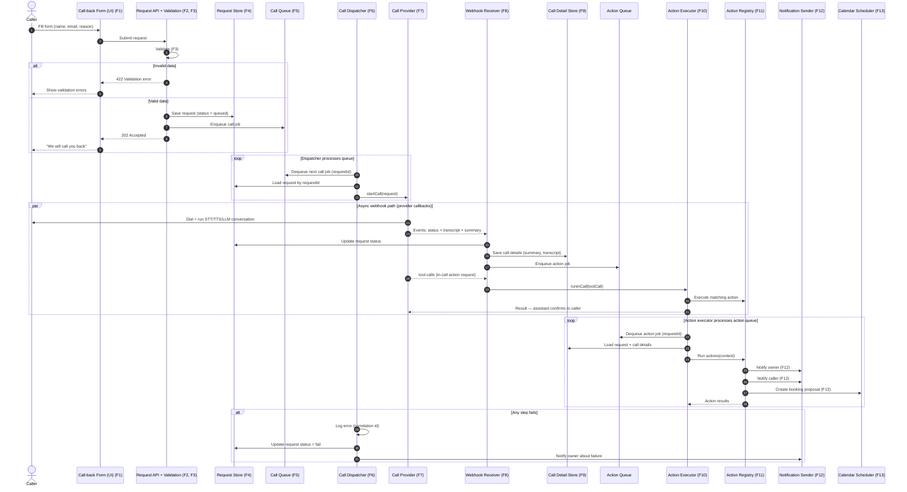

# Callback Assistant – General Implementation (Framework-Agnostic)

This document defines the implementation **by function only** — no specific language,
framework or vendor. The concrete stack decision (incl. B2B / multi-tenant considerations)
is tracked in [`Plans/05-b2b-merge.md`](Plans/05-b2b-merge.md).

## 1. Functional Units

| # | Unit | Responsibility |
|---|---|---|
| F1 | Call-back Form (UI) | Present the call-back form (name, email, reason) and show results / errors |
| F2 | Request API | Receive the form submission |
| F3 | Validation | Reject invalid input (bad email, bad phone, nonsensical reason) |
| F4 | Request Persistence | Store the validated request with status `queued` |
| F5 | Work Queue | Two queues: call jobs (dispatch) and action jobs (executor) |
| F6 | Call Dispatcher | Pick queued requests and start calls through the CallProvider |
| F7 | Call Provider | Execute the phone call (telephony + STT/TTS/LLM) and emit events |
| F8 | Webhook Receiver | Receive provider events (status, transcript, summary, tool-calls); delegate in-call actions to the Action Executor |
| F9 | Call Detail Persistence | Store outcome, summary and events; update request status |
| F10 | Action Executor | Execute actions — in-call (via tool-calls, synchronous) and post-call (after the call, via the queue) |
| F11 | Action Registry | Extensible list of actions, each with a uniform interface |
| F12 | Notification Sender | Deliver messages to owner and caller |
| F13 | Calendar Scheduler | Create booking proposals |
| F14 | Admin UI | Owner view of requests, calls, recordings and stats |
| F15 | Logging / Observability | Correlation ids, metrics, alerts |

## 2. Ports (Contracts)

The core depends only on these interfaces, never on a concrete provider or framework.
All actions — whether triggered during the call (tool-calls) or after it (action queue) —
are executed by a single **Action Executor** against the `Action` interface:

```
interface CallProvider {
    startCall(request: Request): CallId
    // events delivered via webhook: status, transcript, summary, tool-calls
}

interface Action {
    name: string
    execute(context: CallContext): ActionResult
}

interface NotificationPort {
    send(recipient: Recipient, message: Message): void
}

interface CalendarPort {
    createBookingProposal(details: BookingDetails): BookingProposal
}

interface RequestStore {
    save(request: Request): Request
    findByStatus(status: Status): Request[]
    update(id: Id, patch: RequestPatch): Request
}

interface CallDetailStore {
    save(details: CallDetails): CallDetails
}
```

## 3. Data Flow (Generic Sequence Diagram)



## 4. Status Model

Request status follows a fixed state machine (see [`01-callback-assistant.md`](01-callback-assistant.md),
section "Call Lifecycle State Machine"):

`queued → dialing → ringing → in-progress → completed | failed | no_answer | busy`,
then `actions-executing`.

## 5. Error Handling Contract

- Every step logs with a **correlation id**.
- A request always reaches a terminal state (`done`, `fail`, `no_answer`, `busy`).
- Failures mark the request `fail` and notify the owner.
- Actions may fail independently; retry with exponential backoff; permanently failed calls
  go to a dead-letter review queue.
- In-call tool calls must be answered promptly (the provider waits for the response); on
  failure, return an error result so the assistant can recover gracefully.

## 6. Extensibility Rules

- New action = new `Action` implementation registered in the registry; the Action Executor
  runs it for both in-call (tool-calls) and post-call (queue) triggers.
- New call provider = new `CallProvider` adapter; core flow unchanged.
- New notification / calendar channel = new `NotificationPort` / `CalendarPort` adapter.

## 7. In-Call vs Post-Call Actions

| | In-Call (via tool-calls) | Post-Call (via action queue) |
|---|---|---|
| Trigger | `tool-calls` webhook during the conversation | action job after the call ends |
| Timing | Immediate, mid-call | After the call |
| Response | Synchronous; the assistant reads the result to the caller | Asynchronous; the result is stored |
| Retry | Fast path, no queue retry | Queue retry with backoff |
| Examples | Calendar booking + instant confirmation | Notifications, follow-ups |

Both are executed by the same **Action Executor** against the `Action` interface.

## 8. Diagrams

- Process diagram: [`02-flowchart.md`](02-flowchart.md)

