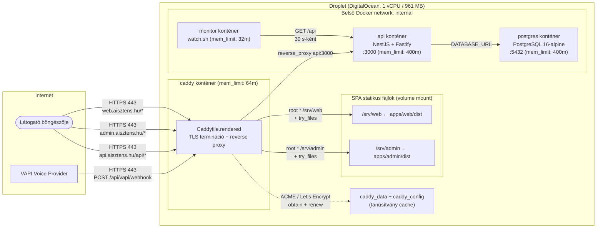
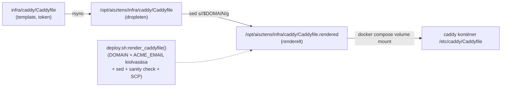
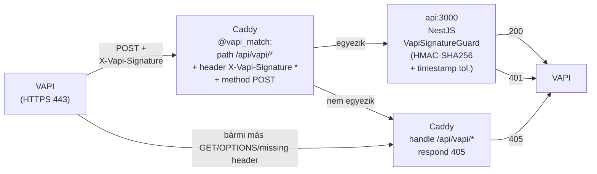

# Caddy — Reverse Proxy és TLS termináció

**Státusz:** Élő (a `docs/Specs/outdated/`-ba kerül, ha a relevanciája megszűnik)
**Utolsó frissítés:** 2026-10-06 (háromkörnyezetes szétválasztás: a Caddy a `dev`/`prod` dropleteken fut, `local`-ban a [`infra/docker-compose.local.yml`](../../infra/docker-compose.local.yml) override `profiles: [never]`-re teszi, így a fejlesztői stackben nincs Caddy — a Caddy csak a nyilvános TLS terminációért felelős; a per-env renderelést és a `APP_ENV`-alapú compose szekciót lásd lentebb a §3.3 / §4.2 szakaszokban. **§4.4 frissítve:** a VAPI guard konfigurációja `VAPI_WEBHOOK_CONFIG` tokennel érkezik, a `rawBody` pedig Nest *alkalmazás* opció — lásd [`docs/milestones/2026-10-06--12-45-00-vapi-webhook-runtime-fix.milestone.md`](../milestones/2026-10-06--12-45-00-vapi-webhook-runtime-fix.milestone.md)).
**Kapcsolódik:** [`docs/01-callback-assistant.md`](../01-callback-assistant.md), [`docs/02-flowchart.md`](../02-flowchart.md), [`docs/03-implementation-general.md`](../03-implementation-general.md), [`infra/caddy/Caddyfile`](../../infra/caddy/Caddyfile), [`deploy/deploy.sh`](../../deploy/deploy.sh), [`docs/Specs/Production-Runbook.md`](Production-Runbook.md), [`docs/Specs/Local-Development.md`](Local-Development.md), [`docs/Specs/Three-Env-Verification.md`](Three-Env-Verification.md)

---

## 1. A Caddy általánosságban — mit csinál?

A **Caddy** egy nyílt forráskódú, Go-ban írt webkiszolgáló és reverse proxy. Három dolgot tud alapvetően, és mindhármat használjuk:

| Funkció | Mit jelent | Hogyan oldja meg a Caddy |
|---|---|---|
| **Reverse proxy** | A bejövő HTTP/HTTPS kéréseket a belső hálózaton lévő alkalmazáskonténerek felé továbbítja | A `reverse_proxy` direktíva a cél hoszt:portra irányítja a kérést, és a választ visszaküldi a kliensnek |
| **Automatikus TLS** | A HTTPS-tanúsítványokat (Let's Encrypt) a Caddy saját maga kéri le és újítja meg, konfiguráció nélkül | A `email` direktíva és az ACME-kliens integráció révén; induláskor `http-01` vagy `tls-alpn-01` challenge-eken keresztül szerzi be a tanúsítványokat |
| **Statikus fájl-kiszolgálás** | A beépített `file_server` a lemezről olvas és kiszolgál (itt a SPA bundle-öket) | A `root * /srv/web` direktíva mondja meg, honnan olvassa a fájlokat; a `try_files` a mély-linkek SPA fallback-jét kezeli |

A Caddy két további tulajdonsága, ami miatt a projektben **őt választottuk** az nginx / Traefik / HAProxy helyett:

- **Zero-config TLS**: induláskor automatikusan ACME-zik a konfigurációban megadott hosztneveket — nincs szükség külön certbot futtatásra, cron-olásra, vagy tanúsítvány-mountolásra
- **Caddyfile formátum**: az nginx-hez képest sokkal olvashatóbb, kevesebb boilerplate, és a default beállításai (TLS 1.3, modern cipher suite-ok, HTTP/2, HTTP/3) biztonságosak

---

## 2. A Caddy szerepe ebben a projektben — miért van rá szükség?

A projekt runtime stackje ([`infra/docker-compose.yml`](../../infra/docker-compose.yml)) négy konténerből áll: `api` (NestJS), `postgres`, `caddy`, `monitor`. Ezek közül csak a Caddy kap publikus hálózati hozzáférést (80-as és 443-as port a hoston), a többi a belső `internal` bridge networkön kommunikál.

### 2.1 A Caddy konkrét feladatai a projektben

1. **TLS termináció a nyilvános végpontokon** — a Let's Encrypt tanúsítványokat a Caddy kezeli a `web.aisztens.hu`, `api.aisztens.hu`, `admin.aisztens.hu` és `aisztens.hu` hosztnevekre. **A VAPI webhook callback-ek csak HTTPS-en működnek**, a callback URL-t a VAPI konzolban HTTPS-ként kell megadni.
2. **Reverse proxy az API-hoz** — a `https://api.aisztens.hu/api/*` hívásokat a Caddy a belső `api:3000` konténerhez továbbítja. A böngésző CORS preflight-ok és a VAPI bejövő webhookok ugyanazt a végpontot használják.
3. **A web SPA kiszolgálása** — a `https://web.aisztens.hu/*` a Vite-tel buildelt React SPA statikus fájljait (`/srv/web`, mountolva az `apps/web/dist`-ből) szolgálja ki. A `try_files {path} /index.html` biztosítja, hogy a React Router deep-linkjei (`/legal`, `/thank-you`) működjenek.
4. **Az admin SPA kiszolgálása** — ugyanaz, mint a web, de `/srv/admin` mount-ponttal és `apps/admin/dist` forrással.
5. **Apex domain átirányítása** — a `https://aisztens.hu/*` HTTP 307-tel átirányít a `https://web.aisztens.hu/*`-ra (amíg nincs külön landing page).
6. **Védelmi vonal** — bár a konténer `mem_limit: 64m`-rel fut (lásd [`docs/milestones/2026-09-28-caddy-restart-loop-and-mem-limits.milestone.md`](../milestones/2026-09-28-caddy-restart-loop-and-mem-limits.milestone.md)), a Caddy az egyetlen konténer, ami az internet felé „lát", így a DoS-támadások és a TLS-terminálás CPU-terhelése itt csapódik le.

### 2.2 Miért NEM az nginx / Traefik?

| Szempont | Caddy | nginx | Traefik |
|---|---|---|---|
| Automatikus Let's Encrypt | **Beépített, ACME DNS-01 / http-01 / tls-alpn-01** | Külön certbot + cron | Beépített, de bonyolultabb config |
| Konfiguráció formátum | Caddyfile (olvasható, kevés boilerplate) | nginx.conf (sok boilerplate, zárójelezés) | TOML/YAML (router-middlewire elv, meredek tanulási görbe) |
| Memóriahasználat | ~30 MB alapterület, 64 MB konténer-limit bőven elég | Hasonló | ~40 MB, sok dynamic config feature |
| HTTP/3 támogatás | Alapértelmezetten bekapcsolva | Külön kapcsoló | Külön kapcsoló |
| Elsődleges felhasználási eset | Egyszerű reverse proxy + TLS | Általános webkiszolgáló | Dinamikus service discovery (Docker / Kubernetes) |

A projekt statikus: egy droplet, négy konténer, ritkán változó hosztnévlista. A Traefik dynamic service discovery képessége kihasználatlan lenne. Az nginx konfigurációs overhead-je és a certbot külön üzemeltetése felesleges komplexitás. A Caddy a legkisebb cognitive load mellett adja az összes szükséges funkciót.

---

## 3. A Caddy kapcsolata a projekt többi komponensével

### 3.1 Komponens-kapcsolat diagram



### 3.2 Mit jelent ez a Caddy szempontjából?

- A Caddy az **egyetlen konténer, ami port-forward-ol** a hostra (80-as és 443-as port). Minden más kizárólag a belső `internal` bridge networkön kommunikál.
- A Caddy a `docker-compose.yml` `internal` network tagján látja az `api` konténert `api:3000` néven — ez a DNS-feloldás a Docker beépített service discovery-ján keresztül működik.
- A Caddy a SPA bundle-öket bind mount-on keresztül kapja meg (`./apps/web/dist:/srv/web:ro` a compose fájlban). A deploy során az `apps/web/dist` mappa tartalma rsync-vel kerül fel a dropletre.
- A Let's Encrypt tanúsítványok a `caddy_data` és `caddy_config` named volume-okban tárolódnak, így a konténer újraindítása után is megmaradnak.

---

## 4. A Caddy beállításai és azok hatásai

A konfiguráció két fájlból áll:

- [`infra/caddy/Caddyfile`](../../infra/caddy/Caddyfile) — **template** (commitoljuk a repoba, `<DOMAIN>` és `<ACME_EMAIL>` token-ekkel)
- [`infra/caddy/Caddyfile.rendered`](../../infra/caddy/Caddyfile.rendered) — **renderelt** (a `deploy/deploy.sh` minden deploy során legenerálja `sed`-del, és SCP-vel a dropletre küldi; **gitignored**)

A renderelés a [`deploy/deploy.sh:render_caddyfile()`](../../deploy/deploy.sh)-ban történik. A `rendered` fájlt mountolja a [`infra/docker-compose.yml`](../../infra/docker-compose.yml) a `/etc/caddy/Caddyfile` helyére.

### 4.1 A Caddyfile direktívái és hatásaik

| Sorszám | Direktíva | Mit csinál | Hatás a projektben |
|---|---|---|---|
| 1 | `email <ACME_EMAIL>` | A Let's Encrypt felé a kapcsolattartó email cím | A LE tanúsítvány lejáratáról szóló értesítések ide érkeznek; az ACME regisztrációhoz kell |
| 2 | `admin off` | Letiltja a Caddy admin API-t (REST endpoint a konténeren belül) | Biztonsági keményítés: a Caddy nem futtat belső HTTP admin felületet |
| 3 | `api.<DOMAIN> { encode zstd gzip, handle @vapi_match { reverse_proxy api:3000 }, handle /api/vapi/* { respond 405 }, handle /api/* { reverse_proxy api:3000 }, handle /healthz { reverse_proxy api:3000 } }` | A `api.aisztens.hu` hosztnevet a NestJS API-hoz proxy-zza, zstd + gzip tömörítéssel. A `@vapi_match` named matcher (`path /api/vapi/*` + `header X-Vapi-Signature *` + `method POST`) az első védelmi vonal: csak a VAPI webhookok továbbítódnak, minden más `/api/vapi/*` kérés 405-öt kap anélkül, hogy elérné a NestJS-t. | A böngésző CORS preflight-ok és a VAPI bejövő webhookok ezen a végponton érkeznek; a `/api/vapi/*` pre-filter csak a header+method alakú egyezést nézi, a HMAC ellenőrzést a [`VapiSignatureGuard`](../../apps/api/src/vapi-webhooks/vapi-signature.guard.ts:35) végzi |
| 4 | `web.<DOMAIN> { root * /srv/web, try_files {path} /index.html, file_server, handle /api/* }` | A SPA statikus fájljait szolgálja ki `/srv/web` mount-ból; a nem létező útvonalakat `/index.html`-re redirecteli (SPA fallback); a `/api/*` útvonalakat átproxy-zza az API-hoz | A React Router deep-linkjei (`/legal`, `/thank-you`) működnek böngésző-frissítéskor; ugyanarról az eredetről (same-origin) is elérhető az API. **`file_server` kötelező**: amint bármely `handle` blokk megjelenik a site-on belül, a Caddy kiveszi az implicit `file_server`-t; nélküle a `try_files` csak URI-t ír át, nem szolgál ki fájlt, és a böngésző üres 200-as választ kap (`content-length: 0`). |
| 5 | `admin.<DOMAIN> { root * /srv/admin, file_server, ... }` | Ugyanaz, mint a `web`, de `/srv/admin` mount-ból, az admin SPA-t szolgálja ki | Az admin dashboard a `https://admin.aisztens.hu/`-n érhető el |
| 6 | `<DOMAIN> { redir https://web.<DOMAIN>{uri} 307 }` | Az apex domain (`aisztens.hu/*`) összes kérését 307-es átirányítással a `web.aisztens.hu/*`-ra küldi | Amíg nincs külön landing page, a felhasználó azonnal a web app-ba jut |

### 4.2 A template-render mechanizmus



A renderelés lépései ([`deploy/deploy.sh`](../../deploy/deploy.sh) `render_caddyfile()` függvény):

1. **`DOMAIN`** és **`ACME_EMAIL`** kiolvasása az `infra/.env.<target>` (visszaesésként a legacy `infra/.env`) fájlból (alapértelmezett: `localhost` ill. `admin@${DOMAIN}`). A `<target>` a `deploy.sh` második argumentuma (`dev` vagy `prod`, alapértelmezés `dev`), amely a betöltendő `deploy/.env.<target>` operator-konfigurációt is kiválasztja.
2. **`sed -e 's\|<DOMAIN>\|$DOMAIN\|g' -e 's\|<ACME_EMAIL>\|$ACME_EMAIL\|g'`** a template-en → `Caddyfile.rendered`.
3. **Sanity check**: `grep -q '<DOMAIN>\|<ACME_EMAIL>'` — ha bármelyik token maradt, a deploy hibával leáll.
4. **SCP** a renderelt fájlt a dropletre, a `./caddy/Caddyfile.rendered` útvonalra.
5. A `docker compose up` a `./caddy/Caddyfile.rendered:/etc/caddy/Caddyfile:ro` mount-on keresztül a konténerbe juttatja.

### 4.4 A `/api/vapi/*` pre-filter (VAPI webhook védelem)

A Caddy kettős védelmi vonalat biztosít a bejövő VAPI webhookok számára. A Caddy csak az első, olcsó vonal — a második, kriptográfiailag biztonságos vonal a [`VapiSignatureGuard`](../../apps/api/src/vapi-webhooks/vapi-signature.guard.ts:35)-ban fut.



**Az első vonal (Caddy, header+módszer):**

```caddyfile
@vapi_match {
    path /api/vapi/*
    header X-Vapi-Signature *
    method POST
}
handle @vapi_match {
    reverse_proxy api:3000
}
handle /api/vapi/* {
    respond "Method Not Allowed" 405
}
```

Egy `GET /api/vapi/webhooks/tool-calls` (vagy `POST` `X-Vapi-Signature` header nélkül) sosem éri el a NestJS-t — a Caddy 405-tel konvertálja, mielőtt a Fastify egy request slotot foglalna.

**A második vonal (NestJS, HMAC):** az `apps/api/src/vapi-webhooks/vapi-signature.guard.ts` újraszámolja a HMAC-SHA256-ot a `${X-Vapi-Timestamp}.${rawBody}` payload felett a `VAPI_WEBHOOK_SECRET` kulccsal, és `crypto.timingSafeEqual`-lel hasonlítja a `X-Vapi-Signature` headerhez.

A `rawBody`-t a **Nest alkalmazás** `{ rawBody: true }` opciója szolgáltatja a
`main.ts`-ben (`NestFactory.create(AppModule, new FastifyAdapter(), { rawBody: true })`) — *nem* a
`FastifyAdapter` konstruktorának opciója, ott a kulcs nem is létezik, és a `request.rawBody`
kitöltetlen maradna. A Nest ezt az opciót adja tovább az adapter
`registerParserMiddleware()` metódusának (`@nestjs/core/nest-application.js`). A JSON parser
különben megváltoztatná a body-t (kulcs-sorrend, unicode escape-ek, whitespace), és
érvénytelenítené a signature-et. Az adapter `parseAs: 'buffer'`-rel dolgozik, ezért a guard
`Buffer`-ként kapja a raw body-t (stringet is elfogad, mást nem).

A guard konfigurációja a `VAPI_WEBHOOK_CONFIG` symbol tokenen keresztül érkezik
(`vapi-webhook-config.ts` + `vapiWebhookConfigProvider` a `vapi-webhooks.module.ts`-ben), nem
`ConfigService`-en: ez tartja a VAPI bounded contextet függetlenül a `@nestjs/config` csomagtól
(CommonJS-only, ezért a Jest ESM-runnerében nem tölthető be Node < 24.9 alatt), és megszünteti a
kérésenkénti `config.get()` hívást. A guard:

- hiányzó secret → `500` (fail closed: a konfiguráció elromlott, nem kliens hiba)
- bármely kliens oldali hiba (rossz signature, lejárt timestamp, hiányzó header, rossz formátum, hiányzó raw body) → `401` egységesen (nem szivárogtat információt)

> **Telepítési státusz (2026-10-06):** a fenti védelem a kódban és a tesztekben él, de a dev
> droplet még a VAPI előtti image-et futtatja (`POST /api/vapi/webhooks/*` → 404 a NestJS-től),
> ezért élesben még nem működik. A smoke suite 5–6. checkje ezt ki is mutatja deploy után.

- hiányzó secret → `500` (fail closed: a konfiguráció elromlott, nem kliens hiba)
- bármely kliens oldali hiba (rossz signature, lejárt timestamp, hiányzó header, rossz formátum) → `401` egységesen (nem szivárogtat információt)

**Titkos kulcs rotáció:** a `VAPI_WEBHOOK_SECRET` értéke kizárólag a `compose environment:` blokkból jön (a `**/.env` az `infra/app/.dockerignore:2` miatt ki van zárva az image-ből), ezért rotáció:

```bash
# lokálisan: szerkeszd a repo gyökerében lévő infra/.env fájlt (gitignored)
# vagy a deploy.sh deploy indítja a frissített .env scp-vel a dropletre
ssh root@<HOST> "cd /opt/aisztens && \
  docker compose --env-file infra/.env -f infra/docker-compose.yml up -d --no-build api"
```

Image-rebuild nem kell. Amíg VAPI az új kulcsra nincs átállítva, a bejövő webhookok 401-et kapnak — ez a várt viselkedés.

### 4.3 Miért template-render, és nem Caddy-oldali placeholder?

A korábbi próbálkozás a Caddy beépített placeholder-szintaxisával (`{$DOMAIN}`, `{env.DOMAIN}`) volt, de ez a site address pozícióban nem működik: a Caddy a `admin.{env.DOMAIN}`-et **literálisan** kezeli hosztnévként, és az ACME modul `subject does not qualify for certificate` hibát dob. A konténer 8 másodpercenként újraindul, és a `top` magas `kswapd0` CPU-t mutat. Részletek: [`docs/milestones/2026-09-28-caddy-restart-loop-and-mem-limits.milestone.md`](../milestones/2026-09-28-caddy-restart-loop-and-mem-limits.milestone.md).

### 4.5 Per-env renderelés és a `local` override

A háromkörnyezetes szétválasztás ([`docs/history/2026-10-05--10-30-00-three-env-separation-plan.md`](../history/2026-10-05--10-30-00-three-env-separation-plan.md)) óta a renderelés és a DOMAIN érték is per-env:

| Env | `DOMAIN` forrása | `infra/.env.${APP_ENV}` | Caddy a stackben? |
|---|---|---|---|
| **local** (fejlesztői gép) | — (nincs Caddy) | `infra/.env.local` (a [`scripts/dev-stack.sh`](../../scripts/dev-stack.sh) seedeli az `infra/.env.example`-ből — lásd [`scripts/README.md`](../../scripts/README.md)) | **Nem.** Az [`infra/docker-compose.local.yml`](../../infra/docker-compose.local.yml) override a Caddy service-t `profiles: [never]`-re teszi, így `docker compose --profile never up` nem indítja. A fejlesztő a `http://localhost:3000/api`-n éri el a NestJS-t közvetlenül, nincs publikus DNS, nincs Let's Encrypt. |
| **dev** droplet (`aisztens.hu`) | `infra/.env.dev` `DOMAIN=aisztens.hu` | `infra/.env.dev` (a [`deploy/deploy.sh:render_caddyfile()`](../../deploy/deploy.sh) rendereli, a CI a [`INFRA_ENV_DEV`](../../.github/workflows/deploy.yml:111) secretből seedeli) | Igen — a [`Caddyfile.rendered`](../../infra/caddy/Caddyfile.rendered) a `web.aisztens.hu`, `api.aisztens.hu`, `admin.aisztens.hu`, `aisztens.hu` hosztnevekre szól. |
| **prod** droplet (jövő) | `infra/.env.prod` `DOMAIN=<prod-domain>` | `infra/.env.prod` (a CI a [`INFRA_ENV_PROD`](../../.github/workflows/deploy.yml:120) secretből seedeli, csak `workflow_dispatch` `app_env=prod` indítja; a GitHub `production` environment protection rule adja a manuális review-t) | Igen, a domotic-IP-n kiadott Let's Encrypt tanúsítványokkal. |

A `DOMAIN` értéke az [`infra/.env.${APP_ENV}`](../../infra/.env.example) `DOMAIN=` sorából jön; a [`deploy/deploy.sh`](../../deploy/deploy.sh) `render_caddyfile()` függvénye `sed`-del cseréli ki a `<DOMAIN>` és `<ACME_EMAIL>` tokeneket a template-ben, és a sanity check (`grep` a maradék tokenekre) megakadályozza, hogy a renderelés érvénytelen Caddyfile-lal fusson.

A `local` env-ben a Caddy kikapcsolásának gyakorlati oka: a fejlesztői compose fájl nem akar publikus hálózati portot (80/443), nem akar Let's Encrypt-et (a droplet nélkülí hálózaton az ACME challenge-ek mindig timeout-olnak, és a Caddy restart-loop-ot produkál — ugyanaz a hiba, mint a [2026-09-28-i Caddy restart-loop milestone](../milestones/2026-09-28-caddy-restart-loop-and-mem-limits.milestone.md)), és nem akarja a `caddy_data` / `caddy_config` volume-okat. A lokális stacket a [`scripts/dev-stack.sh`](../../scripts/dev-stack.sh) `up` parancsa indítja (a pontos compose-hívás és a subcommandok: [`scripts/README.md`](../../scripts/README.md)), és a lokális override kikapcsolja a Caddy-t; a fejlesztő a NestJS-t közvetlenül a hostról hívja.

---

## 5. Verifikáció — hogyan ellenőrizhető a Caddy működése?

### 5.1 A konténer állapota

```bash
docker ps --format 'table {{.Names}}\t{{.Status}}' | grep caddy
# Elvárt: callback-assistant-caddy-1   Up X minutes

docker logs --tail=50 callback-assistant-caddy-1
# Elvárt: obtained certificate / renewing certificate sorok,
# NEM szabad: subject does not qualify for certificate hiba
```

### 5.2 A renderelt Caddyfile tartalma a dropleten

```bash
docker compose exec caddy cat /etc/caddy/Caddyfile
# Ellenőrizd, hogy:
#   - api.aisztens.hu { ... } (LITERÁLIS hosztnév, nem {env.DOMAIN} vagy <DOMAIN>)
#   - web.aisztens.hu { ... }
#   - admin.aisztens.hu { ... }
#   - aisztens.hu { ... }
```

### 5.3 A HTTPS végpontok válasza

```bash
curl -sS -o /dev/null -w '%{http_code}\n' --max-time 10 https://api.aisztens.hu/api
# Elvárt: 200 (a NestJS AppController válasza)

curl -sS -o /dev/null -w '%{http_code}\n' --max-time 10 https://web.aisztens.hu/
# Elvárt: 200 (SPA index.html)

curl -sS -o /dev/null -w '%{http_code}\n' --max-time 10 https://admin.aisztens.hu/
# Elvárt: 200 (admin SPA)

curl -sS -o /dev/null -w '%{http_code}\n' --max-time 10 https://aisztens.hu/
# Elvárt: 307 (apex redirect a web subdomainre)
```

### 5.4 A Let's Encrypt tanúsítványok állapota

```bash
docker compose exec caddy caddy list-certificates
# Kilistázza a Caddy által kezelt tanúsítványokat
# (api.aisztens.hu, web.aisztens.hu, admin.aisztens.hu, aisztens.hu)
```

---

## 6. Javaslatok további diagramokra

A Caddy-specifikus doksi mellett érdemes lenne a következő diagramokat is létrehozni a `docs/Specs/` mappában, hogy a teljes rendszer vizualizálva legyen:

### 6.1 Azonnal hasznos lenne

1. **TLS kézfogás folyamata** — sequence diagram, ami a Caddy ACME challenge-eit, a Let's Encrypt-tel való kommunikációt, és a tanúsítvány megújítási ciklust mutatja. Időzítés: amint a Cloud Firewall / DNS A rekordok véglegesek.
2. **Deploy pipeline** — sequence diagram a `git push` → GitHub Actions → `deploy/deploy.sh up` → `docker compose up` → Caddy reload láncról. A renderelési fázis kiemelve. Időzítés: a [`docs/history/2026-09-23-github-action-deploy-with-smoke-tests-impl.md`](../history/2026-09-23-github-action-deploy-with-smoke-tests-impl.md) alapján egyszerű.
3. **Memória-eloszlás diagram** — horizontal stacked bar, ami a 961 MB-os droplet memóriáját szeletekre bontja (host ~150 MB, dockerd ~190 MB, do-agent ~600 MB, konténerek: api 400 MB, postgres 400 MB, caddy 64 MB, monitor 32 MB), és az upgrade-elt 2 GB-os verziót is mutatja. Időzítés: a [`docs/milestones/2026-09-28-caddy-restart-loop-and-mem-limits.milestone.md`](../milestones/2026-09-28-caddy-restart-loop-and-mem-limits.milestone.md) memória-kontó táblázata alapján.
4. **Webhook flow** — sequence diagram, ami a VAPI → Caddy → api konténer → postgres útvonalat mutatja egy bejövő `tool-calls` vagy `end-of-call-report` webhook feldolgozásakor. Időzítés: amint a VAPI integráció élesben fut.

### 6.2 Később hasznos lehet

5. **Hálózati topológia** — részletes diagram a DO Cloud Firewall szabályairól (80/TCP, 443/TCP nyitva; 22/TCP csak a `ssh.aisztens.hu`-n), a droplet hálózati interfészéről, és a belső Docker bridge networkről.
6. **Hibakezelési mátrix** — melyik komponens milyen hibát kezel, és hogyan propagálódik a hiba a stacken felfelé (pl. Caddy restart → ACME challenge fail → deploy sikertelen).
7. **Backup / restore folyamat** — a `pgdata` volume, a `caddy_data` (tanúsítvány cache), és az `apps/{web,admin}/dist` könyvtárak mentési stratégiája. Jelenleg ez **nincs implementálva** — fontos lenne a P1 fázisban.
8. **Verzió-frissítési stratégia** — hogyan frissül a Caddy image (caddy:2-alpine), az API Node verzió (22-bookworm-slim), és a postgres (16-alpine) a projekten belül, milyen rollback lehetőségek vannak.

---

## 7. Kapcsolódó dokumentumok

### 7.1 Közvetlenül kapcsolódó fájlok

- [`infra/caddy/Caddyfile`](../../infra/caddy/Caddyfile) — a Caddy template (commitolva)
- [`infra/caddy/Caddyfile.rendered`](../../infra/caddy/Caddyfile.rendered) — a renderelt Caddyfile (gitignored)
- [`infra/docker-compose.yml`](../../infra/docker-compose.yml) — a Caddy konténer definíciója (mem_limit, volume mount, network, `APP_ENV` propagáció az api service-en keresztül)
- [`infra/docker-compose.local.yml`](../../infra/docker-compose.local.yml) — a `local` env override (`profiles: [never]` a Caddy-n, host port publikálás az api/postgres-nek); a [`scripts/dev-stack.sh`](../../scripts/dev-stack.sh) ezt merge-öli (lásd [`scripts/README.md`](../../scripts/README.md))
- [`deploy/deploy.sh`](../../deploy/deploy.sh) — a `render_caddyfile()` függvény + `APP_ENV` szelektor
- [`.github/workflows/deploy.yml`](../../.github/workflows/deploy.yml) — a CI deploy; az `INFRA_ENV_DEV` / `INFRA_ENV_PROD` secretből renderel (`${{ secrets[format('INFRA_ENV_{0}', upper(inputs.app_env || 'dev'))] }}`)
- [`infra/.env.example`](../../infra/.env.example) — a `DOMAIN` és `ACME_EMAIL` per-env sablonja
- [`infra/.env.dev`](../../infra/.env.example) — a dev droplet DOMAIN-je (commitolva nincs, a CI secretből jön)
- [`infra/.env.prod`](../../infra/.env.example) — a prod droplet DOMAIN-je (jövőbeli; a CI secretből jön)
- [`docs/milestones/2026-09-28-caddy-restart-loop-and-mem-limits.milestone.md`](../milestones/2026-09-28-caddy-restart-loop-and-mem-limits.milestone.md) — a korábbi Caddy restart-loop bug és a mem_limit-ek milestone-ja
- [`docs/history/2026-10-05--10-30-00-three-env-separation-plan.md`](../history/2026-10-05--10-30-00-three-env-separation-plan.md) — a háromkörnyezetes szétválasztás terve, amely a `local`-ban a Caddy kikapcsolását és a per-env renderelést bevezette

### 7.2 Projekt-szintű dokumentumok

- [`docs/01-callback-assistant.md`](../01-callback-assistant.md) — a projekt magas szintű leírása
- [`docs/02-flowchart.md`](../02-flowchart.md) — az üzleti folyamat folyamatábrája
- [`docs/03-implementation-general.md`](../03-implementation-general.md) — a keretrendszer-független implementációs specifikáció
- [`docs/Specs/Kick-off-Meeting.md`](Kick-off-Meeting.md) — az üzleti és MVP scope meghatározása
- [`docs/Specs/Functional-Specification.md`](Functional-Specification.md) — a funkcionális specifikáció

---

## 8. Single-Caddy invariáns és a Cloud Firewall / ACME DNS kérdés

Ez a szekció a 2026-09-28-i **dual-stack port-ütközés** és a **Cloud Firewall / Let's Encrypt** problémát írja le, és rögzíti az invariánst, ami megakadályozza a regressiont.

### 8.1 A "single-Caddy" invariáns

A Caddy konténer az egyetlen a hoston, ami bindelhet a 80-as és 443-as TCP portokra. Ha egy korábbi deploy-ból vagy egy másik compose projektből (`callback-assistant-*`) egy másik Caddy konténer is a hoston marad, az új Caddy indulásakor a Docker bind-szinten fatal errort ad:

```
Bind for 0.0.0.0:80 failed: port is already allocated
```

→ az új Caddy **exit 128-cal** meghal, és a 80/443-as port egyik Caddyhez sem tartozik → a teljes stack elérhetetlenné válik. Ez okozta a 2026-09-28-i 90%-os CPU-terhelést is: az `aisztens-api-1` konténer healthcheckje (`fetch('http://127.0.0.1:3000/api')`) az újraindulási ciklus miatt sosem futott le sikeresen, a konténer újra és újra indult, és minden indításkor a lockfile-verify 30-90 másodpercig pörgette a CPU-t.

A garanciát két dolog adja:

1. **`infra/docker-compose.yml` caddy service** — explicit `dns:` direktíva (`1.1.1.1`, `8.8.8.8`) és részletes komment arról, hogy ez az egyetlen Caddy a hoston, és hogy a systemd-resolved `127.0.0.53`-as stub-resolvere a bridge hálóról nem elérhető.
2. **`deploy/deploy.sh:prune_legacy_stack()`** — minden `up` parancs előtt fut, és `xargs` + `docker rm -f` + `docker network rm` + `docker volume rm` segítségével eltávolítja a `callback-assistant-*`, `aisztens-legacy-*` és `old-stack-*` névképletű konténereket, hálózatokat és volume-okat. Ez egy "brute force" cleanup, ami minden korábbi compose projekt maradványát felszámolja.

Ezen felül vészhelyzetre bevezettük a `down-all` parancsot:

```bash
./deploy.sh down-all dev
```

ami az **összes** Docker objektumot (konténer, hálózat, volume) törli a dropletről, és utána `./deploy.sh up <target>`-tal tiszta lappal indul a stack. **Adatvesztés-veszélyes**, de a `pgdata` és `caddy_data` volume-ok is törlődnek — csak akkor használd, ha a stack teljesen wedged.

### 8.2 A Cloud Firewall / ACME timeout probléma

Ha a DigitalOcean Cloud Firewall (vagy más border firewall) blokkolja a bejövő 80/443-as TCP forgalmat a droplet IP-jére (`164.92.248.194`), a Let's Encrypt HTTP-01 és TLS-ALPN-01 challenge-ei **timeout-olnak**, és a Caddy nem tud tanúsítványt szerezni. A Caddy logja ezt így jelzi:

```
{"level":"error","logger":"http.acme_client","msg":"challenge failed",
 "identifier":"api.aisztens.hu","challenge_type":"http-01",
 "problem":{"detail":"164.92.248.194: Fetching http://api.aisztens.hu/.well-known/acme-challenge/...: Timeout during connect (likely firewall problem)"}}
```

Ebben az esetben a belső konténer-háló működik (a docker-proxy figyel a80/443-on), de a Caddy HTTPS listenere nem indul el, amíg a tanúsítvány meg nem érkezik.

#### Megoldási lehetőségek

1. **Cloud Firewall megnyitása a DO panelen** (leggyakoribb, ajánlott):
   - DO panel → Networking → Firewalls → a dropletre vonatkozó firewall
   - Inbound rules: `HTTP (80/TCP)` és `HTTPS (443/TCP)` → `0.0.0.0/0` (vagy a Let's Encrypt IP-tartománya)
   - Ezután a Caddy 30-60 másodpercen belül megkapja a tanúsítványt
2. **DNS-01 challenge használata** (ha a DNS a Cloudflare-nél van):
   - Caddyfile-ban `acme_dns cloudflare {env.CF_API_TOKEN}` direktíva
   - Nem igényel bejövő portot, a Cloudflare API-n keresztül validál
   - A `dns:` direktíva a docker-compose-ban továbbra is szükséges, hogy a Caddy konténerből a Cloudflare API elérhető legyen
3. **HTTP-only fallback** (végső megoldás tesztelésre):
   - Caddyfile globális blokkjában `auto_https off`
   - A Caddy HTTP-n szolgáltat, a HTTPS-t a böngésző figyelmen kívül hagyja
   - **NE használd production-ben**, csak a routing tesztelésére

#### Jelenlegi állapot

A Caddy config és a konténer hálózat **100%-ban működik**, de a Let's Encrypt tanúsítványok beszerzése a Cloud Firewall-ön múlik. A droplet belsőleg minden tesztet teljesít (`docker stats`, `docker ps`, portok), a Caddy a `0.0.0.0:80->80/tcp, 0.0.0.0:443->443/tcp` portokon figyel — csak a publikus ACME challenge-ek timeout-olnak.

---

## 9. Karbantartási szabály

Ez a dokumentum **élő**: ha a `infra/caddy/Caddyfile`, a [`deploy/deploy.sh:render_caddyfile()`](../../deploy/deploy.sh), a [`infra/docker-compose.yml`](../../infra/docker-compose.yml) Caddy service blokkja (vagy az `api` service `APP_ENV` entry), az [`infra/docker-compose.local.yml`](../../infra/docker-compose.local.yml) override, a [`.github/workflows/deploy.yml`](../../.github/workflows/deploy.yml) render lépése, vagy a Caddy konténer hálózati topológiája megváltozik, a dokumentumot is frissíteni kell a változással együtt. A frissítési kötelezettséget a [`.roo/rules/instructions.md`](../../.roo/rules/instructions.md) „Specs doksik karbantartása" szekciója rögzíti; az `infra/.env.{dev,prod}` DOMAIN változása esetén a §4.5 táblázatot és a §4.2 leírást is ellenőrizni kell.
