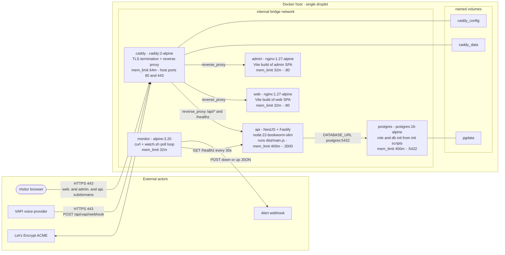

# Infrastructure — Docker containers on the droplet

**Státusz:** Élő
**Utolsó frissítés:** 2026-10-09 (image-based deploy: minden alkalmazás-komponens saját konténerben fut — `api`, `web`, `admin`, `postgres`, `caddy`, `monitor` — a droplet csak `docker compose pull && up -d`-t futtat; a forráskód és a pnpm workspace nem kerül a dropletre)
**Kapcsolódik:** [`infra/docker-compose.yml`](../../infra/docker-compose.yml), [`infra/caddy/Caddyfile`](../../infra/caddy/Caddyfile), [`docs/Specs/Caddy-Reverse-Proxy.md`](Caddy-Reverse-Proxy.md), [`docs/Specs/Production-Runbook.md`](Production-Runbook.md), [`docs/history/2026-10-08-dockerized-stack-and-image-based-deploy-plan.md`](../history/2026-10-08-dockerized-stack-and-image-based-deploy-plan.md)

---

## 1. Áttekintő diagram

## 2. Jelmagyarázat / Legend

| Jel | Jelentés |
|---|---|
| Folyamatos nyíl | Runtime forgalom (HTTP/HTTPS kérés vagy adatbázis-kapcsolat) |
| Szaggatott vonal | Mount / kötet-csatolás a named volume-hoz |
| `depends_on` | Compose indítási sorrend (nem adatforgalom) — lásd a táblázatot lent |

## 3. Mi van az egyes konténerekben?

| Service | Image | Tartalma / mit futtat | Belső port | mem_limit | depends_on |
|---|---|---|---|---|---|
| `caddy` | `caddy:2-alpine` | Renderelt `Caddyfile.rendered`; TLS termináció + reverse proxy + ACME | 80, 443 (host-publikált) | 64m | `api`, `web`, `admin` started |
| `api` | `ghcr.io/…/aisztens-api` | NestJS + Fastify alkalmazás; `node apps/api/dist/main.js`; `NODE_OPTIONS=--max-old-space-size=384` | 3000 | 400m | `postgres` healthy |
| `web` | `ghcr.io/…/aisztens-web` | nginx:1.27-alpine a `@callback/web` Vite build-jét szolgálja ki | 80 | 32m | — |
| `admin` | `ghcr.io/…/aisztens-admin` | nginx:1.27-alpine a `@callback/admin` Vite build-jét szolgálja ki | 80 | 32m | — |
| `postgres` | `postgres:16-alpine` | PostgreSQL; idempotens role/db init a `./postgres/init`-ből; `shared_buffers=128MB` | 5432 | 400m | — |
| `monitor` | `ghcr.io/…/aisztens-monitor` | alpine:3.20 + curl + `watch.sh` polling loop | — | 32m | `api` started |

## 4. Named volume-ok

| Volume | Mount-pont | Cél |
|---|---|---|
| `pgdata` | postgres `/var/lib/postgresql/data` | Adatbázis-adatok perzisztenciája |
| `caddy_data` | caddy `/data` | Let's Encrypt tanúsítványok + ACME állapot |
| `caddy_config` | caddy `/config` | Caddy futásidejű konfiguráció |

## 5. Kommunikáció összefoglaló

- **Csak a `caddy` publikus a hostra** (80/443 port-forward). Minden más konténer kizárólag az `internal` bridge networkön kommunikál, a Docker beépített DNS-én (`api`, `web`, `admin`, `postgres` service-nevekkel).
- **Látogató böngésző** → `web.`/`admin.`/`api.` subdomainek → Caddy TLS-terminál, majd `reverse_proxy` a `web:80` / `admin:80` / `api:3000` konténerekhez.
- **VAPI** → `https://api.<DOMAIN>/api/vapi/webhook` → Caddy pre-filter (`POST` + `X-Vapi-Signature` header) → `api:3000`, ahol a HMAC ellenőrzés fut.
- **api → postgres** a `DATABASE_URL` kapcsolati stringen keresztül (`postgres:5432`); az API a `postgres` healthy státuszára vár.
- **monitor → api** `GET /healthz` 30 másodpercenként; 2 egymást követő hiba után `down`, felépülés után `up` eseményt POST-ol az alert webhookra.
- **Caddy → Let's Encrypt** az ACME challenge-eken keresztül szerzi be és újítja meg a tanúsítványokat (külső DNS: 1.1.1.1 / 8.8.8.8).

> A `ghcr.io/…` képek letöltése **deploy-időben** történik (a `.github/workflows/images.yml` által publikálva), nem futásidejű konténer-kommunikáció, ezért a diagramon nem szerepel.

---

## 6. Hogyan lesz a három appból három külön konténer?

A `api`, `web` és `admin` ugyanabból a monorepóból, ugyanabban a CI jobban épül, de **három külön Dockerfile** van, és mindegyik más package-et választ ki a `pnpm --filter` segítségével:

| App | Dockerfile | Mit buildel / mi kerül a képbe | Runtime a képben |
|---|---|---|---|
| `api` | [`infra/app/Dockerfile`](../../infra/app/Dockerfile) | `@callback/shared` + `@callback/api` → `apps/api/dist` | Node 22, `node apps/api/dist/main.js` |
| `web` | [`infra/web/Dockerfile`](../../infra/web/Dockerfile) | `@callback/shared` + `@callback/web` → `apps/web/dist` | nginx:1.27-alpine |
| `admin` | [`infra/admin/Dockerfile`](../../infra/admin/Dockerfile) | `@callback/shared` + `@callback/admin` → `apps/admin/dist` | nginx:1.27-alpine |

A szétválasztás két ponton történik:

1. **Build időben** — a [`.github/workflows/images.yml`](../../.github/workflows/images.yml) három külön `docker build`-et futtat (az `infra/app/Dockerfile`, `infra/web/Dockerfile` és `infra/admin/Dockerfile` célzásával), és mindegyik külön képnév alá kerül a GHCR-re: `aisztens-api`, `aisztens-web`, `aisztens-admin`. Minden kép csak a saját package-ének `dist/` kimenetét tartalmazza.
2. **Runtime-ban** — az [`infra/docker-compose.yml`](../../infra/docker-compose.yml) három külön service-t definiál, mindegyik a saját képére mutat. A Docker minden service-ből külön konténert indít, saját fájlrendszer-, processz- és hálózati névtérrel. A konténerek nem osztoznak fájlokon; csak az `internal` hálózaton, DNS-neveken keresztül beszélnek egymással, és a Caddy route-ol köztük.

Így a „közös build hely" csak a közös forráskód (monorepo + `packages/shared`); az elkészült artifact-ok külön image-ekbe és külön konténerekbe kerülnek.
