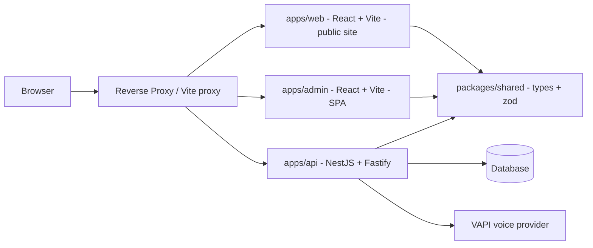

# Plan: pnpm Monorepo — NestJS API + React/Vite Public Site & Admin Dashboard

- Date: 2026-09-02
- Status: Draft for review
- Scope: Repo restructuring into a pnpm-workspace monorepo, plus scaffolding of two React/Vite frontends and their wiring to the existing NestJS/Fastify backend. No business features beyond a working vertical slice.

## 1. Goal

Host the server and both clients in one repository:

- **Server** — the existing NestJS + Fastify app, moved into `apps/api`.
- **Public website** — React + Vite, multi-page with client-side routing (`react-router`).
- **Admin dashboard** — React + Vite SPA.
- **Shared contracts** — TypeScript types + Zod schemas in `packages/shared`.

No Next.js is involved.

## 2. Confirmed Decisions

| Decision | Choice |
|---|---|
| Repo layout | pnpm-workspace monorepo: `apps/api`, `apps/web`, `apps/admin`, `packages/shared` |
| Public site | React + Vite, multi-page routing via `react-router`, NOT a single-page marketing shell |
| Admin dashboard | React + Vite SPA |
| SSR framework | None — no Next.js |
| Shared contract | TypeScript types + Zod schemas in `packages/shared` |
| Package manager | pnpm (single lockfile at root) |
| Language | TypeScript, strict mode everywhere |

## 3. Frontend Framework Advice

Both frontends use **React + Vite** because:

- The backend is already TypeScript/NestJS, so one language and one type system span the whole repo.
- Vite gives fast dev startup, HMR, and simple static builds (`vite build` → plain static files served by any reverse proxy).
- React has the largest ecosystem for form-heavy sites and data-dense admin dashboards.

Routing and rendering model:

- **`apps/web`** is a *real multi-page site*: separate URLs for Home/landing, the call-back form, a thank-you page, and legal pages. Use `react-router` in browser mode so each page has its own URL and can be linked/shared. This is still a client-rendered app (no Next.js), but with genuine page-level routing rather than a single-screen SPA.
- **`apps/admin`** is an SPA with `react-router` and a protected route guard: a login page plus nested routes for requests, calls, recordings, and stats.

### Library choices

| Concern | Public site `apps/web` | Admin `apps/admin` |
|---|---|---|
| Routing | `react-router-dom` | `react-router-dom` (+ route guards) |
| Forms | `react-hook-form` + `zod` + `@hookform/resolvers` | same |
| Server state | plain `fetch` (single POST) | `@tanstack/react-query` |
| Styling | Tailwind CSS | Tailwind CSS + shadcn/ui-style primitives |
| HTTP | `fetch` | `fetch`/`axios` with auth header interceptor |
| Auth | none (public) | access token from API, stored in memory + refresh |

## 4. Repository Structure

```
root/
  package.json                  # private workspace root, shared scripts
  pnpm-workspace.yaml           # apps/*, packages/*
  tsconfig.base.json            # shared TS options
  .prettierrc
  eslint.config.mjs
  apps/
    api/                        # NestJS + Fastify (moved from root)
      package.json
      nest-cli.json
      tsconfig.json
      tsconfig.build.json
      src/
      test/
    web/                        # public website
      package.json
      vite.config.ts
      tsconfig.json
      index.html
      src/
    admin/                      # admin SPA
      package.json
      vite.config.ts
      tsconfig.json
      index.html
      src/
  packages/
    shared/                     # TS types + Zod schemas
      package.json
      tsconfig.json
      src/
```

## 5. How the Frontends Connect to the Backend

### 5.1 Shared contract (`packages/shared`)

- `CallbackRequest` / `CreateCallbackRequestDto` types and the `CallStatus` union mirror the API DTOs.
- Zod schemas (`createCallbackRequestSchema`) are used by the public form for client-side validation and can be reused server-side.
- The API imports the same types so a DTO change is caught at compile time across the monorepo.

### 5.2 API surface

- `app.setGlobalPrefix('api')` so every endpoint is under `/api` (matches the docs' `POST /api/callback-requests`).
- `app.enableCors(...)` — Fastify CORS is powered by `@fastify/cors`, which ships with `@nestjs/platform-fastify` (already installed).
- Global `ValidationPipe` (`whitelist: true`, `transform: true`) and a rate limit on the public form (`@nestjs/throttler`).
- Configuration via `@nestjs/config` (`PORT`, `CORS_ORIGINS`, provider keys, DB).

### 5.3 Development

- Vite dev servers run on `localhost:5173` (`web`) and `localhost:5174` (`admin`).
- Each Vite config proxies `/api` to `http://localhost:3000`, so the browser never hits CORS in dev and the frontends call relative `/api/...` URLs.

### 5.4 Production

- `vite build` emits static assets; a reverse proxy (Caddy/Nginx) serves them and forwards `/api` to the NestJS process on one origin. CORS allowlist is configured for the production origin(s) as a fallback.

## 6. System Overview



## 7. Step-by-step Implementation

1. Add `pnpm-workspace.yaml` and convert the root `package.json` into a private workspace root with orchestration scripts (`dev`, `build`, `lint`, `test`).
2. Move the existing NestJS app into `apps/api` (`src`, `test`, `nest-cli.json`, `tsconfig*.json`, ESLint/Prettier) and update its `package.json` name/scripts.
3. Add `tsconfig.base.json` and per-package tsconfigs; reinstall at root with `pnpm install`; confirm `apps/api` builds, unit tests, and e2e tests still pass.
4. Create `packages/shared` with `CallbackRequest`, `CreateCallbackRequestDto`, `CallStatus`, and the Zod schema.
5. Configure the API: global `/api` prefix, Fastify CORS, `@nestjs/config`, global `ValidationPipe`.
6. Scaffold `apps/web` (Vite + React + TS + `react-router` + Tailwind) with Home, callback form, thank-you, and legal routes.
7. Scaffold `apps/admin` (Vite + React + TS + `react-router` + TanStack Query + Tailwind) with login guard and placeholder list routes.
8. Wire the public form to `POST /api/callback-requests` using `react-hook-form` + shared Zod schema; render success/`422` errors.
9. Wire the admin list to a `GET /api/callback-requests` endpoint via TanStack Query and shared types.
10. Add Vite dev proxies and `VITE_API_BASE_URL` env config for both frontends.
11. Add root `dev` script (concurrently runs api + web + admin), update `README.md`, and verify a full build + a smoke test of the vertical slice.

## 8. Open Items

- Admin authentication mechanism (JWT access/refresh vs. single-owner session) to be finalized.
- Production reverse-proxy and TLS setup.
- Rate limiting and bot protection on the public form.
- i18n (Hungarian copy) and accessibility for the public site.
