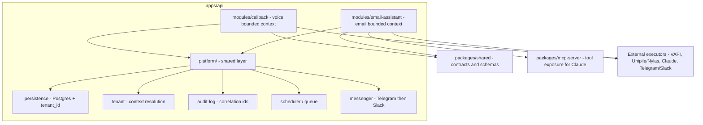
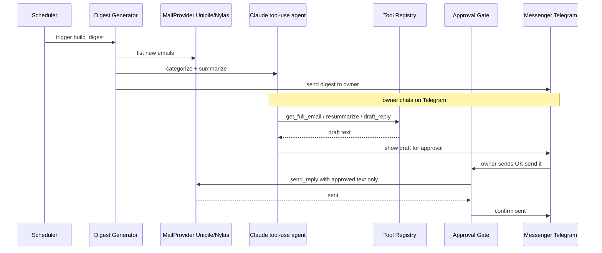

# Plan: Email Assistant MVP Integration into the AIsztens Monorepo

- Date: 2026-09-21
- Status: Approved for implementation
- Scope: Integrate the KKV-AIsztens email-module MVP as a new bounded context inside the existing modular monolith

## 1. Goal

Integrate the email-module MVP described in
`docs/temp/KKV-AIsztens — MVP scope-dokumentum.md` into the current
`aisztens` pnpm monorepo, reusing the platform concerns that the
voice call-back product also needs.

## 2. Context

- The current codebase hosts the **AIsztens** voice product:
  `apps/api` (NestJS 12 + Fastify, ESM, strict), `apps/web`, `apps/admin`,
  `packages/shared`, an empty `packages/mcp-server`, and an `infra/` Docker
  stack (`api`, `postgres`, `caddy`, `monitor`).
- Only a thin vertical slice exists today: `CallbackRequestsModule` with an
  in-memory store. Persistence, queues, webhook receiver, action engine and
  tenant isolation are documented but not yet implemented.
- The email MVP is a **second product** in the AIsztens vision: mailbox
  onboarding via a unified email API (Unipile/Nylas), a scheduled digest sent
  to a messenger (Telegram/Slack), a Claude "tool use" agent with exactly five
  tools, a style profile, an explicit approval gate before sending, structured
  tool-call logging, and tenant isolation from day one.

## 3. Decision: modular monolith

Extend `apps/api` with a shared `platform/` layer plus an `email-assistant`
bounded context. The voice product is moved into a `callback` bounded context.

Rationale:

- The platform layer does not exist yet; building it once and sharing it
  avoids duplicating persistence, tenant, audit-log, scheduling and messenger
  concerns across two deployables.
- One container, one database, one queue and one deploy pipeline match the
  current single-droplet, managed, one-pilot operating model and the
  two-person team.
- A documented escape hatch allows extracting the email context into a
  separate `apps/email` later if scale or team size requires it.

| Dimension | Modular monolith (chosen) | Separate app |
|---|---|---|
| Ops footprint | 1 container, 1 DB, 1 queue | 2 containers, coordinated migrations |
| Shared platform | Trivial, no duplication | Must be extracted first |
| Blast radius | Shared process | Independent |
| Deploy coupling | Redeploy both on any change | Independent deploys |
| Independent scaling | Harder | Easier |
| Module boundaries | Enforced by discipline | Enforced by process |
| Time to first pilot | Fastest | Slower |

## 4. Target structure

## 5. Email MVP data flow

## 6. Work breakdown

1. Adopt platform stack decisions and record a short ADR in `docs/history`:
   ORM (Prisma or Drizzle), scheduler/queue (pg-boss or `@nestjs/schedule`),
   config via `@nestjs/config`.
2. Platform persistence module: wire `DATABASE_URL` in `apps/api`, schema with
   a `tenants` table and `tenant_id` on domain tables, migrations, health check.
3. Platform tenant module: `TenantContext` resolution per request,
   guard/middleware, multi-tenant data-access helper.
4. Platform audit-log module: structured audit log with correlation ids; helper
   used by every tool-call and side-effect.
5. Platform scheduler and queue module: cron jobs for the digest, a queue
   abstraction reusable by future call and action jobs.
6. Platform messenger module: `MessengerPort` interface with a Telegram adapter
   (Slack later), reused for digest delivery and owner notifications.
7. Refactor `callback-requests` into the `modules/callback` bounded context and
   enforce module boundary rules; keep shared contracts in `packages/shared`.
8. Email shared contracts: email, digest, draft, approval and style-profile
   types plus Zod schemas in `packages/shared`.
9. Email `MailProvider` port with a Unipile or Nylas adapter: OAuth mailbox
   onboarding, fetch email, send reply.
10. Email `AgentProvider` using Claude tool-use plus a tool registry with the
    five tools, exposed through `packages/mcp-server`.
11. Email digest generator: scheduled job that fetches new mail, categorizes,
    builds the digest and sends it via the messenger.
12. Email style profile: generated from twenty to fifty historical sent emails
    of the pilot customer.
13. Email approval gate: `send_reply` executes only with explicitly approved
    text; hard block otherwise.
14. Email tool-call logging: integrate the audit-log into all five tools.
15. Infra, env and docs update: add Unipile/Nylas, Telegram/Slack and Claude
    secrets to infra env and docker-compose; update README and write the
    `docs/history` summary.
16. Tests: unit tests for validation, approval gate and tools; e2e for the
    onboarding and digest flows with mocked providers.

## 7. Module boundary rules

- Bounded contexts (`modules/callback`, `modules/email-assistant`) depend only
  on `platform/` ports and `packages/shared`; never on each other's internals.
- Shared contracts live in `packages/shared`; contexts never import each
  other's DTOs, services or entities directly.
- External services are executors only; the backend owns state, side effects
  and the source of truth.
- The email approval gate is mandatory and non-bypassable: no send without an
  explicit, user-approved text.

## 8. Future extraction path

If the email product outgrows the monolith, move the whole
`modules/email-assistant` folder into a new `apps/email`, keeping `platform/`
either as shared packages or as a dedicated platform service. The boundary
rules in section 7 are what make this extraction cheap.

## 9. Out of scope

- Invoice module, calendar microservice, document search, central admin UI and
  self-service operation are explicitly deferred per the scope document.
- Voice product feature completion beyond the platform layer is not part of
  this plan.
