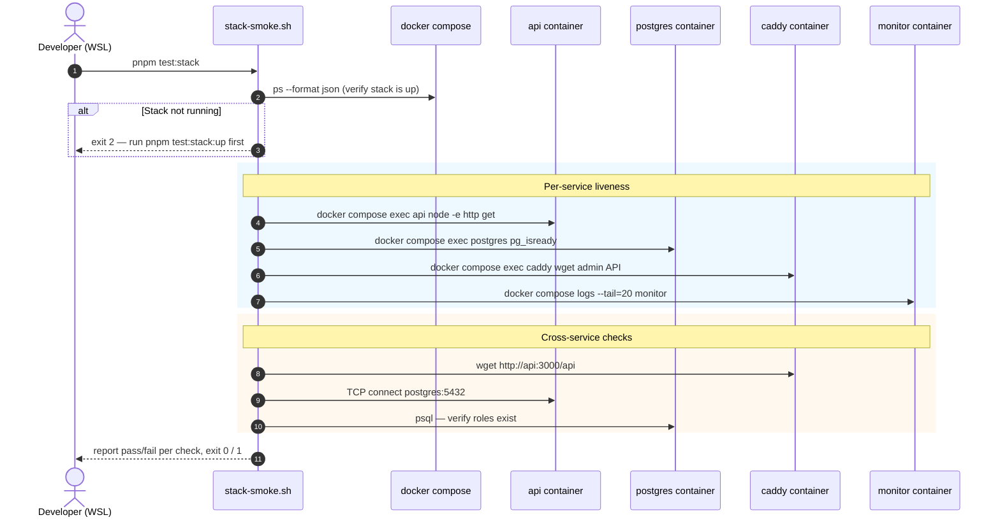

# Stack Smoke Test Plan — Container-Level Integration Tests

**Date:** 2026-09-21
**Status:** Approved for implementation
**Scope:** `infra/docker-compose.yml` runtime stack (`api`, `postgres`, `caddy`, `monitor`)

## 1. Goal

Add a **container-level smoke test suite** that fits into the existing single-droplet
runtime stack defined in [`infra/docker-compose.yml`](infra/docker-compose.yml:15).
The suite must, for every service declared in that compose file:

1. Verify the service **starts and stays up** (process running, healthy).
2. Verify the service **responds on its declared contract** (HTTP endpoint, DB
   readiness, log/metric output, etc.).
3. Verify the services **see each other** through the `internal` Docker network
   (DNS resolution + cross-service calls).

The tests run **locally on the developer machine** (WSL + Docker) before
deployment, so deploy-time regressions are caught early. They are written in
**plain bash + `curl`/`psql`/docker compose** — no extra runtime dependency.

This intentionally does NOT replace the existing NestJS unit/e2e tests
([`apps/api/src/app.controller.spec.ts`](apps/api/src/app.controller.spec.ts:1),
[`apps/api/test/app.e2e-spec.ts`](apps/api/test/app.e2e-spec.ts:1)). Those test
business logic in isolation. This new suite tests the **container graph**.

## 2. What "Fits Into the System" Means

The runtime stack has exactly four services:

| Service | Contract to verify | Source of truth |
|---|---|---|
| `api`      | `GET http://api:3000/api` returns 200 (Fastify/NestJS)         | [`infra/docker-compose.yml:36-43`](infra/docker-compose.yml:36) healthcheck |
| `postgres` | `pg_isready` returns 0 inside the `postgres` container         | [`infra/docker-compose.yml:63`](infra/docker-compose.yml:63) healthcheck |
| `caddy`    | admin endpoint on `:2019` is reachable inside the container    | Caddy's runtime API |
| `monitor`  | `watch.sh` is running and has logged at least one tick          | [`infra/monitor/watch.sh`](infra/monitor/watch.sh:1) |

Cross-service contracts to verify (the "see each other" requirement):

| Direction | Contract | Tool |
|---|---|---|
| `caddy → api`        | `GET http://api:3000/api` from inside `caddy` returns 200 | `docker compose exec caddy wget` |
| `api → postgres`     | TCP connect to `postgres:5432` succeeds from `api`        | `docker compose exec api node -e "net.createConnection(...)"` |
| `monitor → api`      | `watch.sh` already exercises this on every tick           | inspect `monitor` container logs |
| `api → api (loopback)`| `GET http://127.0.0.1:3000/api` from inside `api` returns 200 | matches the existing healthcheck |
| `postgres` init       | The `aisztens`, `tkovari`, `krak` roles exist             | `psql` from inside `postgres` |

## 3. Deliverables

```
scripts/
└── test/
    ├── stack-smoke.sh            # entrypoint, runs all checks, exits non-zero on failure
    └── lib/
        ├── 00-prelude.sh         # shared helpers: logging, assertion, docker compose wrapping
        ├── 10-services.sh        # per-service liveness checks (api, postgres, caddy, monitor)
        ├── 20-cross-service.sh   # network & cross-service checks (see each other)
        └── 99-teardown.sh        # optional stack-down after the run
```

Plus documentation updates:

- [`package.json`](package.json:8) — add three convenience scripts
  (`test:stack`, `test:stack:up`, `test:stack:down`).
- A new top-level section in [`docs/03-implementation-general.md`](docs/03-implementation-general.md:1)
  referencing this plan and the entrypoint.

The existing `infra/docker-compose.yml` and the per-app `package.json` files are
**not modified** — the suite is read-only with respect to the deployed artifacts.

## 4. Design Principles

- **No new toolchains.** Bash, `curl`, `docker compose`, `psql`, and `wget` (already
  present in `caddy:2-alpine` and `postgres:16-alpine` images). The `monitor` image
  already has `curl`.
- **Idempotent.** The script must be safe to re-run. It does **not** stop the
  stack by default — it observes it. A separate `test:stack:down` script (and a
  `--down` flag on the entrypoint) handles teardown so CI can opt in.
- **Exit codes matter.** `0` = all green, `1` = at least one failure, `2` = the
  stack is not up at all. CI can gate on this.
- **Each check is independent and runs sequentially** with a clear pass/fail
  line, so output is human-readable in a terminal.
- **Service contract tests match the existing healthcheck definitions** so the
  suite cannot drift from what compose considers healthy.
- **Cross-service tests use the internal network name** (e.g. `api`, `postgres`),
  not `localhost`, so they prove real inter-container connectivity.

## 5. Execution Model

### 5.1 Sequence diagram



### 5.2 Pre-flight: stack must already be up

The smoke suite **assumes** the stack is running (started via
[`deploy/deploy.sh up`](deploy/deploy.sh:64) or
`docker compose --env-file infra/.env -f infra/docker-compose.yml up -d --build`).
A short preflight step in `00-prelude.sh` runs
`docker compose ... ps --format json` and aborts with a clear message if no
service is `running`. This keeps the script fast and avoids accidentally
spinning up resources the developer did not intend.

A companion helper script (`scripts/test/stack-up.sh`, wired to
`pnpm test:stack:up`) wraps the `up -d --build` invocation for convenience.

### 5.3 Per-service checks (in `10-services.sh`)

| # | Service | Command | Expected | Failure message |
|---|---|---|---|---|
| 1 | `api`      | `docker compose exec -T api node -e "fetch('http://127.0.0.1:3000/api').then(r=>process.exit(r.ok?0:1))"` | exit 0 | "API health endpoint did not return 200" |
| 2 | `postgres` | `docker compose exec -T postgres pg_isready -U ${POSTGRES_USER} -d ${POSTGRES_DB}` | exit 0 | "Postgres is not accepting connections" |
| 3 | `caddy`    | `docker compose exec -T caddy wget -q -O- http://127.0.0.1:2019/config/` | non-empty body | "Caddy admin API is unreachable" |
| 4 | `monitor`  | `docker compose logs --tail=50 monitor \| grep -q "API check"` | match found | "Monitor did not log a check yet (wait ~30s)" |

Each check is wrapped by the `assert_service` helper defined in
`00-prelude.sh`:

```sh
# pseudo-code, real implementation lives in 00-prelude.sh
assert_service <name> <description> <command...>
```

The helper logs `[ OK ] <name>: <description>` or `[FAIL] <name>: <description>`,
increments a pass/fail counter, and on failure prints the captured stderr.

### 5.4 Cross-service checks (in `20-cross-service.sh`)

| # | Check | Command (executed via docker compose exec) | Expected |
|---|---|---|---|
| 1 | DNS: `api` resolves from inside `caddy` | `caddy: getent hosts api` | non-empty output containing `api` |
| 2 | DNS: `postgres` resolves from inside `api` | `api: getent hosts postgres` | non-empty output containing `postgres` |
| 3 | `caddy → api`: proxied request works | `caddy: wget -qO- http://api:3000/api` | HTTP 200 body `Hello World!` |
| 4 | `api → postgres`: TCP connect | `api: node -e "require('net').createConnection({host:'postgres',port:5432},()=>process.exit(0)).on('error',()=>process.exit(1))"` | exit 0 |
| 5 | `postgres` roles | `postgres: psql -tAc "SELECT 1 FROM pg_roles WHERE rolname IN ('aisztens','tkovari','krak')"` | exactly 3 rows |
| 6 | `monitor → api`: logs show a check tick | `docker compose logs --tail=100 monitor \| grep -c "API check"` | `>= 1` |

These checks answer the user's "see each other" requirement concretely:
they run **inside the relevant containers**, addressing each other by service
name, which is the actual contract that the `internal` Docker network must
honour.

### 5.5 Output format

A colored, line-per-check summary at the end:

```
[ OK ] api: GET /api returns 200
[ OK ] postgres: pg_isready succeeds
[ OK ] caddy: admin API responds
[ OK ] monitor: logged at least one tick
[ OK ] caddy -> api: GET http://api:3000/api via internal DNS
[ OK ] api -> postgres: TCP connect to postgres:5432
[ OK ] postgres: roles aisztens, tkovari, krak exist
[ OK ] monitor -> api: tick observed in logs

8/8 checks passed
```

Coloring is automatic only when stdout is a TTY (guarded by `[ -t 1 ]`), so the
script remains CI-friendly.

## 6. File-by-file Plan

### 6.1 `scripts/test/stack-smoke.sh`

- `#!/usr/bin/env bash`, `set -euo pipefail`.
- Resolves repo root, sources each `lib/*.sh` in order.
- Calls preflight, then `10-services.sh`, then `20-cross-service.sh`.
- Prints the summary and exits with the aggregate result code.
- Accepts optional flags:
  - `--up`   — also runs `docker compose up -d --build` before testing.
  - `--down` — runs `docker compose down` after testing (only on success).
  - `--compose-file <path>` — override which compose file to use (defaults to
    `infra/docker-compose.yml`).
  - `--env-file <path>`     — override env file (defaults to `infra/.env`).

### 6.2 `scripts/test/lib/00-prelude.sh`

Defines:

- `REPO_ROOT`, `COMPOSE_FILE`, `ENV_FILE` resolution.
- `dc()` — thin wrapper around `docker compose` with the resolved files.
- `dc_exec()` — wrapper for `docker compose exec -T <svc> ...`.
- `dc_logs()` — wrapper for `docker compose logs`.
- `log_info`, `log_pass`, `log_fail` — stdout/stderr helpers with optional color.
- `assert_service <name> <description> <command...>` — runs the command, captures
  exit status + stderr, updates counters.
- `assert_check <name> <description> <grep_pattern>` — for log-based checks.
- `preflight_stack_up` — runs `dc ps`, returns 2 if nothing is running.
- `summary_and_exit` — prints totals, sets exit code.

### 6.3 `scripts/test/lib/10-services.sh`

Defines `run_service_checks` that runs the four rows from §5.3, in order.

### 6.4 `scripts/test/lib/20-cross-service.sh`

Defines `run_cross_service_checks` that runs the six rows from §5.4, in order.

### 6.5 `scripts/test/lib/99-teardown.sh`

Defines `teardown_stack` — only invoked when `--down` is passed. Confirms
interactive prompt unless `--yes` is also given.

### 6.6 `scripts/test/stack-up.sh`

Thin convenience wrapper: `docker compose --env-file infra/.env -f
infra/docker-compose.yml up -d --build`. Wired to `pnpm test:stack:up`.

### 6.7 `scripts/test/stack-down.sh`

Thin convenience wrapper: `docker compose --env-file infra/.env -f
infra/docker-compose.yml down`. Wired to `pnpm test:stack:down`.

## 7. `package.json` Integration

Add to the root [`package.json`](package.json:8) `scripts` block:

```json
"test:stack": "bash scripts/test/stack-smoke.sh",
"test:stack:up": "bash scripts/test/stack-up.sh",
"test:stack:down": "bash scripts/test/stack-down.sh"
```

`test:stack:up` should be run once before `test:stack`. `test:stack:down` is
optional and only relevant when the developer wants to free ports.

The existing `test` script (which delegates to `apps/api`) is unchanged — this
suite is additive.

## 8. Documentation Updates

- Add a new entry to [`docs/03-implementation-general.md`](docs/03-implementation-general.md:1)
  (section 9 — "Testing") explaining:
  - The two-layer testing model: unit/e2e in `apps/api` vs stack smoke in
    `scripts/test/`.
  - The order to run them locally.
- Append this file to [`docs/03-implementation-general.md`](docs/03-implementation-general.md:1)
  via a reference rather than inlining.

## 9. Out of Scope (Explicit)

The following are intentionally **not** part of this suite and belong to a
separate plan:

- VAPI webhook simulation tests (requires a real or stubbed VAPI server).
- Frontend `apps/web` / `apps/admin` build smoke tests (they are not part of
  the droplet compose stack yet — see [`infra/caddy/Caddyfile:33`](infra/caddy/Caddyfile:33)
  commented blocks).
- Load tests, soak tests, chaos tests.
- CI pipeline wiring (GitHub Actions). The script is CI-friendly by design
  (exit codes, no TTY requirement) but no CI config is added here.

## 10. Definition of Done

- All four services have a passing liveness check.
- All six cross-service checks pass on a freshly built stack.
- Running `pnpm test:stack` on a clean clone (after `pnpm test:stack:up`)
  reports `N/N checks passed` and exits 0.
- Running it against a stack with one service deliberately stopped reports the
  exact failing check and exits 1.
- The existing `apps/api` unit and e2e suites still pass unmodified.
