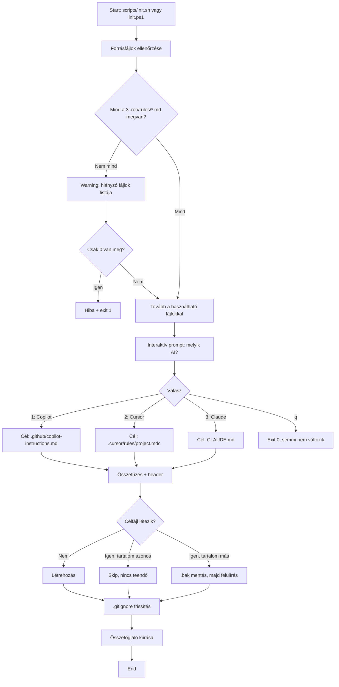

# Terv: `init.ps1` + `init.sh` — AI agent instruction szinkronizáló scriptek

**Státusz:** jóváhagyott terv — implementációra kész
**Dátum:** 2026-09-22
**Szerző:** Zoo (Architect mode)
**Jóváhagyás:** 2026-09-22 — user által elfogadva (lásd 9. szekció döntései)

---

## 1. Cél

Egy interaktív, idempotens szkriptpár (PowerShell + Bash), amelyet a projekt
klónozása után egyszer kell futtatni (vagy bármikor, amikor a `.roo/rules/`
megváltozik). A script:

1. Bekéri, hogy a fejlesztő melyik AI coding agentet használja:
   - **GitHub Copilot**
   - **Cursor**
   - **Claude Code**
2. A kiválasztott agent számára előállítja a saját instruction fájlját a
   `.roo/rules/` forrásfájlokból.
3. A `.gitignore`-ba felveszi a generált fájl(oka)t, hogy a single source of
   truth továbbra is a `.roo/rules/` maradjon.

A scriptek a `scripts/` mappa gyökerébe kerülnek:
- `scripts/init.ps1`
- `scripts/init.sh`

A célfájlok helye (agentenként):

| Agent              | Generált fájl                  | Formátum               |
|--------------------|--------------------------------|------------------------|
| GitHub Copilot     | `.github/copilot-instructions.md` | sima Markdown          |
| Cursor             | `.cursor/rules/project.mdc`    | MDC frontmatter + body |
| Claude Code        | `CLAUDE.md`                    | sima Markdown          |

---

## 2. A `.roo/rules/` forrásfájlok (single source of truth)

A workspace jelenlegi forrásfájljai (a script ezeket olvassa össze):

- `.roo/rules/instructions.md` — fejlesztési folyamat szabályai
- `.roo/rules/general.coding-standards.md` — kódolási normák
- `.roo/rules/project-context.md` — projekt kontextus

A script ezt a 3 fájlt fix listaként kezeli (a megerősített döntés alapján:
"konkrétan ezt a 3 fájlt"). Ha bármelyik hiányzik, a script **nem áll le**,
hanem figyelmeztet, és a hiányzót kihagyja az összefűzésből.

### 2.1 A generált célfájlok szerkezete

A 3 forrásfájlból összefűzött tartalom (ebben a sorrendben, címsorokkal
elválasztva):

```markdown
# AI Agent Instructions — autogenerated from .roo/rules/

<!-- DO NOT EDIT THIS FILE MANUALLY. -->
<!-- Source of truth: .roo/rules/ — edit those files instead. -->
<!-- Regenerate by running: scripts/init.sh / scripts/init.ps1 -->

---

## Source: .roo/rules/instructions.md

<teljes tartalom>

---

## Source: .roo/rules/general.coding-standards.md

<teljes tartalom>

---

## Source: .roo/rules/project-context.md

<teljes tartalom>
```

Cursor esetén ugyanez, de `.mdc` frontmatterben egy `description` mezővel
(Cursor konvenció), pl.:

```markdown
---
description: AIsztens — project + coding rules (autogenerated from .roo/rules/)
globs:
alwaysApply: true
---

# AI Agent Instructions — autogenerated from .roo/rules/
...
```

---

## 3. Symlink vs valódi fájl — döntés

A user kérése: **„ha lehet csak symlinkeket használjon az újonnan létrehozott
könyvtárakban, ne másolja!"** — DE a `.roo/` mappa maradjon a forrás, és a
generált fájlok NE kerüljenek a gitbe.

### 3.1 A probléma

- A `.roo/rules/instructions.md` *egyetlen* fájl, de a cél 3 különböző
  szerkezetű és helyen lévő fájl (Copilot: 1 db `.md`, Cursor: 1 db `.mdc`,
  Claude Code: 1 db `CLAUDE.md`).
- A 3 forrásfájlt **össze kell fűzni**, nem lehet symlinkelve csak egyiküket.
- Symlinket csak akkor érdemes használni, ha a célfájl *tartalma = egyetlen
  forrásfájl* szó szerint — itt viszont egy 3-fájlból összefűzött, headerrel
  ellátott, agent-specifikus kimenet kell.

### 3.2 Döntés

**Valódi fájlokat generálunk (nem symlink),** mert:

1. Az output nem == source (összefűzés + agent-specifikus header/frontmatter).
2. A symlinkek a workspace-en kívüli (külső AI kliens) toolok számára nem
   feltétlenül átlátszóak — ha a Copilot a `.github/copilot-instructions.md`
   symlinkjére néz, lehet, hogy nem követi, vagy warningot dob.
3. A `.gitignore` miatt a generált fájlok amúgy sem kerülnek a gitbe, így a
   „duplikáció" csak lokális, nem okoz git-conflictet.

A script **egy kommentben** a célfájl tetejére odairja, hogy a forrás
`.roo/rules/`, és symlinket CSAK a teljesen triviális 1:1-es esetekben
használna (most nincs ilyen). Ha a későbbiekben bármelyik agent natívan támogat
egy "include másik fájlból" mechanizmust, a terv frissíthető.

> **Kérdés a usernek (lásd lent):** Ha bármelyik fájl 1:1-ben symlinkelhető
> lenne (most nincs ilyen), vagy ha a user ragaszkodik a symlinkekhez bármi
> áron, jelezze — különben a fenti döntéssel megyünk tovább.

---

## 4. .gitignore frissítés

A workspace gyökerén lévő [`.gitignore`](.gitignore:1) kiegészül egy új
szekcióval, amelyet a script kezel:

```
# --- AI agent instruction files (autogenerated by scripts/init.*) ---
# Source of truth: .roo/rules/
.github/copilot-instructions.md
.github/copilot-instructions.md.bak
.cursor/rules/project.mdc
.cursor/rules/project.mdc.bak
CLAUDE.md
CLAUDE.md.bak
```

A script csak akkor ír a `.gitignore`-ba, ha a fájl/útvonal még nem szerepel
benne (duplikáció-mentes). A szekciót egyszer, a script első futásakor
hozzáadja, és onnan idempotens.

A meglévő `.gitignore` tartalma sértetlen marad — a script csak **appendel**
egy komment-szekciót a fájl végére.

---

## 5. .bak mentési stratégia

Megerősített döntés: **egyetlen `.bak` maradjon**, mindig felülíródik, ha már
létezik ilyen.

Algoritmus minden meglévő célfájlra, ha a script új tartalmat írna:

1. Ha a célfájl nem létezik → csak létrehozás.
2. Ha a célfájl létezik ÉS a tartalma == új tartalom → skip, nincs teendő.
3. Ha a célfájl létezik ÉS a tartalma != új tartalom →
   - Ha a `*.bak` még nem létezik → `cp célfájl célfájl.bak`.
   - Ha a `*.bak` már létezik → felülírjuk a régi tartalommal (az utolsó
     „még működő" verziót őrizzük).
   - Ezután felülírjuk a célfájlt az új tartalommal.

---

## 6. Script flow (`init.sh` és `init.ps1` közös logika)

```
1. Bevezető kiírás: "AI agent instruction sync — .roo/rules → agent-fájlok"
2. Megerősítés kiírása a forrásról (3 fájl listája + méretük).
3. Interaktív prompt:
     "Melyik AI coding agentet használod?"
       1) GitHub Copilot
       2) Cursor
       3) Claude Code
       q) Quit
4. A válasz alapján:
     - célfájl útvonal meghatározása
     - cél-tartalom összeállítása (3 forrásfájl összefűzése + header)
     - célfájl kezelése (.bak logika)
5. .gitignore frissítés (komment-szekció hozzáfűzése, ha még nincs benne).
6. Végső összefoglaló:
     "✓ Létrehozva: <fájl>"
     "✓ .gitignore frissítve"
     "⚠ Ne feledd: a forrás a .roo/rules/ — ne szerkeszd a generált fájlt."
```

### 6.1 Hibakezelés

- Ha `.roo/rules/` nem létezik → hibaüzenet + kilépés (1).
- Ha egy forrásfájl hiányzik → warning, kihagyás, de a script megy tovább a
  többi fájllal. Ha mind a 3 hiányzik → hiba + kilépés.
- Ha a cél-útvonal nem írható (pl. permission) → hibaüzenet + kilépés.
- Ha a `.gitignore` nem írható → warning, de a script ne álljon le — a
  generált fájlok azért létrejönnek, és a user kézzel is hozzáadhatja a
  .gitignore-hoz.
- Ha a user a `q` (quit) opciót választja → kilépés 0 státusszal, semmi nem
  változik.

### 6.2 PowerShell-specifikus szempontok (`init.ps1`)

- PowerShell 7+ ajánlott (Linuxon is fut). A script tetején:
  `#!/usr/bin/env pwsh` (opcionális shebang).
- Windows PowerShell 5.1-gyel is működik (a PS 5.1 alapértelmezett a
  Win11-en).
- `Read-Host` az input bekéréshez.
- `[IO.File]::ReadAllText` / `WriteAllText` a fájlműveletekhez
  (keresztplatform).
- A `.gitignore` módosítása `Get-Content` + `Add-Content` kombóval
  (duplikáció-mentes).

### 6.3 Bash-specifikus szempontok (`init.sh`)

- `#!/usr/bin/env bash`, `set -euo pipefail`.
- `read -rp` az input bekéréshez.
- A `.gitignore` módosítása `grep -qxF` ellenőrzéssel + `cat >>`.
- Cross-platform: POSIX-szerű, Linux és macOS alatt is fusson.

---

## 7. Kimeneti fájlok listája — checklist

A script futtatása után az alábbiak jönnek létre/módosulnak:

- `scripts/init.ps1` *(új, marad a gitben)*
- `scripts/init.sh` *(új, marad a gitben)*
- `.github/copilot-instructions.md` *(csak ha Copilot lett választva, gitignore)*
- `.github/copilot-instructions.md.bak` *(opcionális, gitignore)*
- `.cursor/rules/project.mdc` *(csak ha Cursor lett választva, gitignore)*
- `.cursor/rules/project.mdc.bak` *(opcionális, gitignore)*
- `CLAUDE.md` *(csak ha Claude Code lett választva, gitignore)*
- `CLAUDE.md.bak` *(opcionális, gitignore)*
- `.gitignore` *(módosul — új szekció hozzáfűzve)*

A `.roo/rules/*.md` fájlok **soha nem módosulnak**, mindig a single source of
truth.

---

## 8. Mermaid — script flow



---

## 9. Véglegesített döntések (user által jóváhagyva, 2026-09-22)

| # | Kérdés | Döntés |
|---|---|---|
| 1 | Cursor formátum | **Új rendszer**: `.cursor/rules/project.mdc` frontmatterrel (`description`, `globs`, `alwaysApply`) |
| 2 | Claude Code helye | **`CLAUDE.md` a workspace gyökerében** (gitignore-olt, lokális, per-project) |
| 3 | Symlink vs valódi fájl | **Valódi fájl** generálása (3.2 szekció döntése) — nincs symlink, mert az output összefűzés, nem 1:1 |
| 4 | Régi agent-fájlok kezelése | **Maradjanak „holt" fájlokként** — a `.gitignore` miatt nem zavarnak, és a user bármikor visszaválthat |
| 5 | Terv egésze | **Jóváhagyva**, implementáció indulhat (Code mode) |

---

## 10. Implementációs lépések (a jóváhagyás után)

1. `scripts/init.sh` megírása (bash).
2. `scripts/init.ps1` megírása (PowerShell).
3. Helyi tesztelés mindkét scripttel:
   - 1. futás (célfájl nem létezik) → létrehozás + `.gitignore` frissítés.
   - 2. futás (célfájl azonos) → skip.
   - 3. futás (célfájl más) → `.bak` + felülírás.
   - Hiányzó forrásfájl → warning, de megy tovább.
   - Nemlétező `.gitignore` → warning, de a célfájl létrejön.
4. A 3. teszt eredményét beírni ebbe a history-fájlba (lásd 11. lépés).
5. History note a `docs/history/2026-09-22-ai-rules-init-scripts-execution.md`
   alá (az `.roo/rules/instructions.md` szabálya szerint).

---

## 11. History note kötelezettség

Az [`.roo/rules/instructions.md`](.roo/rules/instructions.md) szerint a
implementáció után összegzést kell írni a `docs/history/<ISO-datetime>-<short>.md`
fájlba. A terv itt emlékezik erre, a kódolás után a Code mode-ban lesz
elvégzve.