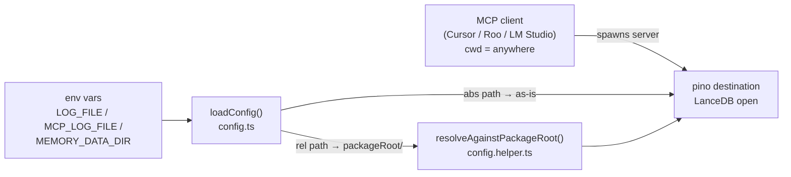

# Plan: anchor MCP server file outputs to its package directory

## Goal

The MCP server (`E:\projects\AI\2026-08-28-MCPs\`) currently writes its
runtime files — `logs/mcp-messages.log`, `logs/app.log`, the LanceDB
`data/` directory — to paths that are relative to `process.cwd()` of the
launching client. Whenever Cursor / Roo / LM Studio starts the server from
a different working directory (the user's `2026-08-31-ai-sztens-dev`
project root, `packages/mcp-server/`, `scripts/packages/mcp-server/`, …)
the files land in that directory instead of the MCP repo.

See [`2026-09-23-deletion-candidates-audit.md`](2026-09-23-deletion-candidates-audit.md:1)
for the empirical evidence: `logs/mcp-messages.log` in the Callback
Assistant repo, `packages/mcp-server/logs/app.log` + `packages/mcp-server/data/`,
`scripts/packages/mcp-server/logs/app.log` + `scripts/packages/mcp-server/data/`.

**Outcome we want:** the MCP server always writes its runtime files into
`<mcp-repo>/packages/mcp-server/<logs|data>/…`, regardless of which
directory the client launched it from. Operators can still override the
location with absolute env-var paths when they want to.

## Design decision (already confirmed with user)

- **Anchor** relative paths to the **MCP server package directory**
  (`<mcp-repo>/packages/mcp-server`), resolved at runtime with
  `path.resolve(__dirname, '..', '..')` from `dist/config/`.
- Absolute paths (any value that already starts with a drive letter on
  Windows or `/` on POSIX) are passed through unchanged — operator
  override stays available.
- `examples/lmstudio.mcp.json` is updated so the documented example
  matches the new behaviour (uses absolute paths).

## Files in scope (MCP repo)

```
E:\projects\AI\2026-08-28-MCPs\
├─ packages/mcp-server/
│  ├─ src/config/
│  │  ├─ config.ts                ← main change
│  │  ├─ config.helper.ts         ← small helper added
│  │  ├─ config.const.ts          ← constant defaults stay as-is
│  │  └─ config.interface.ts      ← interface unchanged
│  ├─ tests/
│  │  ├─ config/config.test.ts    ← new tests for resolution
│  │  └─ mocks/config.mock.ts     ← mock factory updated
│  └─ dist/                       ← recompiled, no source changes
└─ examples/
   └─ lmstudio.mcp.json           ← switch to absolute paths
```

The Callback Assistant workspace (`2026-08-31-ai-sztens-dev`) needs no code
changes. After the MCP server fix lands, the deletions from
[`2026-09-23-deletion-candidates-audit.md`](2026-09-23-deletion-candidates-audit.md:1)
can be applied once to clean up the historical leftovers, and the
artifacts will never reappear.

## Architectural overview



The new helper sits between `loadConfig` and the file consumers
(`RequestLogger`, `Logger`, `LanceDbMemoryStore`). It is the only place
where path resolution happens, so the change is testable in isolation and
does not ripple into `request-logger.ts`, `logger.ts`, or the memory store.

## Step-by-step implementation plan

Each step is a single, well-defined task that another mode (Code) can
pick up independently. Steps are ordered to keep `pnpm vitest` green at
every commit.

### Step 1 — Add `resolveAgainstPackageRoot` helper

**File:** `packages/mcp-server/src/config/config.helper.ts`

- Add a pure function:

  ```ts
  import { dirname, isAbsolute, resolve } from 'node:path';
  import { fileURLToPath } from 'node:url';

  const PACKAGE_ROOT = resolve(
    dirname(fileURLToPath(import.meta.url)),
    '..', '..',          // dist/config -> dist -> packages/mcp-server
  );

  /**
   * Resolves a path against the MCP server package directory when the
   * value is relative. Absolute paths are returned unchanged so operators
   * can still point the logs/memory elsewhere when they want to.
   */
  export function resolveAgainstPackageRoot(value: string): string {
    return isAbsolute(value) ? value : resolve(PACKAGE_ROOT, value);
  }
  ```

- Note on the offset: `dist/config/config.js` (after build) sits two
  directories below `packages/mcp-server/`. When the test runner runs the
  TypeScript sources directly via vitest, the offset is the same
  (`src/config/config.ts` → `src` → `packages/mcp-server`). vitest
  preserves `import.meta.url`, so this works in both modes.

### Step 2 — Apply the resolver in `loadConfig`

**File:** `packages/mcp-server/src/config/config.ts`

- Import `resolveAgainstPackageRoot` from `./config.helper.js`.
- Wrap three fields:

  ```ts
  logFile: resolveAgainstPackageRoot(
    readStringEnv(env, LOG_FILE_ENV, DEFAULT_LOG_FILE),
  ),
  vectorMemory: {
    …
    dataDir: resolveAgainstPackageRoot(
      readStringEnv(env, MEMORY_DATA_DIR_ENV, DEFAULT_MEMORY_DATA_DIR),
    ),
    …
  },
  mcpLog: {
    …
    filePath: resolveAgainstPackageRoot(
      readStringEnv(env, MCP_LOG_FILE_ENV, DEFAULT_MCP_LOG_FILE),
    ),
    …
  },
  ```

- The existing `vectorMemory.dataDir: resolve(...)` call on line 107 must
  be replaced (not double-wrapped). The single `resolve` is currently
  using `process.cwd()` as the base; the new helper uses the package
  root, which is what we want.

### Step 3 — Update the mock factory

**File:** `packages/mcp-server/tests/mocks/config.mock.ts`

- The factory probably builds an `IAppConfig` literal with hard-coded
  `dataDir`, `filePath`, etc. After Step 2 those fields are expected to
  be already-resolved absolute paths. The mock must be updated so its
  values match the resolver output for the test env, e.g.:

  ```ts
  dataDir: resolveAgainstPackageRoot('data'),
  filePath: resolveAgainstPackageRoot('logs/mcp-messages.log'),
  logFile: resolveAgainstPackageRoot('logs/app.log'),
  ```

- Add `import { resolveAgainstPackageRoot } from '../../src/config/config.helper.js';`
  and use it the same way the production code does.

### Step 4 — Add focused unit tests

**File:** `packages/mcp-server/tests/config/config.test.ts` (new file if
not present, otherwise extend)

Cover these cases:

1. **Absolute path passes through.** Set `MCP_LOG_FILE=E:/tmp/foo.log`,
   assert `config.mcpLog.filePath === 'E:/tmp/foo.log'` (POSIX equivalent
   for the Linux test job).
2. **Relative path is anchored.** With `MCP_LOG_FILE=relative/x.log` and
   no other env interference, assert the result equals
   `path.resolve(<package-root>, 'relative/x.log')`.
3. **Default value is anchored.** With no env vars, assert the result is
   `<package-root>/logs/mcp-messages.log` (and the same shape for
   `logFile`, `vectorMemory.dataDir`).
4. **Operator override still works.** Mixing `LOG_FILE` with absolute,
   `MEMORY_DATA_DIR` with relative, etc., each resolves independently
   according to its own anchor rule.
5. **Empty-string env var falls back to default.** Already covered by
   `readStringEnv` behaviour, but assert it again here to lock in the
   resolution chain.

Use `vi.mock('node:url', ...)` if the test harness ever changes the
module URL, otherwise `import.meta.url` works out of the box.

### Step 5 — Add an integration-style test that proves cwd independence

**File:** `packages/mcp-server/tests/config/cwd-independence.test.ts` (new)

Spawn the MCP server entry point (`src/index.ts` compiled to
`dist/index.js`) with:

- `process.cwd()` deliberately set to a temp dir different from the
  package root (use `process.chdir(os.tmpdir())` inside the test, then
  restore).
- `LOG_FILE`, `MCP_LOG_FILE`, `MEMORY_DATA_DIR` set to relative paths.

After startup, assert:

- The package-root `logs/` directory contains the new entries.
- The temp dir does **not** contain any `logs/` or `data/` folder.
- `cleanup()` removes the files it created so the test is hermetic.

This is the regression test that proves the original bug is gone.

### Step 6 — Recompile and run the full test suite

```bash
cd E:\projects\AI\2026-08-28-MCPs
pnpm --filter @mcp/server build
pnpm --filter @mcp/server test
```

Both must pass before the next step.

### Step 7 — Update `examples/lmstudio.mcp.json`

**File:** `examples/lmstudio.mcp.json`

Replace the relative paths with absolute ones pointing inside the user's
working copy of the MCP repo, so the example matches the new defaults
even without env overrides:

```jsonc
"LOG_FILE": "E:/projects/AI/2026-08-28-MCPs/packages/mcp-server/logs/app.log",
"MCP_LOG_FILE": "E:/projects/AI/2026-08-28-MCPs/packages/mcp-server/logs/mcp-messages.log",
"MEMORY_DATA_DIR": "E:/projects/AI/2026-08-28-MCPs/packages/mcp-server/data",
```

Keep all other fields untouched. This file is documentation-by-example;
on any other developer's machine they will copy it and edit the absolute
paths to match their own checkout.

### Step 8 — Update MCP-repo docs

**File:** `docs/2026-09-03-1619 - command-execution-tool-group.md` (if it
mentions cwd resolution — check).

**File:** add a new short note `docs/2026-09-23-anchored-runtime-paths.md`
explaining:

- The behaviour change (relative paths anchored to package root).
- How operators can still redirect logs/data to any absolute path via env
  vars.
- The migration step for downstream callers: they can drop the now
  redundant absolute paths from their client config, or leave them in
  place (both work).

### Step 9 — Run deletion cleanup in the consumer project

Back in `E:\projects\AI\2026-08-31-ai-sztens-dev`, run the PowerShell
block from
[`2026-09-23-deletion-candidates-audit.md`](2026-09-23-deletion-candidates-audit.md:102)
("Recommended cleanup commands"). The artifacts will not return after the
MCP server fix.

### Step 10 — Communicate the change

Append a one-line entry to the MCP repo `CHANGELOG.md` (create the file
if absent):

```
## 2026-09-23
- Anchor relative paths for LOG_FILE, MCP_LOG_FILE and MEMORY_DATA_DIR
  to the MCP server package directory. Absolute paths still work as
  operator overrides. See docs/2026-09-23-anchored-runtime-paths.md.
```

## Risk assessment

| Risk | Mitigation |
|------|------------|
| Breaking change for operators who relied on cwd-relative behaviour | Documented in Step 8; absolute-path override keeps the old behaviour available. |
| `import.meta.url` not pointing where we expect during tests | Step 4 test #2 asserts the result with `path.resolve(packageRoot, …)`; if vitest ever changes the URL semantics, the test will fail loudly and Step 4 can be revisited. |
| `LanceDbMemoryStore` opens the data dir at construction time, before any logging | Already true; moving the resolve earlier (in `loadConfig`) keeps the contract intact. |
| Concurrent MCP server instances sharing the same `logs/` dir | Out of scope — the same risk exists today; PID-suffixed filenames can be a follow-up. |
| Windows path separator (`\` vs `/`) in tests | Use `path.resolve` everywhere, never string concatenation; the helper already does this. |

## Acceptance criteria

The plan is considered complete when all of these hold:

1. `pnpm --filter @mcp/server test` passes on Windows + Linux CI.
2. Step 5's `cwd-independence.test.ts` fails on `main` and passes on the
   branch (regression guarantee).
3. `examples/lmstudio.mcp.json` opens in a JSON validator without errors
   and contains absolute paths.
4. After launching the MCP server with `cwd` set to the Callback Assistant
   project root, **no** `logs/`, `data/`, or `$null` file appears there.
5. The deletion-cleanup block from
   [`2026-09-23-deletion-candidates-audit.md`](2026-09-23-deletion-candidates-audit.md:102)
   runs to completion and `git status` is clean afterwards.
