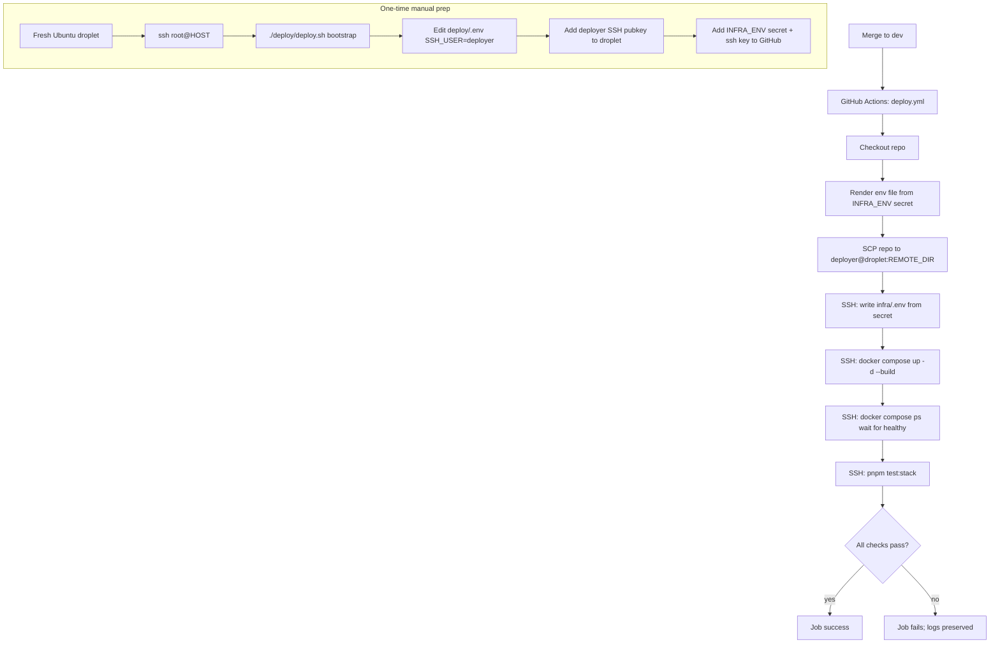

# Plan: GitHub Action deploy + post-deploy smoke tests

- Date: 2026-09-23
- Status: Draft
- Scope: Take the existing droplet setup ([`deploy/bootstrap.sh`](../../deploy/bootstrap.sh), [`deploy/deploy.sh`](../../deploy/deploy.sh), [`infra/`](../../infra) stack, [`scripts/test/stack-smoke.sh`](../../scripts/test/stack-smoke.sh)) and wire a GitHub Actions workflow that deploys to a DigitalOcean droplet on merge to `dev` and runs the container-level smoke tests against the live deployment. This plan also documents the one-time droplet initialization steps required before the first CI run.

## 1. Background

The repo already has everything needed for a reproducible droplet and for
verifying that the running stack is healthy:

| Existing piece | Where | Used for |
|---|---|---|
| One-time droplet bootstrap | [`deploy/bootstrap.sh`](../../deploy/bootstrap.sh) | Docker, users, SSH keys, UFW (optional) |
| Local-to-droplet deploy helper | [`deploy/deploy.sh`](../../deploy/deploy.sh) | `rsync` the repo, `docker compose up -d --build` |
| Runtime stack | [`infra/docker-compose.yml`](../../infra/docker-compose.yml) | api, postgres, caddy, monitor |
| Container-level smoke suite | [`scripts/test/stack-smoke.sh`](../../scripts/test/stack-smoke.sh) | 4 liveness + 6 cross-service checks, exit-coded for CI |
| Smoke helpers | [`scripts/test/lib/`](../../scripts/test/lib) | shared `dc`, `dc_exec`, `dc_logs`, `assert_*` |
| Convenience scripts | [`scripts/test/stack-up.sh`](../../scripts/test/stack-up.sh), [`stack-down.sh`](../../scripts/test/stack-down.sh) | `pnpm test:stack:up` / `:down` |
| CodeQL workflow (template) | [`.github/workflows/codeql.yml`](../../.github/workflows/codeql.yml) | reference only — kept untouched |

What is missing is the wiring that lets GitHub do the same thing
automatically, plus the documentation that tells a human how to take a
fresh droplet to a state where the Action can connect to it.

## 2. Goals

1. A new droplet can be initialized using only the scripts already in `deploy/` and a one-time manual `ssh root@…` run.
2. After initialization, every merge into the `dev` branch:
   - uploads the latest repo to the droplet over SSH as the `deployer` user,
   - writes `infra/.env` from a single GitHub Actions secret,
   - runs `docker compose up -d --build`,
   - SSHes back in and runs `pnpm test:stack` against the live stack,
   - fails the workflow if any smoke check returns non-zero.
3. PR-time checks (lint, unit tests) run on a separate workflow so the deploy workflow stays focused on droplet delivery.

## 3. Architecture overview



The deploy job reuses the same files the human uses (`deploy/deploy.sh`,
`infra/docker-compose.yml`, `scripts/test/stack-smoke.sh`) — the Action is
just a thin orchestrator, not a parallel pipeline.

## 4. Task 1 — Droplet initialization (one-time, manual)

The repository already provides [`deploy/bootstrap.sh`](../../deploy/bootstrap.sh:1)
and [`deploy/deploy.sh`](../../deploy/deploy.sh:1) for this. The goal of
Task 1 is to run them end-to-end on the fresh DigitalOcean droplet so a
human can later switch to `SSH_USER=deployer`.

### 4.1 Prerequisites on the operator's local machine

1. `ssh` and `rsync` available (Git Bash, WSL, or any Unix shell).
2. The repository checked out locally.
3. Real SSH public keys placed in [`deploy/ssh-keys/`](../../deploy/ssh-keys):
   - `tkovari.pub`, `krak.pub`, `deployer.pub`, `aisztens.pub`
   - Real keys are already gitignored; only placeholders are committed.
4. [`deploy/.env`](../../deploy/.env) filled in (copy from
   [`deploy/.env.example`](../../deploy/.env.example:1)):
   - `HOST=<droplet-public-ipv4>` (e.g. `164.92.248.194`)
   - `SSH_USER=root` (only for this first run)
5. [`infra/.env`](../../infra/.env) filled in (copy from
   [`infra/.env.example`](../../infra/.env.example:1)):
   - `DOMAIN`, `ACME_EMAIL`
   - DB passwords: `POSTGRES_PASSWORD`, `AISZTENS_DB_PASSWORD`,
     `TKOVARI_DB_PASSWORD`, `KRAK_DB_PASSWORD`
   - `VAPI_WEBHOOK_SECRET`, `CORS_ORIGINS`, `MONITOR_ALERT_WEBHOOK_URL`
6. DNS `A` records pointing at the droplet for `DOMAIN` and `api.DOMAIN`
   so Caddy can obtain Let's Encrypt certificates on first `up`.

### 4.2 First connection and bootstrap

```bash
# 1. SSH in as root to verify the droplet is reachable
ssh root@<droplet-ip>

# 2. From the local machine: upload + bootstrap (installs Docker,
#    creates tkovari/krak/deployer/aisztens users, installs SSH keys).
./deploy/deploy.sh bootstrap
```

What this does ([`deploy/bootstrap.sh`](../../deploy/bootstrap.sh:104)):

- Sets the timezone to `Europe/Budapest`.
- Installs Docker Engine + the Compose plugin if missing.
- Creates `tkovari`, `krak`, `deployer` (sudo, docker group) and `aisztens` (docker group).
- Installs each user's `authorized_keys` from `deploy/ssh-keys/<user>.pub`.
- Leaves UFW off by default (DigitalOcean cloud firewall recommended).

### 4.3 Switch the deploy helper to the `deployer` user

After bootstrap completes, the runbook ([`deploy/README.md`](../../deploy/README.md:46))
says to switch `SSH_USER=deployer`. The follow-up verification proves the
key-based login works without `root`:

1. Edit [`deploy/.env`](../../deploy/.env): set `SSH_USER=deployer`.
2. From the local machine:
   ```bash
   ssh deployer@<droplet-ip> 'docker --version && docker compose version'
   ```
3. If it fails, the most common cause is the public key in
   `deploy/ssh-keys/deployer.pub` not matching the private key the
   operator holds. The Action will use the same private key (Task 2),
   so fixing it here fixes both.

### 4.4 First stack bring-up (still manual)

```bash
./deploy/deploy.sh up
./deploy/deploy.sh ps
curl https://api.<DOMAIN>/api   # expect: Hello World!
```

This produces the working `/opt/aisztens` tree and a healthy stack that
the GitHub Action will later replace code into.

## 5. Task 2 — GitHub Actions deploy workflow

### 5.1 Repository secrets (one-time setup in GitHub UI)

Add the following to **Settings → Secrets and variables → Actions**:

| Secret | Value | Purpose |
|---|---|---|
| `DROPLET_HOST` | Droplet public IPv4 (e.g. `164.92.248.194`) | SSH target |
| `DROPLET_SSH_KEY` | Private key corresponding to `deploy/ssh-keys/deployer.pub` | SSH auth |
| `INFRA_ENV` | Full contents of [`infra/.env`](../../infra/.env) (multi-line) | Written to `/opt/aisztens/infra/.env` on every deploy |

Notes:

- `DROPLET_SSH_KEY` must be the *deployer* key, not `root`. The bootstrap
  step in §4 already installed the matching `authorized_keys`.
- `INFRA_ENV` is the runtime config. It contains DB passwords and the
  VAPI webhook secret; treat it like a production credential.
- Optional: `DROPLET_PORT` (default `22`) and `REMOTE_DIR` (default
  `/opt/aisztens`) can be repository **variables** if anyone ever needs
  to override them.

### 5.2 New workflow: `.github/workflows/deploy.yml`

Skeleton (the actual file will be created during implementation):

```yaml
name: Deploy to droplet

on:
  push:
    branches: [dev]
  workflow_dispatch:        # manual re-run / rollback lever

concurrency:
  group: deploy-droplet
  cancel-in-progress: false  # never kill an in-flight deploy

jobs:
  deploy:
    name: Deploy + smoke-test
    runs-on: ubuntu-latest
    timeout-minutes: 30
    environment: production   # optional: lets you add manual approval later
    steps:
      - name: Checkout
        uses: actions/checkout@v4

      - name: Render infra/.env from secret
        run: |
          mkdir -p infra
          echo "$INFRA_ENV" > infra/.env
        env:
          INFRA_ENV: ${{ secrets.INFRA_ENV }}

      - name: Copy repo to droplet
        uses: appleboy/scp-action@v0.1.7
        with:
          host: ${{ secrets.DROPLET_HOST }}
          username: deployer
          key: ${{ secrets.DROPLET_SSH_KEY }}
          source: "."
          target: /opt/aisztens
          rm: true               # mirror, like deploy.sh rsync --delete
          strip_components: 0
          exclude: |
            .git
            node_modules
            dist
            coverage
            infra/.env          # written separately, in the next step

      - name: Write infra/.env on droplet
        uses: appleboy/scp-action@v0.1.7
        with:
          host: ${{ secrets.DROPLET_HOST }}
          username: deployer
          key: ${{ secrets.DROPLET_SSH_KEY }}
          source: "infra/.env"
          target: /opt/aisztens/infra/.env

      - name: Build and start the stack
        uses: appleboy/ssh-action@v1.0.3
        with:
          host: ${{ secrets.DROPLET_HOST }}
          username: deployer
          key: ${{ secrets.DROPLET_SSH_KEY }}
          command: |
            set -euo pipefail
            cd /opt/aisztens
            docker compose --env-file infra/.env -f infra/docker-compose.yml up -d --build
            # Wait for the api container to report healthy (compose retry=5 + start_period=30s).
            for i in $(seq 1 30); do
              state=$(docker inspect -f '{{.State.Health.Status}}' "$(docker compose --env-file infra/.env -f infra/docker-compose.yml ps -q api)" 2>/dev/null || echo unknown)
              if [ "$state" = "healthy" ]; then
                echo "api is healthy after ${i} probes"
                break
              fi
              sleep 5
            done

      - name: Run stack smoke tests against live deployment
        uses: appleboy/ssh-action@v1.0.3
        with:
          host: ${{ secrets.DROPLET_HOST }}
          username: deployer
          key: ${{ secrets.DROPLET_SSH_KEY }}
          command: |
            set -euo pipefail
            cd /opt/aisztens
            bash scripts/test/stack-smoke.sh
          # stack-smoke.sh returns 0 on pass, 1 on failure, 2 if stack not up.
          # Any non-zero exit fails this step, which fails the workflow.

      - name: Save smoke-test logs on failure
        if: failure()
        uses: appleboy/ssh-action@v1.0.3
        with:
          host: ${{ secrets.DROPLET_HOST }}
          username: deployer
          key: ${{ secrets.DROPLET_SSH_KEY }}
          command: |
            cd /opt/aisztens
            docker compose --env-file infra/.env -f infra/docker-compose.yml logs --no-color --tail=500 > /tmp/smoke-failure.log 2>&1 || true
            echo "----- /tmp/smoke-failure.log -----"
            cat /tmp/smoke-failure.log
```

Key design decisions:

- **`appleboy/scp-action` + `ssh-action`** are the standard pattern for
  GitHub Actions → SSH deploys, used because they handle the SSH key
  materialization cleanly and don't require a self-hosted runner.
- **Reuses [`scripts/test/stack-smoke.sh`](../../scripts/test/stack-smoke.sh:1) verbatim** —
  no parallel CI test suite is created. The smoke script is already
  CI-friendly (TTY-aware coloring, exit-coded).
- **`concurrency: deploy-droplet`** with `cancel-in-progress: false`
  prevents two deploys from racing for the droplet.
- **Environment `production`** is optional today but lets a maintainer
  add manual approval or restricted secrets later without changing the
  workflow file.
- **Health-gate before smoke**: the build/start step waits for the `api`
  container to become `healthy` so the smoke script's preflight
  (`preflight_stack_up` in
  [`scripts/test/lib/00-prelude.sh`](../../scripts/test/lib/00-prelude.sh:214))
  never aborts with code 2.

### 5.3 Optional companion: `.github/workflows/ci.yml`

A separate PR-time workflow so `dev` merges don't have to wait on lint:

```yaml
name: CI
on:
  pull_request:
    branches: [main, dev]
  push:
    branches: [dev]

jobs:
  build-test:
    runs-on: ubuntu-latest
    steps:
      - uses: actions/checkout@v4
      - uses: pnpm/action-setup@v4
      - uses: actions/setup-node@v4
        with: { node-version: 22, cache: pnpm }
      - run: pnpm install --frozen-lockfile
      - run: pnpm -r build
      - run: pnpm -r lint
      - run: pnpm --filter @callback/api test
```

`deploy.yml` does not run on pull requests — it only fires on the merge.

## 6. Task 3 — Make the workflow run the smoke tests

Task 3 is the **Run stack smoke tests against live deployment** step
above plus the matching wiring inside the existing smoke harness:

### 6.1 What runs

On every merge to `dev`:

1. The new code is uploaded, the stack is rebuilt and started.
2. The workflow SSHes in as `deployer`, `cd /opt/aisztens`, and runs:
   ```bash
   bash scripts/test/stack-smoke.sh
   ```
   This is the same command documented in
   [`scripts/test/README.md`](../../scripts/test/README.md:21).
3. The 4 liveness + 6 cross-service checks listed in
   [`scripts/test/README.md`](../../scripts/test/README.md:35) must
   pass. Non-zero exit fails the workflow and the deploy is treated as
   rolled-back to the previous image (the previous container keeps
   running because `docker compose up -d --build` only replaces
   recreated services, not the running ones that survived).
4. On failure, the **Save smoke-test logs on failure** step dumps the
   last 500 lines of every container's logs into the workflow run so the
   failure can be triaged from GitHub without re-SSH-ing in.

### 6.2 Why we don't need a new test runner

[`scripts/test/stack-smoke.sh`](../../scripts/test/stack-smoke.sh:79) already:

- Exits `0` only if every check passes
- Exits `1` if a check fails (stack was up but broken)
- Exits `2` if the stack was not running
- Is color-on-TTY, plain otherwise
- Uses the exact same `node -e "fetch(...)"` healthcheck command the
  compose file uses, so the suite cannot drift from what compose
  considers healthy

So the only addition the workflow needs is one `appleboy/ssh-action`
step that invokes it.

### 6.3 Failure handling

| Failure | What the workflow does | What the droplet looks like |
|---|---|---|
| `docker compose up -d --build` errors | Job fails on the build/start step. Previous stack untouched (compose only replaces the services it recreates). | Old code keeps running. |
| Stack comes up but healthcheck stays `starting` for 30 × 5 s = 150 s | Health-gate loop exits with a clear log message; the next step (smoke) still runs because `set -euo pipefail` was not used there — but `preflight_stack_up` will then exit with code 2 and fail the workflow. | New code may be partially up; old containers untouched if `--build` did not recreate them yet. |
| Smoke test reports `1/N checks failed` | Job fails on the smoke step; the failure-logs step uploads the last 500 lines of every container. | Same as above; ops can `ssh deployer@…` and inspect. |
| SSH key invalid / droplet unreachable | `appleboy/ssh-action` fails immediately. | No change. |

There is **no automatic rollback**. If a bad image reaches the droplet
and the smoke test catches it, the old container stays in place. If a
truly broken compose file replaces the old container (e.g. a removed
volume mount), manual intervention is required — the workflow will
report the failure with full logs.

## 7. Security considerations

- The Action runs as the `deployer` OS user (sudo-capable). `deployer`
  is intentionally given sudo because docker compose needs root or
  `docker` group membership; this matches the existing
  [`deploy/bootstrap.sh`](../../deploy/bootstrap.sh:67) policy. If
  stricter isolation is desired later, restrict `deployer`'s sudoers
  file to only `docker compose` and `docker`.
- `DROPLET_SSH_KEY` is stored encrypted at rest by GitHub and only
  exposed to this workflow. It is never echoed.
- `INFRA_ENV` contains DB passwords and `VAPI_WEBHOOK_SECRET`; treat
  rotation as a separate runbook. After a rotation, update the GitHub
  secret; the next deploy writes the new file.
- The droplet's SSH host key is trusted on first connect via the
  runner's `~/.ssh/known_hosts`; for stronger guarantees add a
  `known_hosts` step (out of scope for the first cut).

## 8. Files to add / change

| File | Change | Why |
|---|---|---|
| `.github/workflows/deploy.yml` | **new** | Tasks 2 + 3 |
| `.github/workflows/ci.yml` | **new** (optional) | PR-time lint + unit tests |
| `docs/history/2026-09-23-github-action-deploy-with-smoke-tests-plan.md` | **new** | This file |
| `deploy/README.md` | edit | Add a "GitHub Actions" subsection pointing at the new workflow and secrets |
| `deploy/.env` | edit | Switch `SSH_USER` from `root` to `deployer` after the manual bootstrap succeeds |

Nothing in `deploy/bootstrap.sh`, `deploy/deploy.sh`,
`scripts/test/stack-smoke.sh`, `scripts/test/lib/*.sh`, or
`infra/docker-compose.yml` needs to change. The Action consumes them as-is.

## 9. Out of scope

- Container registry / image-only deploys (today the droplet builds
  images itself — fine for a single-droplet MVP).
- Branch-protection rules for `dev` (handled in GitHub UI).
- Slack/Discord notification on workflow failure (the
  `MONITOR_ALERT_WEBHOOK_URL` already covers runtime failures; CI
  notifications are GitHub's default email/webhook).
- Multi-droplet / blue-green topology.
- Database migrations (no DB-wired code exists yet — see
  [`docs/history/2026-09-18-droplet-deploy-infra-plan.md`](2026-09-18-droplet-deploy-infra-plan.md:87)).
- Static frontend hosting (`apps/web`, `apps/admin` mounts are still
  commented out in [`infra/docker-compose.yml`](../../infra/docker-compose.yml:84)).

## 10. Verification checklist (after implementation)

1. **Local**:
   - `bash -n .github/workflows/deploy.yml` (or `actionlint`).
   - Re-run `pnpm test:stack` locally to make sure the script still
     passes after no changes.
2. **Manual droplet init** (Task 1):
   - `./deploy/deploy.sh bootstrap` succeeds.
   - `ssh deployer@<host> 'docker --version'` succeeds.
   - `curl https://api.<DOMAIN>/api` returns `Hello World!`.
3. **First CI deploy** (Task 2):
   - Open a PR, merge into `dev`, watch the workflow run end-to-end.
   - Confirm in the workflow log that `appleboy/scp-action` uploaded,
     `docker compose up -d --build` ran, and `stack-smoke.sh` reported
     `4/4` per-service + `6/6` cross-service checks.
4. **Negative test** (Task 3 sanity):
   - Temporarily break the API healthcheck in
     [`infra/docker-compose.yml`](../../infra/docker-compose.yml:37)
     (e.g. point it at `/api/does-not-exist`), push to `dev`.
   - Confirm the workflow fails on the smoke step and the
     **Save smoke-test logs on failure** step uploads useful logs.
   - Revert the change, push again, confirm green.
