# `deploy.sh up` hardening — modular plan

**Status:** Plan (no implementation yet)
**Mode:** Architect
**Built on:** The failure analysis in the previous chat turn (TL;DR — `set -euo pipefail` is the only safety net; the first remote action of `up` is `prune_legacy_stack()` which takes the running stack down; there is no rollback, no pre-flight validation, and no post-deploy verification).
**Goal:** Raise `deploy.sh up` from "execute-and-pray" to a guarded, observable, resumable pipeline — without one giant rewrite and without breaking the existing behaviour for users who haven't pulled the change yet.

---

## 0. How to read this plan

- Each **module** is a self-contained change that can ship on its own as a PR.
- Modules are numbered **in the recommended order**, but any one of them can be cherry-picked.
- Every module lists: *what*, *why*, *touch list*, *acceptance test*, *rollback*.
- Modules do not introduce new infrastructure (no GH Actions workflow changes, no Terraform, no new compose profiles) — everything stays inside `deploy/`, `infra/`, `scripts/`, `docs/`.

## 1. Target end state (vision, not a step)

After all modules land, `deploy.sh up` looks roughly like this from the operator's perspective:

1. `preflight` — fails fast locally if anything is missing (ssh, rsync, scp, pnpm, disk, a working ssh-agent connection to the droplet, `docker compose config` on a fresh render).
2. `prune` — only foreign project containers, and **only after** the new compose stack is already up (no zero-downtime claim; the documented downtime window is the build+restart).
3. `upload` — order changed: build the SPAs first, then mirror the tree, so a TS/pnpm failure cannot leave a half-updated source tree on the droplet.
4. `up --wait` — replaces `up -d --build`. Compose waits for every service to reach `healthy` (or `service_completed_successfully`) before the script returns.
5. `post-up gate` — `ps -a` must show all four containers `Up`, plus an external `curl -fsS https://api.$DOMAIN/healthz` must return 200. Any failure exits non-zero **and** leaves enough log breadcrumbs to triage without re-SSH.
6. `trap ... ERR` — every abort prints the current stage and the last 5 remote log lines so the operator does not need to read the script to know where it died.

This is the **target**. The modules below are how we get there in reviewable chunks.

---

## 2. Module roadmap

```mermaid
flowchart LR
    M1["M1<br/>Stage trap + log breadcrumbs"] --> M2["M2<br/>Comment + token-name fix"]
    M2 --> M3["M3<br/>infra/.env scp bugfix"]
    M3 --> M4["M4<br/>Pre-flight checks"]
    M4 --> M5["M5<br/>Reorder upload & build"]
    M5 --> M6["M6<br/>Compose --wait + post-up gate"]
    M6 --> M7["M7<br/>Prune foreign projects last"]
    M7 --> M8["M8<br/>Caddyfile validator"]
    M8 --> M9["M9<br/>SPA bundle integrity check"]
    M9 --> M10["M10<br/>Upstream: drop deploy/ssh-keys risk"]
```



| # | Module | Risk | Touches | Lines (est.) |
|---|---|---|---|---|
| 1 | Stage trap + log breadcrumbs | tiny | `deploy.sh`, `docs/`, `docs/Specs/Production-Runbook.md` | ~40 |
| 2 | Comment + placeholder-token rename | tiny | `deploy.sh`, `infra/caddy/Caddyfile`, `infra/docker-compose.yml` comments, `docs/Specs/Caddy-Reverse-Proxy.md` | ~25 |
| 3 | `infra/.env` scp latent-bug fix | tiny | `deploy.sh` only | ~10 |
| 4 | Local + remote pre-flight | low | new `deploy/lib/preflight.sh`, `deploy.sh` | ~120 |
| 5 | Reorder upload: build SPAs before rsync | low | `deploy.sh`, `docs/Specs/Production-Runbook.md` | ~30 |
| 6 | `up --wait` + post-up gate | medium | `deploy.sh`, new `deploy/lib/postup.sh` | ~100 |
| 7 | Prune **only foreign** projects, after the new stack is up | medium | `deploy.sh`, `docs/Specs/Production-Runbook.md` | ~60 |
| 8 | Validate the rendered `Caddyfile` before scp | low | `deploy.sh`, `deploy/lib/` | ~40 |
| 9 | SPA bundle integrity check (index.html + asset hashes) | low | `deploy.sh`, `scripts/test/lib/` | ~60 |
| 10 | Stop rsync from pushing `deploy/ssh-keys/` | tiny | `deploy.sh` | ~3 |

---

## 3. The modules, in detail

### Module 1 — Stage trap + log breadcrumbs

**What.** Add a `CURRENT_STAGE` variable and an `ERR` trap that prints the stage name, the line number, the failing command, and the last 20 lines of `docker compose logs --tail=20`. The trap runs *before* `set -e` aborts; without it the operator only sees "line 87: foo: command not found" with no clue which phase died.

**Why.** Every other module adds new failure points; without breadcrumbs the new errors are as opaque as the old ones. This is the cheap foundation for everything below.

**Touch list.**
- `deploy/deploy.sh` — add `set_stage()`, `on_err()` trap, `last_remote_logs()` helper.
- `docs/Specs/Production-Runbook.md` — section "Triage: reading the deploy error banner" (≈ 15 lines).

**Acceptance test.**
- Force a build failure (e.g., add a syntax error to `apps/web/src/main.tsx`, run `./deploy.sh up`). Exit code is non-zero. The last 5 lines of stderr include `[deploy] FAILED at stage=upload_build_spas line=77 cmd=pnpm --filter @callback/web build`.
- Re-run `./deploy.sh up` with no changes. The trap fires, but a successful run still prints `[deploy] OK`.

**Rollback.** Revert the single commit.

---

### Module 2 — Comment vs. code placeholder-token mismatch

**What.** The comment at [`deploy.sh:105`](deploy/deploy.sh:105) and the comment at [`docker-compose.yml:120`](infra/docker-compose.yml:120) speak of `__DOMAIN__` / `__ACME_EMAIL__`. The actual code at [`deploy.sh:124`](deploy/deploy.sh:124) substitutes `<DOMAIN>` / `<ACME_EMAIL>` and the [`Caddyfile`](infra/caddy/Caddyfile:35) really does use the angle-bracket form. Choose one convention and apply it everywhere.

**Why.** A future maintainer following the comment will add a `sed` line for the wrong token; the `grep` guard will then fail the deploy (good) but the failure will be confusing. Worse, a copy-paste from the comment into the Caddyfile would break ACME silently if the grep guard is ever relaxed.

**Touch list.**
- `deploy/deploy.sh` — change the comment to use the angle-bracket tokens.
- `infra/docker-compose.yml` — same in the `caddy:` volume comment.
- `infra/caddy/Caddyfile` — same in the leading comment block.

**Acceptance test.**
- `grep -rn '__DOMAIN__\|__ACME_EMAIL__' deploy infra docs` returns nothing.
- `./deploy.sh up` still works.

**Rollback.** Revert the single commit.

---

### Module 3 — Fix the latent `infra/.env` scp bug

**What.** At [`deploy.sh:161`](deploy/deploy.sh:161) the guard accepts `../infra/.env` as a sufficient signal, but the body only assigns `local_infra_env` from `$REPO_DIR/infra/.env`. If only the parent-dir copy exists, the standalone `[ -f ... ] && ...` list returns 1 and `set -e` aborts the whole deploy (otherwise it would `scp ""`). Replace with a single, correct path resolution.

**Why.** It is one of the two "the deploy died for a non-obvious reason" classes called out in the failure analysis. Fixing it is independent of every other module.

**Touch list.**
- `deploy/deploy.sh` — replace the 6-line block with 3 lines that explicitly pick the first existing path and abort with a clear message if none exists.

**Acceptance test.**
- Move `infra/.env` to `../infra/.env`, run `./deploy.sh up`. Should succeed, **or** fail with a clear "no infra/.env found in repo or parent" message — never a silent `scp ""`.
- Run with neither file present → script aborts with a clear message before any remote work happens.

**Rollback.** Revert the single commit.

---

### Module 4 — Pre-flight checks

**What.** Extract a new file `deploy/lib/preflight.sh` with four functions, each aborting with a numbered error code:

| # | Check | Aborts when | Fast to fix? |
|---|---|---|---|
| `check_local_tools` | `ssh`, `rsync`, `scp`, `git`, optionally `pnpm` on PATH | any missing | `apt/brew install rsync` |
| `check_remote_reachable` | `ssh -o BatchMode=yes exit 0`, captures `docker --version`, `free -m`, `df -h /opt`, `nproc` | unreachable, or no `docker compose` plugin | re-run `bootstrap.sh` |
| `check_remote_resources` | free disk ≥ 1 GB, free memory ≥ 256 MB after subtracting current compose usage | below threshold | manual |
| `check_compose_config` | remote `docker compose --env-file infra/.env -f infra/docker-compose.yml config --quiet` | any undefined `${VAR}` | fix `infra/.env` |

The local tool check is *not* fatal when `pnpm` is missing — only a warning, because that case is handled by the existing silent skip (which Module 9 will turn into a hard failure).

**Why.** Right now every one of these failures surfaces inside rsync / ssh / compose with a low-signal message ("Permission denied", "no space left on device", "service 'api' depends on undefined service"). Catching them up-front turns "an hour of triage" into "30 seconds".

**Touch list.**
- `deploy/lib/preflight.sh` — new file.
- `deploy/deploy.sh` — `source` it, call `preflight_all` as the first line of the `up` branch.
- `deploy/README.md` — short "Pre-flight" section.
- `docs/Specs/Production-Runbook.md` — add the four error codes to the diagnostic matrix.

**Acceptance test.**
- Rename `infra/.env`, run `./deploy.sh up` → fails at pre-flight with `preflight:remote_resources` or `preflight:compose_config`, not at `docker compose up`.
- Set `free disk = 0` (test rig) → fails with `preflight:remote_resources:free_disk=0`.
- All checks pass on a healthy droplet.

**Rollback.** Revert the commit; `up` is back to its current lax behaviour.

---

### Module 5 — Reorder `upload()` so the source tree is mirrored only after local builds succeed

**What.** Move `build_spas()` to *before* the rsync mirror. Order becomes:

```
mkdir REMOTE_DIR
scp .env files              # safe; small
preflight_local_build_tools
build_spas                  # pnpm install + 2 vite builds (local)
rsync mirror repo           # now safe to push
upload_dists                # rsync 2 dist folders
render_caddyfile            # sed + scp
```

**Why.** Today a TS/pnpm failure aborts after the source tree was already rsynced (step 3 of the failure analysis). The next `up` may then *succeed* on the local side while the running containers were never updated, producing exactly the "API changed, frontend didn't" inconsistency that the runbook already warns about. This module removes the inconsistency by construction.

**Touch list.**
- `deploy/deploy.sh` — reorder inside `upload()` (or split into `build_and_pack` + `push`; either is fine, single function is smaller).
- `docs/Specs/Production-Runbook.md` — update §4.6 to reflect the new order.

**Acceptance test.**
- Introduce a TS error in `apps/web/src/main.tsx`, run `./deploy.sh up`. Script aborts at the local build **before** any rsync. The droplet tree is byte-identical to the previous deploy. `./deploy.sh ps` shows the previous stack still running.
- Revert the TS error, rerun `./deploy.sh up` — succeeds.

**Rollback.** Revert the commit; order is restored.

---

### Module 6 — `up --wait` + post-up gate

**What.** Replace `docker compose ... up -d --build` with `docker compose ... up -d --build --wait`. Add a `postup.sh` helper that runs after compose returns:

1. `docker compose ps -a` — every service row must contain `(healthy)` (api, postgres) or `Up` (caddy, monitor).
2. `curl -fsS --retry 5 --retry-delay 3 --retry-connrefused http://127.0.0.1:3000/healthz` from inside the droplet (via ssh).
3. `curl -fsS --resolve api.$DOMAIN:443:$(ssh ... dig +short $HOST) https://api.$DOMAIN/healthz` — at least one external endpoint must return 200.

If any check fails, dump the last 200 lines of `docker compose logs` per service before exiting non-zero.

**Why.** Module 5 prevents bad source trees from being shipped; this module prevents "exit 0, site is 502" — the silent failure class #2 from the previous analysis.

**Touch list.**
- `deploy/lib/postup.sh` — new file.
- `deploy/deploy.sh` — call `postup::run` after `run_remote ... up ... --wait`.
- `deploy.sh` README — document the `--wait` requirement (docker compose ≥ 2.10) and what to do if the droplet's compose plugin is too old.

**Acceptance test.**
- Healthy deploy: gate passes in < 5 s after `up --wait` returns.
- Break the API: edit `infra/app/Dockerfile` to `CMD ["true"]`, run `./deploy.sh up`. `up --wait` blocks until the api container exits, then postup fails with `postup:api:state=exited`, dumps logs, exits non-zero. Running containers: postgres is `Up (healthy)`, api is `Exited (1)`, caddy is `Up`, monitor is `Restarting`. The script does *not* lie that the deploy succeeded.

**Rollback.** Drop the `--wait` flag, remove the `postup::run` call. One commit.

---

### Module 7 — Prune foreign projects **after** the new stack is up

**What.** Split [`prune_legacy_stack()`](deploy/deploy.sh:202) into two functions:

- `prune_orphans_first_pass()` — runs **before** `up`. Only removes containers whose **project name** differs from the current one (`aisztens`). The current project's containers are not touched, so the site stays up during the upload.
- `prune_orphans_final_pass()` — runs **after** the postup gate succeeds. Removes the leftover historical containers/networks/volumes listed in [`deploy.sh:208`](deploy/deploy.sh:208).

In `up`, the order becomes: `preflight → prune_foreign_only → upload (with reordered build) → up --wait → postup gate → prune_remaining`.

**Why.** This is the structural fix for the "site goes down at line 0 of `up`" problem. After this module the downtime window is **only** the duration of `docker compose up --build --wait`, which is what the runbook already documents.

**Touch list.**
- `deploy/deploy.sh` — split `prune_legacy_stack` into two; new ordering.
- `docs/Specs/Production-Runbook.md` — update the "Deploy lifecycle" diagram and §4.1 to reflect that an interrupted `up` no longer implies downtime.

**Acceptance test.**
- Start a fake orphan: `docker run -d --name callback-assistant-caddy-1 -p 80:80 nginx:alpine`.
- Run `./deploy.sh up` on the real stack. The orphan survives until the **final** pass — verified by `docker ps | grep callback-assistant-caddy-1` showing the container still up *during* the build, gone *after* the postup gate.
- Now run `./deploy.sh up` with a typo in the Caddyfile such that compose fails. The orphan is **still there** (final pass never ran), the old `aisztens` stack is **still running** (it was never torn down), and the script reports a clean failure. Verify with `docker ps`.

**Rollback.** Revert the commit; behaviour reverts to today's "down first, ask questions later".

---

### Module 8 — Validate the rendered `Caddyfile` before scp

**What.** Add a `validate_caddyfile` step inside [`render_caddyfile()`](deploy/deploy.sh:111):

1. Run `caddy validate --adapter caddyfile --config $rendered` **locally** if `caddy` is on PATH. If absent, skip (with a warning).
2. Add a remote-equivalent check in pre-flight (Module 4) so the same is enforced in CI.

**Why.** The current `grep` guard only catches the literal placeholders; it does not catch a malformed file (missing closing brace, misnested site block, etc.). Caddy will then either refuse to start (good) or, worse, accept a file that silently mis-routes traffic. Catching it on the deploy machine is essentially free.

**Touch list.**
- `deploy/deploy.sh` — new `validate_caddyfile` step.
- `deploy/README.md` — note that local `caddy` install is optional but recommended.

**Acceptance test.**
- Corrupt the rendered file (delete the closing `}` of the apex block). Run `./deploy.sh up`; aborts with `render_caddyfile:caddy_validate_failed`.
- No `caddy` on PATH → warning, deploy proceeds (matches today's behaviour).

**Rollback.** Revert the commit; only the validation step is removed.

---

### Module 9 — SPA bundle integrity check (kill the silent "pnpm not on PATH" case)

**What.** Extend [`upload_dists()`](deploy/deploy.sh:87) so that, after `pnpm` is missing or the local build fails, the **first** dist upload prints a hard error and aborts. Concretely:

- After `build_spas()` returns, check that both `apps/web/dist/index.html` and `apps/admin/dist/index.html` exist. If not, log `FATAL: SPA bundle missing — install pnpm or run the build manually` and exit non-zero.
- After the upload, ssh into the droplet and `ls -1 $REMOTE_DIR/apps/web/dist/assets/ | wc -l` and `.../admin/...` — if either count is 0, abort with a clear message before the compose up.

**Why.** Silent failure class #1 from the previous analysis. Today this is "exit 0, frontend unchanged", which is the worst possible outcome.

**Touch list.**
- `deploy/deploy.sh` — modify `build_spas()` to return non-zero on missing dists (and stop returning `0` for the pnpm-absent case).
- `deploy/deploy.sh` — modify `upload_dists()` to add the asset-count check.

**Acceptance test.**
- `PATH=/usr/bin ./deploy.sh up` (no pnpm) → aborts with a clear message **before** the rsync mirror. Droplet state is unchanged.
- Successful build → uploads and gate passes as today.

**Rollback.** Revert the commit; the silent skip is restored.

---

### Module 10 — Don't rsync `deploy/ssh-keys/`

**What.** Add `--exclude 'deploy/ssh-keys/'` to the rsync invocation in [`deploy.sh:144`](deploy/deploy.sh:144). The CI workflow already excludes it ([`.github/workflows/deploy.yml:101`](.github/workflows/deploy.yml:101)); the local script just got missed.

**Why.** `deploy/ssh-keys/.gitignore` ([`deploy/ssh-keys/.gitignore:1`](deploy/ssh-keys/.gitignore:1)) only ignores `*.pub`. If a developer ever drops a private key (`.pem`, `.key`, a converted `.ppk`) there for testing, the rsync mirror will push it to the droplet unencrypted. Risk is low (the deploy user is non-root by default) but it is free to fix.

**Touch list.**
- `deploy/deploy.sh` — one new `--exclude` line.
- `deploy/README.md` — one note in the SSH keys section.

**Acceptance test.**
- Create a fake `deploy/ssh-keys/test.key`, run `./deploy.sh up`, ssh into the droplet, `find /opt/aisztens/deploy/ssh-keys -type f` shows only the public keys (or empty if you also ignored `.pub`, depending on directory contents).

**Rollback.** Revert the commit.

---

## 4. Out-of-scope (intentionally)

These belong in a separate plan:

- **Atomic deploys** (blue/green, traffic switching) — would require a second droplet / DNS TTL control. Today's single-droplet topology cannot give true zero-downtime.
- **Container-image rollback** — would require a registry on the droplet and `image` tags besides `:latest`. Worth doing, but is its own project.
- **GitHub Actions parity** — once Modules 1–10 land in `deploy.sh`, the workflow in [`.github/workflows/deploy.yml`](.github/workflows/deploy.yml:1) can be simplified to call `./deploy.sh up`. That refactor is the natural follow-up plan, not part of this one.
- **`down-all` data-loss footgun** at [`deploy.sh:228`](deploy/deploy.sh:228) — fix belongs in the destructive-command docs, not in `up`.

## 5. Suggested PR cadence

| PR | Modules | Touches | Reviewable in |
|---|---|---|---|
| #1 | M1 (trap) + M2 (token rename) + M3 (env scp bug) + M10 (ssh-keys exclude) | one file mostly | < 30 min |
| #2 | M4 (preflight) | new `lib/preflight.sh` + `deploy.sh` wiring | ~45 min |
| #3 | M5 (reorder upload) + M9 (SPA integrity) | `deploy.sh` only | ~30 min |
| #4 | M6 (--wait + postup) | new `lib/postup.sh` + `deploy.sh` wiring | ~60 min |
| #5 | M8 (caddy validate) | `deploy.sh` only | ~20 min |
| #6 | M7 (prune split, last) | `deploy.sh` + runbook update | ~45 min |

Each PR leaves the deploy *strictly safer than the previous one*; none of them require the others to be useful.
