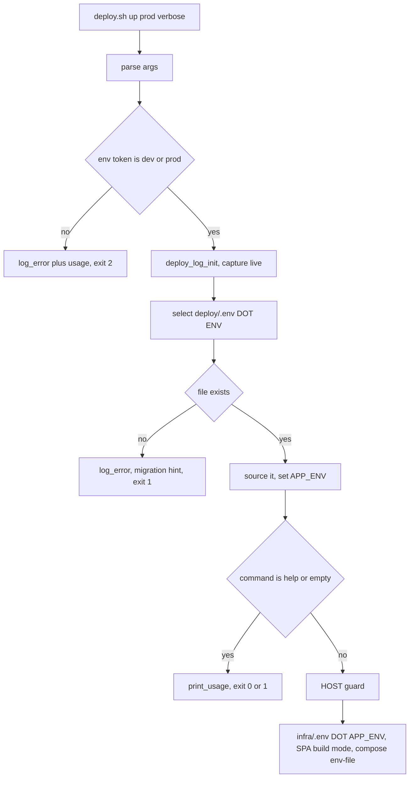

# Plan — per-environment deploy targets for `deploy/deploy.sh`

**Date:** 2026-10-06
**Status:** draft, awaiting approval
**Author:** architect mode
**Scope:** [`deploy/deploy.sh`](../../deploy/deploy.sh:1) (argument parsing + env-file selection),
`deploy/.env` → `deploy/.env.dev`, [`.gitignore`](../../.gitignore:43),
[`.github/workflows/deploy.yml`](../../.github/workflows/deploy.yml:145),
[`scripts/ssh/_remove-ssh-passphrase.sh`](../../scripts/ssh/_remove-ssh-passphrase.sh:54), docs/specs, tests.
**Related:** [three-env separation plan](2026-10-05--10-30-00-three-env-separation-plan.md),
[logging plan](2026-10-06-deploy-script-logging-plan.md),
[logger integration history](2026-10-06--16-05-00-deploy-logger-integration-and-windows-invocation.md),
[`docs/Specs/Production-Runbook.md`](../Specs/Production-Runbook.md:309)

---

## 1. Request

> "I want `deploy.sh` to have a parameter after the operation (`up`, `down`, `ps`, …) that says where
> to deploy: `dev` or `prod` — these two acceptable. `deploy.sh` picks `.env.dev` or `.env.prod` when
> given, otherwise `.env.dev` is the default. `.env` becomes `.env.dev`."

Target CLI:

```bash
./deploy/deploy.sh up            # env defaults to dev  -> deploy/.env.dev
./deploy/deploy.sh up dev        # explicit             -> deploy/.env.dev
./deploy/deploy.sh up prod       # explicit             -> deploy/.env.prod
./deploy/deploy.sh ps prod --verbose
./deploy/deploy.sh up staging    # must fail loudly, exit 2
```

## 2. Current state (facts, verified in this checkout)

| Fact | Where |
|---|---|
| `deploy.sh` reads exactly one env file: `$SCRIPT_DIR/.env` | [`deploy/deploy.sh:119`](../../deploy/deploy.sh:119) |
| The env is an **environment variable** (`APP_ENV`), default `dev`, not an argument | [`deploy/deploy.sh:204`](../../deploy/deploy.sh:204) |
| `APP_ENV` also drives the SPA build mode, `infra/.env.${APP_ENV}`, `DOMAIN`/`ACME_EMAIL` and the compose `--env-file` | [`deploy/deploy.sh:207`](../../deploy/deploy.sh:207), [`deploy/deploy.sh:214`](../../deploy/deploy.sh:214), [`deploy/deploy.sh:262`](../../deploy/deploy.sh:262) |
| Only `$1` (command) and `$2` (`--verbose`) are parsed today | [`deploy/deploy.sh:129`](../../deploy/deploy.sh:129) |
| `HOST` guard message hardcodes `cp deploy/.env.example deploy/.env` | [`deploy/deploy.sh:184`](../../deploy/deploy.sh:184) |
| `upload()` scp's `deploy/.env` to the droplet as `$REMOTE_DIR/deploy/.env` | [`deploy/deploy.sh:400`](../../deploy/deploy.sh:400) |
| `deploy/.env` holds operator/connection config only: `HOST`, `SSH_USER`, `SSH_KEY`, `REMOTE_DIR`, `SUDO_USERS`, `APP_USER`, `UFW_ENABLE` | [`deploy/.env.example`](../../deploy/.env.example:1) |
| **`.gitignore` protects the bare `.env` only** — the per-env rules cover `apps/**` and `infra/**`, **not `deploy/`** | [`.gitignore:43`](../../.gitignore:43), [`.gitignore:57`](../../.gitignore:57) |
| **CI does not run `deploy.sh`** — it mirrors the steps and derives the env from `inputs.app_env` / the `INFRA_ENV_${APP_ENV}` secret | [`.github/workflows/deploy.yml:3`](../../.github/workflows/deploy.yml:3), [`.github/workflows/deploy.yml:105`](../../.github/workflows/deploy.yml:105) |
| **CI's rsync exclude list hardcodes `deploy/.env`** | [`.github/workflows/deploy.yml:145`](../../.github/workflows/deploy.yml:145) |
| A second consumer of `deploy/.env` exists: `scripts/ssh/_remove-ssh-passphrase.sh` greps `SSH_KEY=` out of it | [`scripts/ssh/_remove-ssh-passphrase.sh:54`](../../scripts/ssh/_remove-ssh-passphrase.sh:54) |
| `scripts/dev-stack.sh` exports `APP_ENV=local` for the *local* stack and never touches `deploy/` | [`scripts/dev-stack.sh:146`](../../scripts/dev-stack.sh:146) |
| The offline suites `_deploy-sh-m1-test.sh` (7/7) and `_deploy-sh-logger-test.sh` (10/10) are green; `_deploy-sh-m3-test.sh` is red for an unrelated, pre-existing reason | `scripts/test/` |

**Consequence of the design as it stands:** a dev and a prod droplet cannot coexist, because
`deploy/.env` can only carry one `HOST`. The runbook documents the CI half of this gap already —
"when the prod droplet comes online, a second `DROPLET_HOST_PROD` secret and a per-env matrix step are
needed" ([`deploy/README.md:117`](../../deploy/README.md:117)) — but local deploys have no equivalent.

## 3. Requirements

| # | Requirement | Why |
|---|---|---|
| R1 | `deploy.sh <op> [dev\|prod] [--verbose]` — the env is the first non-flag argument after the operation | requested |
| R2 | `dev` is the default env when the argument is omitted | requested |
| R3 | Only `dev` and `prod` are accepted; anything else fails with a logged, actionable error and exit code **2** (usage error) | requested ("these 2 acceptable") |
| R4 | The selected env decides the env file: `deploy/.env.dev` / `deploy/.env.prod`; `.env` is gone | requested |
| R5 | The selected env is the **single source of truth** for `APP_ENV` — so `infra/.env.${APP_ENV}`, the SPA build mode and the compose `--env-file` cannot drift from the droplet being targeted | safety: mixing a prod deploy with dev SPA/API config is the worst failure mode of this change |
| R6 | `--verbose` keeps working and may appear in any position after the operation | backwards compatibility with the logger integration |
| R7 | The log header records which env **file** was used (path only, never contents) | diagnostics; matches the logger's secret rules |
| R8 | Missing selected file → logged, actionable error (name the file, and if a legacy `deploy/.env` exists, tell the operator to `mv` it) | migration UX |
| R9 | `deploy/.env.dev` / `.env.prod` / `.env.local` must be **gitignored**, and CI must not ship them to the droplet | secret safety |
| R10 | Works identically from Git Bash, WSL, PowerShell/`deploy.ps1` and the droplet | portability contract of the script |
| R11 | Testable offline: invalid env, missing file, default-dev and flag-order cases must all be assertable without a droplet | the repo already tests deploy.sh's guards offline |
| R12 | No silent behaviour change for `APP_ENV=prod deploy.sh up` | existing habits keep working |

## 4. Design

### 4.1 CLI contract

```
deploy.sh <command> [env] [--verbose]
                 ↑     ↑
                 |     dev | prod  (optional, default dev)
                 upload | bootstrap | up | down | down-all | restart | ps | logs | help
```

* `env` is the **first argument after the command**; a bare `dev`/`prod` token in the remaining
  arguments is the env, `-v`/`--verbose` is the verbose flag.
* Any other token after the command → usage error, exit 2 (consistent with R3).
* A second env token (`up dev prod`) → usage error, exit 2.
* `help` / no argument keep their current dispatch and exit codes (0 / 1).

### 4.2 Precedence

| Priority | Source | Behaviour |
|---|---|---|
| 1 | positional argument | wins |
| 2 | `APP_ENV` environment variable | used when no argument was given (keeps `APP_ENV=prod deploy.sh up` working) |
| 3 | built-in default | `dev` |

If a positional argument and `APP_ENV` disagree, the argument wins and a `log_warn` line records the
conflict — a silent override is exactly the kind of thing that pushes a prod deploy at a dev droplet.

### 4.3 File resolution, and migration away from `.env`

```
DEPLOY_ENV=prod
ENV_FILE=$SCRIPT_DIR/.env.${DEPLOY_ENV}     # deploy/.env.prod
```

* The file is **sourced with `set -a`** exactly as `deploy/.env` is today.
* There is **no fallback to `deploy/.env`** (R4). A leftover `deploy/.env` is *detected* and reported
  as a migration hint rather than silently honoured:

```
[ERROR] deploy/.env.prod not found.
[ERROR] Found deploy/.env instead — it has been replaced by per-env files.
[ERROR] Migration:  mv deploy/.env deploy/.env.dev   (then create deploy/.env.prod for the prod droplet)
```

* `local` is deliberately **not** accepted: `deploy.sh` never targets a local droplet; that is
  [`scripts/dev-stack.sh`](../../scripts/dev-stack.sh:146)'s job, and it uses `infra/.env.local`.
  The rejection message says so, to stop the obvious "why not local?" follow-up.
* `deploy/.env.example` stays the **single committed template** (matching the existing
  `apps/*/.env.example` + gitignored `.env.{dev,prod}` convention in this repo), with a comment block
  explaining how the dev and prod files differ.

### 4.4 Ordering inside `deploy.sh` — the one structural constraint

The env file *name* depends on the argument, so argument parsing must happen **before** the file is
sourced. Today the order is: `source .env` → parse args → guard. It becomes:

1. `SCRIPT_DIR` / `REPO_DIR` → source `lib/logger.sh` (unchanged).
2. **Parse arguments** (command, env, verbose) and validate the env.
3. `deploy_log_init "$CMD" [$VERBOSE]` — the capture must be live before the first guard
   (established in the previous change).
4. `source "$SCRIPT_DIR/.env.${DEPLOY_ENV}"` if it exists, else the logged error + migration hint + `exit 1`.
5. `print_usage` + the `help`/no-args early dispatch (unchanged position, still before the `HOST` guard).
6. `HOST` guard (message updated to name the selected file).
7. `APP_ENV="${DEPLOY_ENV}"` — replaces the current `APP_ENV="${APP_ENV:-dev}"`, so everything
   downstream (R5) follows the same value.
8. `log_info "config: DEPLOY_ENV=… env_file=… APP_ENV=…"` and the existing DOMAIN/COMPOSE logging.



### 4.5 Blast radius — every consumer of `deploy/.env`

Renaming the file is not local; four places outside `deploy.sh` assume the old path.

| Consumer | Today | Change |
|---|---|---|
| [`deploy/deploy.sh:119`](../../deploy/deploy.sh:119) | `source $SCRIPT_DIR/.env` | selects `.env.${DEPLOY_ENV}` |
| [`deploy/deploy.sh:400`](../../deploy/deploy.sh:400) | scp's `deploy/.env` to `$REMOTE_DIR/deploy/.env` | scp the **selected** file; destination stays `deploy/.env` (the droplet is single-env, and the droplet-side path is a contract other tooling may rely on) |
| [`.github/workflows/deploy.yml:145`](../../.github/workflows/deploy.yml:145) | excludes `deploy/.env` from the rsync | exclude `deploy/.env`, `deploy/.env.dev`, `deploy/.env.prod` (and `.env.local` for completeness) — **otherwise CI uploads the operator's droplet IP + SSH key path** |
| [`scripts/ssh/_remove-ssh-passphrase.sh:54`](../../scripts/ssh/_remove-ssh-passphrase.sh:54) | hardcoded `deploy/.env` | accept an optional env argument, default `dev`, and resolve `deploy/.env.${1:-dev}`; update its messages |
| [`scripts/ssh/README.md`](../../scripts/ssh/README.md:25) | 4 references to `deploy/.env` | update to `.env.dev` |
| `.gitignore` | `.env` only | add `deploy/.env.local`, `deploy/.env.dev`, `deploy/.env.prod` |

### 4.6 Secret safety

* `.gitignore` must gain the three per-env patterns **in the same change** as the rename —
  `deploy/.env.dev` is committable today ([`.gitignore:43`](../../.gitignore:43) matches only the bare
  `.env`), and it contains the droplet address and the absolute path of the SSH private key.
* The [`.github/workflows/deploy.yml`](../../.github/workflows/deploy.yml:145) exclude list is the
  second half of the same protection.
* The logger's existing rules apply unchanged: no `set -x` on the sourcing path, and only the file
  *path* is logged.

### 4.7 Droplet-side destination

`upload()` keeps scp-ing to `$REMOTE_DIR/deploy/.env`. Rationale: a droplet is a single environment by
definition, and the droplet-side filename is referenced by the runbook; renaming it there would add
churn with no benefit. The **source** file is what becomes per-env.

## 5. Files to change

| # | File | Change |
|---|---|---|
| 1 | [`deploy/deploy.sh`](../../deploy/deploy.sh:1) | argument parser (R1–R3, R6, R12); env-file selection + migration hint (R4, R8); `APP_ENV="${DEPLOY_ENV}"` (R5); config logging (R7); usage text; `HOST` guard message names the file |
| 2 | [`.gitignore`](../../.gitignore:43) | `deploy/.env.local`, `deploy/.env.dev`, `deploy/.env.prod` |
| 3 | [`.github/workflows/deploy.yml`](../../.github/workflows/deploy.yml:145) | extend the rsync exclude list |
| 4 | `deploy/.env.example` | document the per-env file contract in the header comment |
| 5 | [`scripts/ssh/_remove-ssh-passphrase.sh`](../../scripts/ssh/_remove-ssh-passphrase.sh:54) | resolve `deploy/.env.${1:-dev}` + messages |
| 6 | [`scripts/ssh/README.md`](../../scripts/ssh/README.md:25) | path references |
| 7 | [`deploy/README.md`](../../deploy/README.md:16) | invocation table gains the env argument; §10 mentions the selected file |
| 8 | [`deploy/deploy.ps1`](../../deploy/deploy.ps1:1) | usage `.NOTES`/`.EXAMPLE` mention `up prod` (no logic change — arguments already pass through) |
| 9 | `scripts/test/_deploy-sh-env-selection-test.sh` | **new** offline test (see §6) |
| 10 | [`docs/Specs/Production-Runbook.md`](../Specs/Production-Runbook.md:309) | §6.1 examples + the `deploy/.env.${ENV}` selection; header date |
| 11 | [`docs/Specs/Local-Development.md`](../Specs/Local-Development.md:20) | the dev-row command becomes `deploy.sh up dev` |
| 12 | [`docs/Specs/Three-Env-Verification.md`](../Specs/Three-Env-Verification.md:252) | `deploy.sh up` → `deploy.sh up dev` and the §3.1.1 APP_ENV note |
| 13 | [`docs/Specs/Caddy-Reverse-Proxy.md`](../Specs/Caddy-Reverse-Proxy.md:228) | the per-env table gains the `deploy/.env.${ENV}` selector |
| 14 | operator migration | `mv deploy/.env deploy/.env.dev` (manual, documented) |

## 6. Tests

New `scripts/test/_deploy-sh-env-selection-test.sh`, offline, driven through a **temp copy of
`deploy/`** (script + `lib/`) so the real `deploy/.env.*` files are never touched. Every scenario
aborts before any ssh call, which is what makes it droplet-free:

| Scenario | Assertion |
|---|---|
| `up staging` | exit 2, `invalid environment` + valid values listed, log file written |
| `up dev prod` | exit 2, usage error (two env tokens) |
| `ps` with only `.env.prod` present | exit 1, message names `deploy/.env.dev` (proves default dev) |
| `ps prod` with `.env.prod` present but `HOST=` empty | the `HOST` message names `deploy/.env.prod` (proves selection) |
| `ps prod` with `.env.prod` absent and `.env` present | exit 1 + migration hint containing `mv deploy/.env deploy/.env.dev` |
| `ps prod --verbose` and `ps --verbose prod` | identical env resolution, no usage error |
| `APP_ENV=prod` env var, no argument | resolves `deploy/.env.prod` (R12) |
| `APP_ENV=dev` + `up prod` argument | argument wins, warning logged |

Existing suites must stay green: `_deploy-sh-m1-test.sh` (7/7), `_deploy-sh-logger-test.sh` (10/10),
plus `bash -n` on every touched script. `_deploy-sh-m3-test.sh` stays out of scope (pre-existing red,
tracked in the previous change's follow-ups).

## 7. Migration steps for the operator (documented, not automated)

```bash
mv deploy/.env deploy/.env.dev                  # then set HOST= to the DEV droplet
cp deploy/.env.example deploy/.env.prod         # then set HOST= to the PROD droplet
./deploy/deploy.sh ps                           # defaults to dev
./deploy/deploy.sh ps prod
```

## 8. Open decisions for you to confirm

| # | Question | Recommendation |
|---|---|---|
| D1 | Should a legacy `deploy/.env` be honoured as a fallback (with a deprecation warning) for one release, or rejected outright? | **Reject outright** + migration hint — a silent fallback can deploy to the wrong droplet |
| D2 | Should the positional argument beat the `APP_ENV` environment variable, or vice versa? | **The argument wins**, with a warning when they disagree |
| D3 | Should `deploy/.env.prod` be created now (empty `HOST=`) or only when the prod droplet exists? | **Only when needed** — an empty-but-present file would just move the error one step later; the missing-file message already tells you what to create |
| D4 | Is the exit code for a bad env `2` (usage error) acceptable, given the logger's `help` path uses `0`/`1`? | Yes — `2` distinguishes "you typed it wrong" from "the deploy failed" |
| D5 | Keep `deploy/.env.example` as the single committed template, or split into `.env.dev.example` / `.env.prod.example`? | **Keep one template** — matches the repo's existing `apps/*/.env.example` convention and keeps the diff small |
| D6 | Should `scripts/ssh/_remove-ssh-passphrase.sh` get an env argument too, or simply default to `.env.dev`? | **Optional argument, default dev** — consistent with `deploy.sh` |

## 9. Out of scope

* A `local` deploy target (belongs to [`scripts/dev-stack.sh`](../../scripts/dev-stack.sh:146)).
* Adding a prod droplet, prod DNS or `INFRA_ENV_PROD` — the CI matrix half of the prod story stays as
  documented in [`deploy/README.md:117`](../../deploy/README.md:117).
* Rewriting the red `_deploy-sh-m3-test.sh`.
* Sharing `lib/logger.sh` with `bootstrap.sh` / `dev-stack.sh`.

## 10. Verification plan

1. `bash -n` on every touched shell script.
2. `scripts/test/_deploy-sh-env-selection-test.sh` → all scenarios pass.
3. `_deploy-sh-m1-test.sh` (7/7) and `_deploy-sh-logger-test.sh` (10/10) still green.
4. `bash deploy/deploy.sh ps` → `deploy/log/latest.log` shows `env_file=…deploy/.env.dev`, and the
   header/`HOST` messages name `.env.dev`.
5. `bash deploy/deploy.sh ps prod` → names `.env.prod`, exits 1 with the migration hint.
6. `bash deploy/deploy.sh up staging` → exit 2, valid values listed.
7. `git status --untracked-files=all` → `deploy/.env.dev` is **ignored**; `deploy/.env.example` is the
   only tracked file in `deploy/`.
8. `powershell -File deploy\deploy.ps1 ps prod` → same behaviour through the wrapper.
