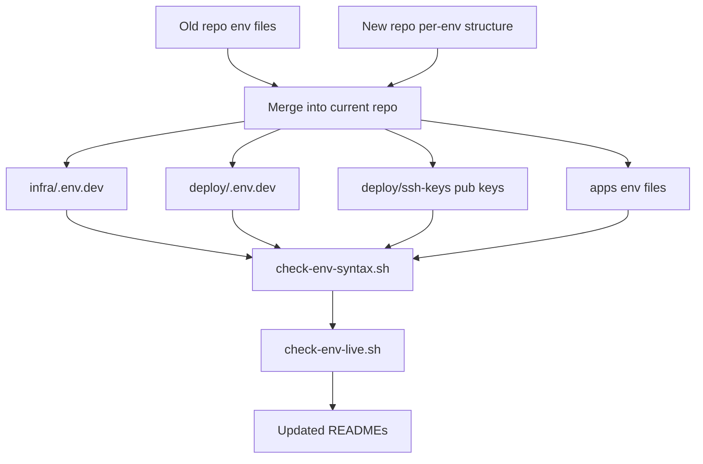

# Env merge: old repo data → new repo structure + env test folder

**Date:** 2026-10-07
**Status:** planned (awaiting implementation)
**Scope:** merge valid credentials from `e:\projects\AI\2026-08-31-ai-sztens-dev-old\` into the current repo `e:\projects\AI\2026-08-31-ai-sztens-dev\`, using the current repo's per-env structure as the source of truth. All changes happen in the current repo only.

---

## 1. Goal

- Reconcile every `.env` file between the two clones so the current repo keeps the **new three-env structure** and the **old valid credentials**.
- Copy the user SSH public keys that only exist in the old repo.
- Compare the resulting structure against the docs and fix the drift.
- Add a dedicated `scripts/env-test/` folder with offline syntax checks and explicit live-access checks.

---

## 2. Findings — env file inventory

### 2.1 Current repo (new structure)

| File | State | Content summary |
|---|---|---|
| [`deploy/.env.dev`](../../deploy/.env.dev:1) | present | HOST=ssh.aisztens.hu, SSH_USER=root, SSH_KEY=./deploy/ssh-keys/root.private.key, REMOTE_DIR, SUDO_USERS=tkovari,krak, APP_USER, UFW_ENABLE=0, DEPLOY_LOG_LEVEL/KEEP |
| `deploy/.env.prod` | missing | dormant by design |
| [`infra/.env.dev`](../../infra/.env.dev:1) | present | full stack config with real dev secrets; CORS=web+admin only |
| `infra/.env.local` | missing | auto-seeded by dev-stack.sh |
| `infra/.env.prod` | missing | dormant by design |
| [`apps/api/.env.local`](../../apps/api/.env.local:1), `.env.dev`, `.env.prod` | present | PORT + CORS; `.env.dev` VAPI secret is a placeholder |
| [`apps/web/.env.local`](../../apps/web/.env.local:1), `.env.dev`, `.env.prod` | present | VITE_API_BASE_URL per env |
| [`apps/admin/.env.local`](../../apps/admin/.env.local:1), `.env.dev`, `.env.prod` | present | VITE_API_BASE_URL per env |
| `deploy/ssh-keys/*.pub` | missing | only README + .gitignore committed |

### 2.2 Old repo (single-env layout)

| File | State | Content summary |
|---|---|---|
| `deploy/.env` | present | HOST=ssh.aisztens.hu, SSH_KEY=/home/tkovari/.ssh/kalman-ssh-key-20260916.openssh.private.key, SUDO_USERS=tkovari,krak,deployer |
| `infra/.env` | present | same real secrets as new infra/.env.dev, but CORS includes https://api.aisztens.hu |
| `apps/api/.env`, `apps/web/.env`, `apps/admin` env | absent | old admin app was Angular; no apps-level env data |
| `deploy/ssh-keys/*.pub` | present | tkovari.pub, krak.pub, aisztens.pub, deployer.pub |

---

## 3. Discrepancies and decisions

The new structure is the source of truth. Decisions confirmed with the requester:

| # | Field / file | Old value | New value | Decision |
|---|---|---|---|---|
| 1 | `infra/.env.dev` CORS_ORIGINS | includes https://api.aisztens.hu | web + admin only | keep new (do NOT re-add api origin) |
| 2 | `deploy/.env.dev` SSH_KEY | /home/tkovari/.ssh/... (WSL) | ./deploy/ssh-keys/root.private.key | keep new repo-local path |
| 3 | `deploy/.env.dev` SUDO_USERS | tkovari,krak,deployer | tkovari,krak | restore deployer → tkovari,krak,deployer |
| 4 | `apps/api/.env.dev` VAPI_WEBHOOK_SECRET | (real in infra/.env.dev) | placeholder | keep placeholder (compose injects real secret) |
| 5 | `deploy/ssh-keys/*.pub` | 4 files present | none | copy all four .pub files |
| 6 | prod + local env files | — | missing | leave as-is (prod dormant, local auto-seeded) |

---

## 4. Merge actions per file

1. **`infra/.env.dev`** — data already correct. Only fix the stale header comment that still says "Copy to `infra/.env`" so it reflects the per-env layout.
2. **`deploy/.env.dev`** — set `SUDO_USERS=tkovari,krak,deployer`; keep `SSH_KEY=./deploy/ssh-keys/root.private.key`; remove the stale "ACTION REQUIRED: set HOST" seed banner (HOST is already set).
3. **`deploy/ssh-keys/`** — copy `tkovari.pub`, `krak.pub`, `aisztens.pub`, `deployer.pub` from the old repo.
4. **`apps/*`** — no old data exists; leave `.env.local`/`.env.dev`/`.env.prod` as they are (placeholders intentional per design).

---

## 5. New test folder `scripts/env-test/`

Separate from [`scripts/test/`](../../scripts/test/README.md:1) (which is the stack smoke suite).

### 5.1 `check-env-syntax.sh` (offline, always safe)

Validates every tracked + gitignored `.env` file:

- parse-only: every non-comment line is `KEY=value`; no spaces around `=`
- bash-source smoke test: `set -a; . file; set +a` in a subshell, report errors
- duplicate key detection within each file
- placeholder detection in **non-example** files (`change-me`, `replace-with`, `<...>`)
- required-key presence per file (derived from the matching `.env.example`)
- cross-file consistency: `apps/{web,admin}/.env.dev` `VITE_API_BASE_URL` matches `https://api.<DOMAIN>/api` where `DOMAIN` comes from `infra/.env.dev`

### 5.2 `check-env-live.sh` (explicit, hits real services)

Run explicitly and only when intended:

- SSH reachability using `deploy/.env.dev` (BatchMode, short timeout, never prints keys)
- PostgreSQL connect using `infra/.env.dev` (via `docker compose exec` or `psql`)
- HTTPS reachability: `https://api.<DOMAIN>/healthz` / `https://web.<DOMAIN>` / `https://admin.<DOMAIN>`
- `VAPI_WEBHOOK_SECRET` non-placeholder in `infra/.env.dev`

### 5.3 Supporting files

- `scripts/env-test/README.md` — documents both scripts, exit codes, and prerequisites
- `check-env-syntax.ps1` / `check-env-live.ps1` — PowerShell wrappers mirroring the existing `deploy.ps1` pattern

---

## 6. Documentation updates

- [`deploy/README.md`](../../deploy/README.md:1) — replace remaining `deploy/.env` / `infra/.env` references (§1, §3, §7, §8) with `deploy/.env.dev` / `infra/.env.dev`.
- [`scripts/test/README.md`](../../scripts/test/README.md:1) — fix `cp infra/.env.example infra/.env` and the `--env-file` override notes to the per-env naming; add a pointer to `scripts/env-test/`.
- `infra/.env.dev` header comment (see §4.1).

---

## 7. History and milestone

- Plan file: this document under [`docs/history/`](../history/).
- Milestone: create `docs/milestones/<ts>-env-merge-old-new-and-env-tests.milestone.md` after implementation (this is a multi-file, credential-touching change).

---

## 8. Out of scope

- Prod provisioning: `deploy/.env.prod` and `infra/.env.prod` stay dormant.
- Generating `infra/.env.local` (handled automatically by `scripts/dev-stack.sh`).
- Rotating any credentials.

---

## 9. Verification

```bash
# offline syntax checks (no network)
bash scripts/env-test/check-env-syntax.sh

# live access (explicit, hits the dev droplet)
bash scripts/env-test/check-env-live.sh
```

Manual review: diff each merged file against the old repo's corresponding file to confirm every real credential was carried over and no secret was lost.

---

## 10. Flow


