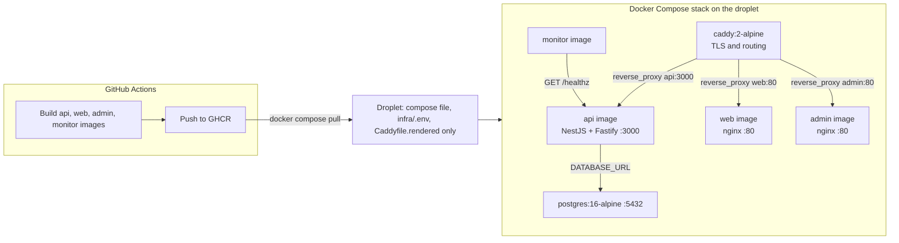

# Plan — Fully Dockerized stack and image-based deploy

**Date:** 2026-10-08
**Status:** Approved for implementation
**Scope:** `infra/`, `deploy/`, `.github/workflows/`, `scripts/`, `docs/Specs/`
**Related:** [`docs/Specs/Production-Runbook.md`](../Specs/Production-Runbook.md), [`docs/Specs/Caddy-Reverse-Proxy.md`](../Specs/Caddy-Reverse-Proxy.md), [`deploy/README.md`](../../deploy/README.md)

---

## 1. Goal

Every application component must run inside a Docker container, and deployment must become **image-based**:

- Images are built **once, in CI** (GitHub Actions).
- The droplet **never builds anything** and **never receives application source code**.
- The droplet only **pulls images** and runs `docker compose up -d`.
- Local development keeps working **without a registry**.

### Explicit non-goal

**Not** one single container for the whole application. `postgres` and `caddy` are official
upstream images and stay separate; per-service containers are what provide the per-service
`mem_limit`, independent restarts and healthchecks. The change is that **nothing runs on the
host filesystem anymore** — every component is a container.

---

## 2. Baseline (what exists today)

| Component | Today | Problem |
|---|---|---|
| `api` | Container, but image built **on the droplet** via `docker compose up -d --build` | Requires the full repo + `pnpm install` + Nest build on a memory-capped droplet |
| `monitor` | Container, built on the droplet | Same as `api` |
| `web` (React SPA) | **Not a container** — built locally/CI, `dist/` rsynced to the host, bind-mounted into Caddy | Lives on the bare server filesystem |
| `admin` (React SPA) | **Not a container** — same as `web` | Same as `web` |
| `postgres` | Official `postgres:16-alpine` | OK |
| `caddy` | Official `caddy:2-alpine`, serves SPA files from host bind mounts | Depends on host `dist/` folders |

Resulting flow: **copy sources → build on server → run containers**.
Target flow: **build images in CI → push to a registry → droplet pulls and runs containers**.

---

## 3. Target architecture



---

## 4. Design decisions

| Decision | Choice | Rationale |
|---|---|---|
| SPA serving | one `nginx:1.27-alpine` container per SPA | Full containerization; Caddy keeps only TLS + routing; nginx is the idiomatic static server and is ~20 MB |
| Build location | GitHub Actions only | The droplet never runs `pnpm`/`nest`/`vite` again |
| Registry | **GHCR** `ghcr.io/<owner>/aisztens-{api,web,admin,monitor}` | Free with GitHub, native `GITHUB_TOKEN` auth, no Docker Hub pull-rate limits |
| Image tags | immutable `sha-<short-sha>` + mutable env tag (`dev`/`prod`) | `IMAGE_TAG` on the droplet pins an exact revision; rollback is one variable change |
| `VITE_API_BASE_URL` | build `ARG` → `ENV` inside the SPA Dockerfile | Vite resolves it at build time; each environment gets its own immutable image |
| Base compose | `image:` only (no `build:`) | The droplet has no source tree, so it must not reference build contexts |
| Local development | keep `build:` blocks in `infra/docker-compose.local.yml` | `scripts/dev-stack.sh` keeps building locally, no registry needed |
| Secrets | runtime only, via compose `environment:` | `.env` files stay out of images (`**/.env*` in `.dockerignore`) |

---

## 5. File inventory

### New

| Path | Purpose |
|---|---|
| `infra/web/Dockerfile` | Multi-stage: pnpm/Node build of `@callback/web` → `nginx:1.27-alpine` runtime serving `dist/` |
| `infra/web/nginx.conf` | SPA fallback `try_files $uri /index.html`, gzip, immutable cache headers for `/assets/*` |
| `infra/admin/Dockerfile` | Same shape for `@callback/admin` |
| `infra/admin/nginx.conf` | Same as `infra/web/nginx.conf` |
| `.github/workflows/images.yml` | Build + push the four images to GHCR on merge to `dev` (and `workflow_dispatch` with `app_env=prod`) |

### Modified

| Path | Change |
|---|---|
| `infra/docker-compose.yml` | `api`/`monitor` become `image:` only; add `web` and `admin` services; remove SPA bind mounts from `caddy` |
| `infra/docker-compose.local.yml` | Carry the `build:` blocks for `api`, `web`, `admin`, `monitor` |
| `infra/caddy/Caddyfile` | `web.<DOMAIN>` and `admin.<DOMAIN>` become `reverse_proxy` instead of `file_server` |
| `infra/.env.example` | Drop `WEB_DIST_PATH`/`ADMIN_DIST_PATH`; document `IMAGE_TAG` and the GHCR image names |
| `.github/workflows/deploy.yml` | Pull-based: render `infra/.env` + rendered Caddyfile, ship 3 files, `pull` + `up -d` without `--build` |
| `deploy/deploy.sh` | Simplified to the same ship-3-files + pull + up flow (rsync of the repo removed) |
| `scripts/test/stack-smoke.sh` (+ prelude under `scripts/test/lib/`) | `--up` builds through the local override instead of the base compose |
| `deploy/README.md`, `scripts/README.md`, `docs/Specs/Production-Runbook.md`, `docs/Specs/Caddy-Reverse-Proxy.md`, `docs/Specs/Local-Development.md`, `docs/Specs/Three-Env-Verification.md` | Reflect the image-based flow and the new `web`/`admin` containers |

### Unchanged

`deploy/bootstrap.sh` (still installs Docker + users on a fresh droplet), `apps/*` sources,
`packages/shared`, `infra/app/Dockerfile`, `infra/monitor/Dockerfile`.

---

## 6. Image build pipeline (CI)

Triggered on push to `dev` and on `workflow_dispatch` (`app_env` = `dev` | `prod`).

1. Resolve `APP_ENV` (default `dev`).
2. Read `DOMAIN` / `ACME_EMAIL` from the `INFRA_ENV_DEV` / `INFRA_ENV_PROD` secret, exactly as
   [`deploy/deploy.sh:render_caddyfile()`](../../deploy/deploy.sh:586) does today.
3. Build the four images with the correct build args:

   | Image | Build args |
   |---|---|
   | `aisztens-api` | `APP_ENV` |
   | `aisztens-web` | `APP_ENV`, `VITE_API_BASE_URL=https://api.<DOMAIN>/api` |
   | `aisztens-admin` | `APP_ENV`, `VITE_API_BASE_URL=https://api.<DOMAIN>/api` |
   | `aisztens-monitor` | — |

4. Tag each image `sha-<short-sha>` (immutable) and `<APP_ENV>` (mutable), then push to GHCR.

The SPA Dockerfile sets `ENV VITE_API_BASE_URL=$VITE_API_BASE_URL` in the build stage so Vite
(which gives process environment precedence over `.env` files) picks it up. No per-environment
`.env` files are needed inside the image.

---

## 7. Runtime model on the droplet

`docker-compose.yml` references images only:

```yaml
services:
  api:
    image: ghcr.io/<owner>/aisztens-api:${IMAGE_TAG}
  web:
    image: ghcr.io/<owner>/aisztens-web:${IMAGE_TAG}
  admin:
    image: ghcr.io/<owner>/aisztens-admin:${IMAGE_TAG}
  monitor:
    image: ghcr.io/<owner>/aisztens-monitor:${IMAGE_TAG}
```

Deploy command (no `--build`):

```bash
docker compose -f infra/docker-compose.yml --env-file infra/.env pull
docker compose -f infra/docker-compose.yml --env-file infra/.env up -d --remove-orphans
```

The droplet needs only: `infra/docker-compose.yml`, `infra/.env`, `infra/caddy/Caddyfile.rendered`
plus registry credentials (`docker login ghcr.io` when the repo is private).

---

## 8. Local development

`scripts/dev-stack.sh up` merges `infra/docker-compose.yml` with
`infra/docker-compose.local.yml`; the override restores `build:` for all four services, so the
developer builds from source with `--build` and never touches a registry. Caddy stays disabled
(`profiles: [never]`) as today. Web/admin SPA development continues through `pnpm dev` (Vite), so
no change is required for day-to-day frontend work.

---

## 9. Rollout steps (implementation order)

1. Add the `web` SPA Dockerfile, nginx config and `.dockerignore`; verify `docker build` locally.
2. Add the `admin` SPA Dockerfile, nginx config and `.dockerignore`; verify `docker build` locally.
3. Add `.github/workflows/images.yml` (build + push to GHCR).
4. Convert `infra/docker-compose.yml` to image-based services and add `web`/`admin`.
5. Move the `build:` blocks into `infra/docker-compose.local.yml`.
6. Flip the `web`/`admin` sites in `infra/caddy/Caddyfile` to `reverse_proxy`.
7. Update `infra/.env.example` (`IMAGE_TAG`, registry names; drop the dist path vars).
8. Rewrite `.github/workflows/deploy.yml` to the pull-based flow.
9. Simplify `deploy/deploy.sh` to the ship-3-files + pull + up flow.
10. Update `scripts/test/stack-smoke.sh` and its prelude.
11. Update the specs and README documents listed in §5.
12. Verify end-to-end (§10).

---

## 10. Verification

| Check | Command / method | Expected |
|---|---|---|
| Local image build | `docker build -f infra/web/Dockerfile .` (and admin) | Build succeeds, `index.html` in `/usr/share/nginx/html` |
| Compose validity | `docker compose -f infra/docker-compose.yml --env-file infra/.env config` | No `build:` refs, `web`/`admin` present |
| Local stack | `scripts/dev-stack.sh up` | api + postgres up, built from the override |
| CI image publish | merge to `dev` | Four `ghcr.io/...` images, `sha-<sha>` and `dev` tags |
| Droplet deploy | workflow run | `pull` + `up -d` succeeds, no build output |
| Runtime | `docker compose ps -a` | `api`, `web`, `admin`, `postgres`, `caddy`, `monitor` all `Up` |
| External | `curl -fsSI https://web.<DOMAIN>/` and `https://admin.<DOMAIN>/` | `200`, served by the SPA containers through Caddy |
| Smoke suite | `bash scripts/test/stack-smoke.sh` | All checks pass |
| Rollback | set `IMAGE_TAG=sha-<previous>` and `up -d` | Previous revision runs |

---

## 11. Risks and open questions

| Risk | Mitigation |
|---|---|
| Private repo ⇒ droplet cannot pull anonymously | `docker login ghcr.io` with a PAT limited to `read:packages`; document in the runbook |
| `GITHUB_TOKEN` needs `packages: write` | Set workflow `permissions:` accordingly |
| Arch mismatch if CI moves to ARM runners | Pin `platforms: linux/amd64` with `docker/build-push-action` |
| Existing droplet still has the old tree | Phase cutover removes it; rollback path kept until verified |
| Smoke suite `--up` assumes a buildable base compose | Point it at the local override |

---

## 12. Follow-ups (not in this plan)

- Automatic rollback when the smoke suite fails.
- Image vulnerability scanning (Trivy / `docker scout`) in the build workflow.
- Multi-environment matrix (dev + prod droplets) in `images.yml`.
