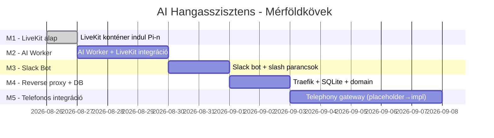

# Milestone 1 – LiveKit szerver a Raspberry Pi-n

**Dátum:** 2026-08-26
**Kapcsolódó terv:** [`docs/plans/01-architecture.md`](../../plans/01-architecture.md)
**Tárgy:** Az architektúra-dokumentumban definiált 6-8 konténeres AI hangasszisztens rendszer első mérföldköve: egy működő LiveKit szerver a Pi-n, minden más szolgáltatás nélkül.

---

## 🎯 A mérföldkő célja

Egyetlen Docker konténer (a [`livekit`](../../plans/01-architecture.md:57) service) elinduljon a Raspberry Pi-n, fogadjon WebRTC klienseket a böngészőből, és a [`livekit.yaml`](../../plans/07-configuration-livekit.md:1) + `.env` alapján működjön. Ezzel bizonyítjuk, hogy a hálózati topológia, a portkezelés és a konfiguráció-betöltés helyes, és minden további szolgáltatást (AI Worker, Slack Bot, Traefik) erre az alapra tudunk építeni.

## 🧠 Döntések (a felhasználóval egyeztetve)

| Döntés | Választás | Miért |
|--------|-----------|-------|
| Fejlesztési hely | **Local-first (Windows, ez a workspace)** | A Pi fizikailag nem elérhető most; a konfig fájlokat itt készítjük és validáljuk |
| API kulcsok | **Dev-only kulcsok a `.env.example`-ben**, kommenttel jelölve | Első futás out-of-the-box működjön; éles kulcsok cseréje későbbi lépés |
| Hálózati modell | **Közvetlen port binding** (7880/7881/7882) a Pi LAN IP-jén | Traefik csak akkor kell, ha HTTPS-t (Slack webhook) is ki akarunk szolgálni |

## 📐 Architektúra (M1-re szűkítve)

```mermaid
flowchart LR
    Browser[Web böngésző - teszt kliens]
    Pi[Raspberry Pi 4]
    LK[livekit konténer - 7880/7881/7882]

    Browser -- WebRTC --> Pi
    Pi -- host port forwarding --> LK
    LK -. olvas .-> ENV[.env]
    LK -. bind mount . -> YML[livekit.yaml]
```

A belső `internal`/`external` Docker hálózat, a Traefik, az AI Worker, a Slack Bot, az adatbázis és a Calendar service mind **kimarad** M1-ből. Ezek a M2+ mérföldkövekben jönnek.

## 📁 M1-ben létrejövő projekt-szerkezet

```
.
├── .env                              # DEV ONLY - gitignored, a .env.example-ből másolva
├── .env.example                      # DEV ONLY kulcsokkal, kommentben figyelmeztetéssel
├── .gitignore                        # .env, data/, .idea/ kizárása
├── README.md                         # Frissítve: M1 státusz + quickstart
├── docker-compose.yml                # Csak a livekit service
├── livekit.yaml                      # Port, RTC, room, kulcsok $(...)-ből
│
├── scripts/
│   ├── README.md                     # Scriptek dokumentációja (rövid)
│   ├── lib/
│   │   ├── colors.sh                 # Színes terminál kimenet
│   │   ├── logging.sh                # Konzisztens log formátum
│   │   └── checks.sh                 # OS/arch/root/disk előfeltételek
│   ├── setup-system.sh               # Pi előkészítés (swap, timezone, cgroup)
│   ├── setup-docker.sh               # Docker Engine + Compose plugin
│   ├── install-prerequisites.sh      # Orchestrator: setup-system + setup-docker
│   ├── generate-env.sh               # Interaktív .env generátor validációval
│   └── smoke-test-livekit.sh         # Konténer indítás → /health → /rtc → stop
│
├── data/                             # Üres, .gitkeep-pel (perzisztens tárhely később)
│
├── docs/
│   ├── plans/                        # Meglévő tervek (változatlanok)
│   └── memories/
│       └── 2026-08-26-milestone-1-livekit-on-pi-plan.md   # ← ez a fájl
│
└── plans/                             # Ez a mappa egyelőre megmarad (már létezik)
```

## 🔧 Fájl-szintű specifikáció (M1)

### [`livekit.yaml`](../../plans/07-configuration-livekit.md:1)

Minimális, de működőképes konfiguráció:

- `port: 7880`, `bind_addresses: [""]`
- `logging.level: info`, `logging.json: false` (emberbarát logok M1-ben)
- `rtc.tcp_port: 7881`, `rtc.udp_port: 7882`
- `rtc.use_external_ip: false` (M1-ben LAN-only; a Pi NAT mögötti működés M5 kérdés)
- `turn.enabled: true` UDP 3478 + TLS 5349 (NAT-os klienseket később támogatja)
- `room.empty_timeout: 300`, `room.max_participants: 50`, `room.enable_recording: false`
- `keys:` ága a `$(LIVEKIT_API_KEY): $(LIVEKIT_API_SECRET)` formátumot használja – a Docker Compose behelyettesíti indításkor.
- **Nincs** `webhook:` blokk (M2-ben, a Slack bottal együtt jön).

### [`.env.example`](../../plans/05-configuration-env.md:119) (M1-re szűkítve)

Csak azokat a kulcsokat tartalmazza, amiket a LiveKit konténer M1-ben ténylegesen olvas:

```bash
# ===== DEV ONLY - DO NOT USE IN PRODUCTION =====
# Ezek a kulcsok kizárólag helyi fejlesztésre és M1 smoke-teszthez szolgálnak.
# Éles környezetben a scripts/generate-livekit-keys.sh generál újat, vagy
# kézzel írd át, és SOHA ne commit-old a valódi .env fájlt.

PROJECT_NAME=ai-assistant-dev
ENVIRONMENT=development
TZ=Europe/Budapest
LOG_LEVEL=INFO

# LiveKit - DEV kulcsok, cseréld élesben!
LIVEKIT_API_KEY=APIdevM1localOnly
LIVEKIT_API_SECRET=devsecret_local_only_replace_in_prod_xxxxxxxxxxxxxx
LIVEKIT_URL=ws://localhost:7880
LIVEKIT_HOST=livekit
```

A többi változót (Slack, OpenAI, Deepgram, Google) M1-ben **szándékosan kihagyjuk** – csak az M2+ release-ekben kerülnek bele. Így a `.env` minimális és érthető marad.

### [`docker-compose.yml`](../../plans/06-configuration-docker-compose.md:1) (M1-re szűkítve)

```yaml
name: ai-assistant-dev

services:
  livekit:
    image: livekit/livekit-server:v1.8.0   # pinned, nem :latest
    container_name: ${PROJECT_NAME}-livekit
    restart: unless-stopped
    command: --config /etc/livekit.yaml
    volumes:
      - ./livekit.yaml:/etc/livekit.yaml:ro
    ports:
      - "7880:7880"    # HTTP / signaling
      - "7881:7881"    # ICE TCP
      - "7882:7882/udp" # media
      - "7883-7892:7883-7892/udp" # media range (szoba résztvevőkhöz)
    environment:
      LIVEKIT_API_KEY: ${LIVEKIT_API_KEY}
      LIVEKIT_API_SECRET: ${LIVEKIT_API_SECRET}
    healthcheck:
      test: ["CMD", "wget", "--spider", "-q", "http://localhost:7880"]
      interval: 10s
      timeout: 3s
      retries: 5
    logging:
      driver: json-file
      options: { max-size: "10m", max-file: "3" }
```

- **Nincs** `networks:` szekció – a Compose alapértelmezett hálózata elég M1-ben. M2-ben vezetjük be az `internal`/`external` szétválasztást.
- **Nincs** resource limit M1-ben – a Pi 8GB RAM bőven elég egyetlen LiveKit konténernek. M2-től (AI Worker + Slack Bot) lépnek be a limitek.
- **Nincs** Traefik – ahogy a döntésnél megbeszéltük.

### [`scripts/lib/`](../../plans/04-directory-structure.md:124)

Három apró, újrafelhasználható helper:

- [`colors.sh`](../../plans/04-directory-structure.md:126): `info`, `ok`, `warn`, `err` függvények ANSI színkódokkal. Nem ír ki színt, ha a stdout nem TTY (`[ -t 1 ]`).
- [`logging.sh`](../../plans/04-directory-structure.md:126): `log()` függvény, ami `[YYYY-MM-DDTHH:MM:SSZ] [LEVEL] message` formátumban ír `stderr`-re, és opcionálisan fájlba is.
- [`checks.sh`](../../plans/04-directory-structure.md:126): előfeltételek – `require_root`, `require_arch arm64|amd64`, `require_os bookworm|jammy|noble`, `require_command`, `require_disk_free`. Mindegyik tiszta kilépési kóddal tér vissza.

Minden helper a `set -euo pipefail` strict módot követi, és `source`olható a felső szintű scriptekből.

### [`scripts/setup-system.sh`](../../plans/02-raspberry-pi-preparation.md:1)

A Pi előkészítését végzi, a [`02-raspberry-pi-preparation.md`](../../plans/02-raspberry-pi-preparation.md:1) alapján, de **csak az M1-hez szükséges** lépéseket:

1. OS / arch check (Bookworm 64-bit vagy Ubuntu 22.04/24.04 ARM64).
2. `apt-get update` + `apt-get upgrade -y`.
3. `timedatectl set-timezone Europe/Budapest`.
4. `dpkg-reconfigure locales` – `hu_HU.UTF-8` + `en_US.UTF-8` (nem interaktív: `locale-gen`).
5. Swap 2GB-ra növelése (`/etc/dphys-swapfile`, `CONF_SWAPSIZE=2048`, majd `dphys-swapfile setup`).
6. Ellenőrzi a `/boot/cmdline.txt`-ben a `cgroup_memory=1 cgroup_enable=memory` flag-eket; ha hiányzanak, felajánlja a hozzáadást (és figyelmeztet rebootra).
7. Opcionális: UFW szabályok hozzáadása (csak ha a user kéri – `-y` nélkül).

A script **nem csinál** semmi olyat, ami azonnali rebootot igényelne anélkül, hogy szólna – a cgroup-os lépésnél kiírja: "Reboot required for cgroup changes to take effect".

### [`scripts/setup-docker.sh`](../../plans/03-software-requirements.md:1)

A Docker Engine és a Compose plugin telepítése a Docker hivatalos tárolójából ([`03-software-requirements.md`](../../plans/03-software-requirements.md:54) alapján):

1. Előfeltételek telepítése: `ca-certificates`, `curl`, `gnupg`.
2. Docker GPG kulcs letöltése + hozzáadása `/etc/apt/keyrings/docker.asc`-be.
3. Docker repo hozzáadása a `sources.list.d/docker.list`-hez.
4. `apt-get install -y docker-ce docker-ce-cli containerd.io docker-buildx-plugin docker-compose-plugin`.
5. A meghívó felhasználó hozzáadása a `docker` csoporthoz.
6. Ellenőrzés: `docker --version`, `docker compose version`, `docker run --rm hello-world`.
7. ARM64-specifikus figyelmeztetés, ha a user nem ARM64-et futtat (de nem blokkol – Linux x86-on is tesztelhető).

### [`scripts/install-prerequisites.sh`](../../plans/04-directory-structure.md:80)

Egyszerű orchestrator:

```bash
#!/usr/bin/env bash
set -euo pipefail
SCRIPT_DIR="$(cd "$(dirname "${BASH_SOURCE[0]}")" && pwd)"
source "${SCRIPT_DIR}/lib/colors.sh"
source "${SCRIPT_DIR}/lib/logging.sh"
source "${SCRIPT_DIR}/lib/checks.sh"

require_root

info "=== System preparation ==="
bash "${SCRIPT_DIR}/setup-system.sh" "$@"

info "=== Docker installation ==="
bash "${SCRIPT_DIR}/setup-docker.sh" "$@"

ok "Prerequisites installed. You can now 'docker compose up -d'."
```

Támogatott flagek: `-y` (non-interactive), `--skip-os-update`, `--dry-run`, `--help`.

### [`scripts/generate-env.sh`](../../plans/05-configuration-env.md:216)

Interaktív .env generátor M1-re szűkítve:

1. Ha nincs `.env`, másolja a `.env.example`-t.
2. Megkérdezi a `TZ`-t (alapértelmezetten `Europe/Budapest`).
3. Megkérdezi a `LIVEKIT_API_KEY` / `LIVEKIT_API_SECRET` értékeit – ha üresen hagyja, megtartja a DEV ONLY értékeket (és kiír egy figyelmeztetést).
4. Validálás:
   - API key minimum 8 karakter, csak `[A-Za-z0-9]`
   - API secret minimum 16 karakter
   - URL `ws://` vagy `wss://` kezdettel
5. Végén kiírja, hogy a `LIVEKIT_URL` a `ws://localhost:7880`-et használja-e, vagy egy másik hosztot (alap: localhost).

### [`scripts/smoke-test-livekit.sh`](../../plans/10-deployment-guide.md:1)

M1 legfontosabb validációja – automatizált end-to-end teszt:

1. Ellenőrzi, hogy a `.env` és a `livekit.yaml` létezik.
2. `docker compose pull` (csak a livekit image-et).
3. `docker compose up -d livekit`.
4. Vár 5 másodpercet, majd `curl -fsS http://localhost:7880/` (főoldal, aminek HTTP 200-at kell adnia).
5. `curl -fsS http://localhost:7880/rtc` (a LiveKit konfigurációs végpontja – visszaadja az ICE szervereket JSON-ben).
6. Token-teszt: a script generál egy **rövid életű** (5 perc) teszt tokent a LiveKit Go SDK-val vagy `python`-szal (a LiveKit Python SDK-ból), és megnézi, hogy a `/rtc` válasza összhangban van-e a kulcsokkal.
7. Ha minden zöld: `ok "M1 smoke test passed"`.
8. Ha bármelyik lépés elbukik: a script kiírja a `docker compose logs livekit --tail 50` kimenetet, és kilép 1-es kóddal.
9. Végén **nem** állítja le a konténert – a user dönti el, hogy tovább futtatja-e. Ha a `--stop` flaget kapja, akkor igen.

## 🧪 M1 elfogadási kritériumok

A mérföldkő akkor tekinthető késznek, ha az alábbiak mind teljesülnek:

1. A `docker compose up -d livekit` parancs sikeresen elindítja a konténert.
2. A konténer 5 másodpercen belül `healthy` státuszba kerül (healthcheck).
3. A `curl http://localhost:7880/` 200-as státuszt ad vissza.
4. A `curl http://localhost:7880/rtc` JSON-t ad vissza, ami tartalmazza a `ice_servers` tömböt.
5. A `scripts/smoke-test-livekit.sh` kilépési kódja 0.
6. A `docker compose logs livekit` nem tartalmaz `ERROR` szintű bejegyzést az indítás után.
7. A Pi-n (vagy ARM64 emulátoron) a konténer elindul, és a fenti lépések ugyanúgy működnek.

## 🚫 Ami M1-ben szándékosan NEM készül el

Hogy a scope szigorúan a LiveKit szerver indítására korlátozódjon:

- ❌ Traefik / reverse proxy / HTTPS
- ❌ Slack Bot service és a hozzá tartozó `/call` parancs
- ❌ AI Worker (STT/LLM/TTS)
- ❌ Calendar Service
- ❌ Database service
- ❌ Telefonos integráció
- ❌ Production-grade key rotation
- ❌ Több-konténeres health-check koordináció
- ❌ Monitoring / metrics scraping

Ezek rendre a **M2 – M5** mérföldkövekben jönnek (lásd lentebb).

## 🛣 Útiterv a további mérföldkövekhez



| # | Név | Fő tartalom | Belépési kritérium |
|---|-----|-------------|---------------------|
| M1 | **LiveKit alap** | Jelen terv | A fenti 7 elfogadási pont |
| M2 | AI Worker | Python LiveKit Agents SDK, STT/LLM/TTS, end-to-end hang teszt böngészőből | Böngészőből `/call` nélkül is lehet beszélgetni az AI-val |
| M3 | Slack Bot | Node.js service, `/call` slash parancs, tokenek generálása | Slack `/call` indít egy működő hívást |
| M4 | Reverse proxy + DB | Traefik, Let's Encrypt, SQLite volume, domain | HTTPS-en keresztül is működik minden |
| M5 | Telefonos integráció | Twilio/SIP, kimenő és bejövő hívás placeholder-ből implementáció | Telefonról is elérhető az AI |

## 🔗 Kapcsolódó dokumentumok

- [`docs/plans/01-architecture.md`](../../plans/01-architecture.md:1) – Az általános architektúra, amiből M1-et szűkítettük
- [`docs/plans/02-raspberry-pi-preparation.md`](../../plans/02-raspberry-pi-preparation.md:1) – A Pi előkészítés részletes leírása
- [`docs/plans/03-software-requirements.md`](../../plans/03-software-requirements.md:1) – A szoftver-függőségek, amiket a scriptek telepítenek
- [`docs/plans/04-directory-structure.md`](../../plans/04-directory-structure.md:1) – A `scripts/` mappa szerepe
- [`docs/plans/05-configuration-env.md`](../../plans/05-configuration-env.md:1) – A `.env` filozófiája (M1-ben minimális szelet)
- [`docs/plans/06-configuration-docker-compose.md`](../../plans/06-configuration-docker-compose.md:1) – A compose fájl általános leírása
- [`docs/plans/07-configuration-livekit.md`](../../plans/07-configuration-livekit.md:1) – A `livekit.yaml` referencia
- [`docs/plans/10-deployment-guide.md`](../../plans/10-deployment-guide.md:1) – Kiegészítendő az M1 quickstart szekcióval