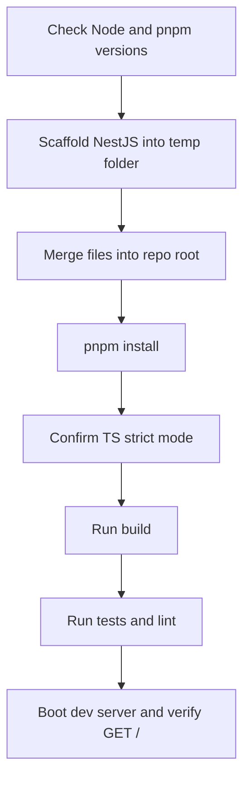

# Plan: Initialize NestJS at Repository Root

- Date: 2026-09-02
- Status: Draft for review
- Scope: Scaffolding only — no business functionality

## 1. Goal

Install a working NestJS application at the repository root that is capable of hosting
the "Callback Assistant" application described in the `docs/` folder, without implementing
any of its functional units yet.

## 2. Context (from `docs/`)

- [`README.md`](../../README.md) and [`docs/01-callback-assistant.md`](../../docs/01-callback-assistant.md)
  define a call-back system: form submission, validation, persistence, two queues
  (call + action), a call dispatcher, a webhook receiver, and an extensible action engine.
- [`docs/Plans/04-Laravel_vs_NestJS.md`](../../docs/Plans/04-Laravel_vs_NestJS.md) concludes that
  **NestJS** (TypeScript / Node.js) is the chosen backend framework.
- [`docs/03-implementation-general.md`](../../docs/03-implementation-general.md) defines the
  framework-agnostic functional units and the ports (`CallProvider`, `Action`,
  `NotificationPort`, `CalendarPort`, `RequestStore`, `CallDetailStore`).
- The repository currently contains only documentation, no `package.json` and no source code.

## 3. Decisions (confirmed with user)

| Decision | Choice |
|---|---|
| Application location | Repository root (single backend project for now) |
| Package manager | pnpm |
| Functionality | None — pure scaffolding |
| Language | TypeScript, strict mode on |

## 4. Prerequisites

- Node.js >= 20 (NestJS 11 officially supports Node 20 / 22; 22 LTS recommended)
- pnpm — install with `corepack enable pnpm` (Corepack ships with Node) or `npm install -g pnpm`

Verify with:

```powershell
node -v
pnpm -v
```

## 5. Step-by-step Procedure

All commands are PowerShell, run from the repository root
(`E:\projects\AI\2026-08-31-ai-sztens-dev`).

### 5.1 Check prerequisites

```powershell
node -v
pnpm -v
```

### 5.2 Scaffold NestJS into a temporary folder

The repository root is not empty (it contains `docs/`, `README.md`, `.idea/`, `.roo/`) and is
already a git repository, so scaffold into a temporary sibling folder first, then merge the
generated files back.

> Note: the latest `@nestjs/cli` (schematics v12) requires Node >= 22. On Node 20 the CLI
> must be pinned to the v11 line, which still generates a NestJS 11 project that runs on
> Node 20.

```powershell
npx --yes @nestjs/cli@11 new nestjs-scaffold --package-manager pnpm --skip-git --skip-install --strict
```

Flags:
- `--package-manager pnpm` — use pnpm
- `--skip-git` — do not run `git init` inside the temp folder (the repo is already git)
- `--skip-install` — defer dependency install until after the merge
- `--strict` — enable TypeScript strict mode

### 5.3 Merge generated files into the repository root

Move every generated file/directory into the root, but **exclude the generated
`README.md`** so the existing project `README.md` is preserved.

```powershell
Get-ChildItem -Path .\nestjs-scaffold -Force | Where-Object { $_.Name -ne 'README.md' } | Move-Item -Destination .
Remove-Item .\nestjs-scaffold
```

Confirm the existing `docs/`, `README.md`, `.idea/` and `.roo/` are untouched.

### 5.4 Install dependencies

```powershell
pnpm install
```

### 5.5 Confirm TypeScript strict mode

Verify [`tsconfig.json`](tsconfig.json) contains `"strict": true` (or the equivalent
strict flags such as `strictNullChecks` and `noImplicitAny`).

### 5.6 Optional scaffold tweaks (no business logic)

- In [`src/main.ts`](src/main.ts), read the port from `process.env.PORT ?? 3000` and call
  `app.enableShutdownHooks()`.
- Set a global prefix `api` (via `app.setGlobalPrefix('api')`) to match the documented
  endpoint shape `POST /api/callback-requests`. This is configuration only, not functionality.

## 6. Expected Resulting Files

- `package.json` — `@nestjs/*` dependencies and scripts (`start`, `start:dev`, `build`,
  `test`, `test:e2e`, `lint`, `format`)
- `pnpm-lock.yaml`
- `nest-cli.json`
- `tsconfig.json`, `tsconfig.build.json`
- `src/main.ts`, `src/app.module.ts`, `src/app.controller.ts`, `src/app.service.ts`
- `src/app.controller.spec.ts` (default unit test)
- `test/app.e2e-spec.ts`, `test/jest-e2e.json`
- `eslint.config.mjs` (ESLint 9 flat config) and `.prettierrc`
- `.gitignore`

Existing `docs/`, `README.md`, `.idea/` and `.roo/` must remain unchanged.

## 7. Verification

```powershell
pnpm run build       # must complete without errors
pnpm test            # default unit + e2e tests must pass
pnpm run lint        # must pass
pnpm run start:dev   # dev server boots; GET http://localhost:3000/api returns Hello World
```

> With the global `api` prefix set in [`src/main.ts`](../../src/main.ts), the default
> endpoint is served at `GET /api` (not `/`).

## 8. Out of Scope (intentionally deferred)

- No controllers, services, DTOs, entities, queues or providers for the business domain
- No database / ORM setup
- No VAPI integration
- No auth, validation, webhooks, or action engine

## 9. Future Module Mapping (reference only, not implemented now)

| `docs/03` functional unit | Planned NestJS module |
|---|---|
| F2 Request API + F3 Validation | `CallbackRequestsModule` (controller, DTO, class-validator) |
| F4 Request Persistence | `RequestStoreModule` (Postgres + ORM) |
| F5 Work Queue | `QueueModule` (pg-boss) |
| F6 Call Dispatcher | `CallDispatcherModule` (queue processor) |
| F7 Call Provider | `CallProviderModule` (port `CallProvider` + VAPI adapter) |
| F8 Webhook Receiver | `WebhooksModule` |
| F10/F11 Action Executor + Registry | `ActionsModule` |
| F12 Notification Sender | `NotificationsModule` |
| F13 Calendar Scheduler | `CalendarModule` |
| F15 Logging / Observability | `LoggerModule` (structured logging, correlation ids) |

## 10. Workflow Diagram


