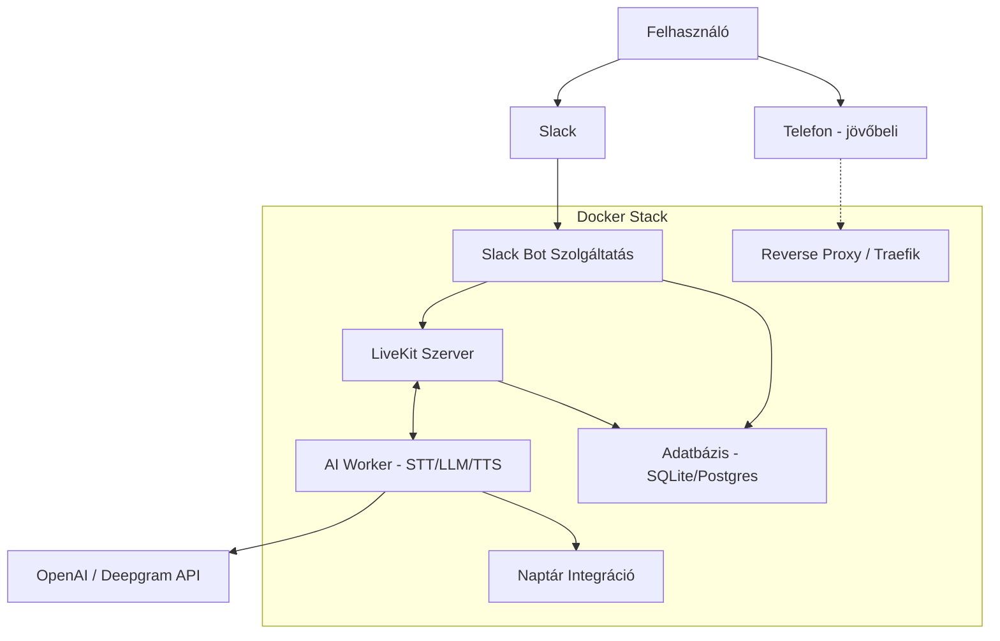
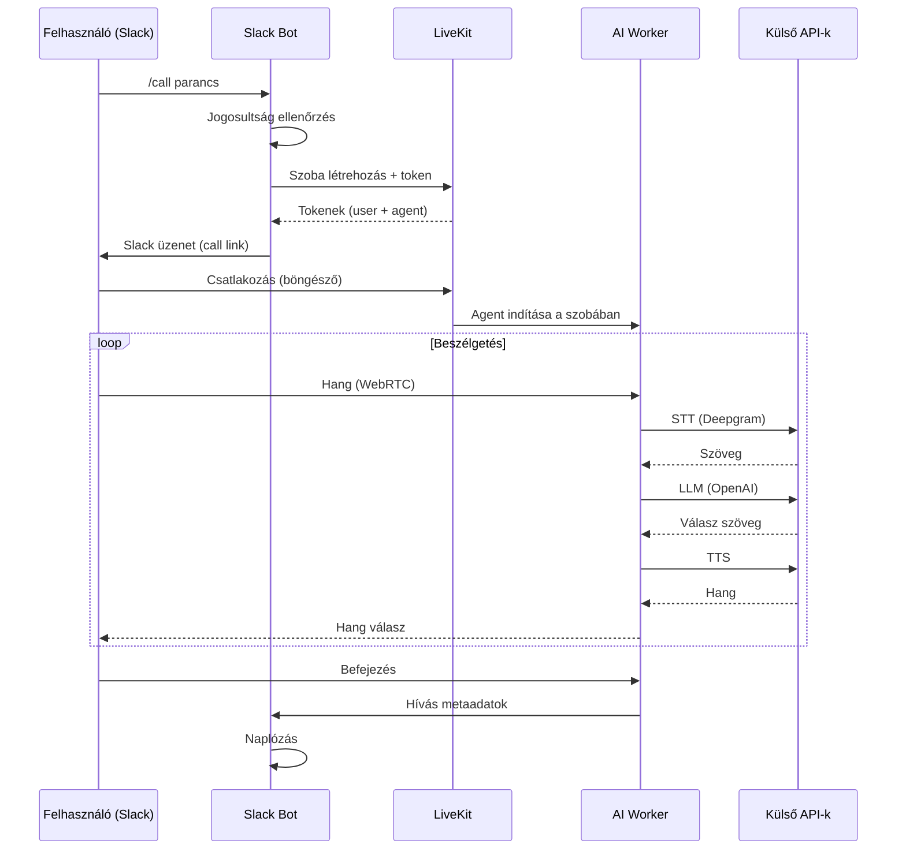

# Rendszerarchitektúra

## 📐 Áttekintés

Az AI Hangasszisztens Rendszer egy **mikroszolgáltatás-alapú architektúrára** épül, ahol minden komponens saját Docker konténerben fut. A kommunikáció a LiveKit platformon keresztül valósul meg, amely valós idejű audio/video adatfolyamokat kezel.

## 🏗 Komponens áttekintés (magas szinten)



## 🐳 Docker konténerek – részletes lista

A rendszer várhatóan **6-8 Docker konténerből** áll majd. Az alábbi lista az egyes konténerek szerepét és felelősségi körét mutatja be:

### 1. 🤖 Slack Bot Service
- **Szerep**: Fogadja a Slack eseményeket és slash parancsokat
- **Felelősségek**:
  - Slack események (slash parancsok, mention-ek) feldolgozása
  - Felhasználói jogosultságok ellenőrzése
  - LiveKit szoba létrehozása a híváshoz
  - Hívás metaadatok naplózása
- **Tech**: Node.js / Python (a későbbi implementáció során dől el)

### 2. 📡 LiveKit Server
- **Szerep**: WebRTC szerver, valós idejű média gateway
- **Felelősségek**:
  - Audio/video adatfolyamok továbbítása
  - Tokenek generálása a kliensek számára
  - Szobakezelés
- **Konfiguráció**: [`livekit.yaml`](configuration-livekit.md:1)
- **Portok**: 7880 (HTTP/WS), 7881 (TCP), 7882 (UDP range)

### 3. 🧠 AI Worker (Agent)
- **Szerep**: A beszélgetés „agya"
- **Felelősségek**:
  - STT (Speech-to-Text) – beszéd szöveggé alakítása
  - LLM (Large Language Model) – válasz generálása
  - TTS (Text-to-Speech) – válasz hangossá alakítása
  - Eszközkezelés (pl. naptár foglalás)
- **Tech**: Python (LiveKit Agents SDK)
- **Külső API-k**: OpenAI, Deepgram (és továbbiak)

### 4. 📅 Calendar Integration Service
- **Szerep**: Külső naptárszolgáltatásokkal való kommunikáció
- **Felelősségek**:
  - Google Calendar OAuth2 flow kezelése
  - Időpontok lekérdezése és foglalása
  - OAuth tokenek tárolása
- **Tech**: Python / Node.js

### 5. 🗄 Database Service
- **Szerep**: Perzisztens adatok tárolása
- **Felelősségek**:
  - Hívásnaplók
  - Felhasználói beállítások
  - OAuth tokenek (titkosítva)
- **Tech választás**: SQLite (könnyű, Pi-hez ideális) vagy PostgreSQL

### 6. 🌐 Reverse Proxy (Traefik / Caddy)
- **Szerep**: HTTPS végpont és útválasztás
- **Felelősségek**:
  - SSL/TLS tanúsítványkezelés (Let's Encrypt)
  - Slack webhook-ok HTTPS végpontjának biztosítása
  - Külső portok minimalizálása
- **Port**: 443 (HTTPS)

### 7. 📞 Telephony Gateway (jövőbeli – placeholder)
- **Szerep**: PSTN/SIP integráció
- **Státusz**: Csak placeholder, későbbi fázisban implementálandó
- **Lásd**: [`telephony-placeholder.md`](telephony-placeholder.md:1)

### 8. 🔧 Utility / Init Container (opcionális)
- **Szerep**: Egyszeri inicializálási feladatok
- **Felelősségek**:
  - Adatbázis séma létrehozása első indításkor
  - Konfiguráció validáció

## 🔄 Adatfolyam – tipikus hívás



## 🔐 Biztonsági megfontolások

- Minden API kulcs a `.env` fájlban, **sosincs a képben** (image-be építve)
- A Reverse Proxy biztosítja a HTTPS-t
- A LiveKit API kulcsok és secret-ek rotálhatók
- Az adatbázis jelszavak és OAuth tokenek titkosítva tárolódnak
- Slack signing secret ellenőrzés minden webhook hívásnál

## 🌐 Hálózati topológia

```
Külső hálózat (internet)
    │
    ├─ Slack webhook ──→ Traefik (443) ──→ Slack Bot
    └─ LiveKit kliensek ──→ LiveKit (7880-7882)
                              │
                              ├─→ AI Worker (belső hálózat)
                              └─→ Database (belső hálózat)
```

A belső szolgáltatások **csak a Docker belső hálózaton** kommunikálnak egymással – ez csökkenti a támadási felületet.

## 📦 Skálázási lehetőségek (jövőbeli)

- AI Worker horizontálisan skálázható (több párhuzamos hívás)
- Database átváltható PostgreSQL-re, ha a SQLite nem elég
- A LiveKit több node-on is futtatható (Redis szükséges)

## 🔗 Kapcsolódó dokumentumok

- [`configuration-docker-compose.md`](configuration-docker-compose.md:1) – A konténerek indítási konfigurációja
- [`configuration-livekit.md`](configuration-livekit.md:1) – LiveKit szerver részletes beállításai
- [`software-requirements.md`](software-requirements.md:1) – A szükséges szoftverek listája
