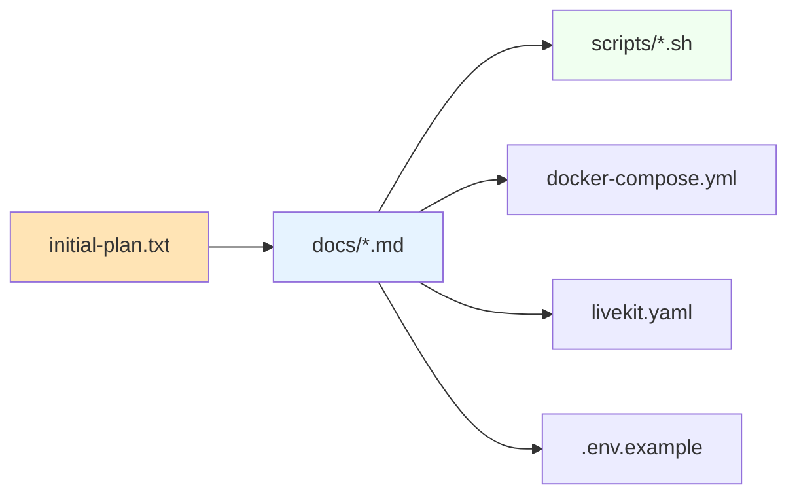

# Könyvtárstruktúra és a `scripts/` Mappa

Ez a dokumentum a teljes projekt könyvtárszerkezetét írja le, kiemelt figyelemmel a [`scripts/`](../scripts/) mappa szerepére és tartalmára.

## 📁 Teljes projekt struktúra (tervezett)

```
.
├── .env                              # Környezeti változók (NEM kerül git-be!)
├── .env.example                      # Példa .env fájl (commitolható)
├── .gitignore                        # Git figyelmen kívül hagyandó fájlok
├── README.md                         # Fő projekt README
├── docker-compose.yml                # A teljes stack definíciója
├── livekit.yaml                      # LiveKit szerver konfiguráció
│
├── docs/                             # Dokumentáció (MINDENT ide teszünk)
│   ├── initial-plan.txt              # Eredeti projekt terv (forrás)
│   ├── README.md                     # Dokumentáció belépési pont
│   ├── architecture.md               # Rendszerarchitektúra
│   ├── raspberry-pi-preparation.md   # Pi előkészítés
│   ├── software-requirements.md      # Szoftver lista
│   ├── directory-structure.md        # Ez a fájl
│   ├── configuration-env.md          # .env konfiguráció
│   ├── configuration-docker-compose.md # docker-compose.yml dokumentáció
│   ├── configuration-livekit.md      # livekit.yaml dokumentáció
│   ├── configuration-slack.md        # Slack konfiguráció
│   ├── telephony-placeholder.md      # Telefonos integráció (jövőbeli)
│   └── deployment-guide.md           # Telepítési útmutató
│
├── scripts/                          # Telepítő és karbantartó scriptek
│   ├── README.md                     # Scriptek dokumentációja
│   ├── install-prerequisites.sh      # Fő telepítő script
│   ├── lib/                          # Közös segédfüggvények
│   │   ├── colors.sh                 # Színes terminál kimenet
│   │   ├── logging.sh                # Közös logolás
│   │   └── checks.sh                 # Előfeltétel ellenőrzések
│   ├── setup-docker.sh               # Docker telepítő (önálló is futtatható)
│   ├── setup-system.sh               # RPi előkészítés
│   ├── generate-env.sh               # .env fájl generálása
│   ├── generate-livekit-keys.sh      # LiveKit kulcsok generálása
│   ├── backup.sh                     # Adatbázis és konfig backup
│   ├── update.sh                     # Frissítő script
│   └── uninstall.sh                  # Eltávolító script
│
├── app/                              # Alkalmazás forráskódja (konténerenként)
│   ├── slack-bot/                    # Slack bot service
│   │   ├── Dockerfile
│   │   ├── package.json (vagy pyproject.toml)
│   │   └── src/
│   ├── ai-worker/                    # AI agent
│   │   ├── Dockerfile
│   │   ├── requirements.txt
│   │   └── src/
│   ├── calendar-service/             # Naptár integráció
│   │   ├── Dockerfile
│   │   ├── requirements.txt
│   │   └── src/
│   └── db/                           # Adatbázis init scriptek
│       └── init.sql
│
├── data/                             # Perzisztens adatok (gitignore)
│   ├── sqlite/                       # SQLite adatbázis
│   ├── logs/                         # Alkalmazás logok
│   └── uploads/                      # Feltöltött fájlok (ha lesz)
│
└── plans/                            # Tervek, vázlatok (opcionális)
    └── *.md
```

## 📂 A `scripts/` Mappa Szerepe

### Miért van külön scripts mappa?

1. **Elkülönített felelősség**: A telepítési és karbantartási logika nem keveredik az alkalmazás kóddal
2. **Újrafelhasználhatóság**: A scriptek önmagukban is futtathatók
3. **Dokumentálhatóság**: Külön README magyarázza mindegyiket
4. **Verziókövetés**: Minden script változását a git követi
5. **Review-zhatóság**: A scriptek kódként viselkednek, code review-ra alkalmasak

### A `scripts/` Mappa Tervezett Tartalma

#### Fő script: `install-prerequisites.sh`

Ez a script a [`software-requirements.md`](software-requirements.md:1) és [`raspberry-pi-preparation.md`](raspberry-pi-preparation.md:1) alapján:

- Ellenőrzi az operációs rendszert és architektúrát (ARM64)
- Frissíti a csomaglistát
- Telepíti az alapvető segédprogramokat
- Hozzáadja a Docker hivatalos tárolóját
- Telepíti a Docker Engine-t és a Compose plugint
- Hozzáadja a felhasználót a `docker` csoporthoz
- Ellenőrzi a telepítést (verziók, hello-world konténer)

**Bemeneti paraméterek** (tervezett):
- `-y, --yes` – Feltételezett igennel minden kérdésre
- `--skip-os-update` – Kihagyja az OS frissítést
- `--dry-run` – Csak kiírja, mit csinálna
- `--help` – Súgó megjelenítése

**Kilépési kódok**:
- 0 – Sikeres
- 1 – Általános hiba
- 2 – Nem támogatott OS
- 3 – Docker telepítési hiba
- 4 – Hálózati hiba

#### Egyéb scriptek (áttekintés)

| Script | Célja | Mikor futtatandó |
|--------|-------|------------------|
| `install-prerequisites.sh` | Teljes telepítés | Egyszer, friss telepítésnél |
| `setup-docker.sh` | Csak Docker telepítés | Ha csak Docker kell |
| `setup-system.sh` | Pi hardening | Érzékeny környezetben |
| `generate-env.sh` | .env fájl generálása | Első indítás előtt |
| `generate-livekit-keys.sh` | API kulcsok generálása | Egyszer, deployment előtt |
| `backup.sh` | Adatmentés | Rendszeresen (cron) |
| `update.sh` | Verziófrissítés | Új release-eknél |
| `uninstall.sh` | Teljes eltávolítás | Ha le kell állítani |

### A `scripts/lib/` Almappa

A közös kódot érdemes kiemelni, hogy ne ismétlődjön:

```bash
scripts/lib/
├── colors.sh    # Színes kimenet (zöld=siker, piros=hiba, sárga=figyelem)
├── logging.sh   # Konzisztens log formátum dátummal és szinttel
└── checks.sh    # Előfeltétel ellenőrzések (root, OS, arch, net)
```

### Script Konvenciók

Minden script a `scripts/` mappában az alábbi konvenciókat követi:

#### Formázás
- **Shebang**: `#!/usr/bin/env bash` (vagy `#!/usr/bin/env sh` ha POSIX-kompatibilis kell)
- **Strict mode**: `set -euo pipefail` a hibák korai észlelésére
- **Bevezető komment**: A script célja, szerzője, függőségei

#### Hibakezelés
- Minden parancs után ellenőrzés (`|| true`, ha kell)
- Hibák esetén a `trap` cleanup függvény hívása
- Világos hibaüzenetek a felhasználónak

#### Interaktivitás
- Alapértelmezetten interaktív (kérdéseket tesz fel)
- `-y` flag a non-interaktív módhoz (CI/CD-hez)
- `--dry-run` mód a biztonságos teszteléshez

#### Kimenet
- Standard kimenet (stdout) a normál üzeneteknek
- Szabványos hiba (stderr) a figyelmeztetéseknek és hibáknak
- Színes kiemelés a fontos lépéseknél

### Script Futtatási Mód

Mivel a scriptek a `scripts/` mappában vannak, ezek futtatási módjai:

```bash
# Közvetlen futtatás (ha van végrehajtási jog)
./scripts/install-prerequisites.sh

# Bash-szal explicit
bash scripts/install-prerequisites.sh

# Egy lépésben az README-ből hivatkozva
curl -fsSL https://.../install-prerequisites.sh | bash
```

⚠️ **Biztonsági figyelmeztetés**: A `curl | bash` minta kényelmes, de veszélyes, mert a letöltött script azonnal root jogokkal fut. Helyette:

```bash
# Biztonságosabb alternatíva
curl -fsSL https://.../install-prerequisites.sh -o install.sh
less install.sh     # Áttekintés
bash install.sh     # Futtatás
```

## 🗂 A `docs/` Mappa Kapcsolata a Többi Mappával



- A [`docs/initial-plan.txt`](initial-plan.txt:1) a **forrás** – minden más dokumentum ebből indul
- A [`docs/*.md`](README.md:1) fájlok a **terv** – ezeket review-zod először
- A [`scripts/*.sh`](../scripts/) a **végrehajtás** – a telepítést végzi
- A konfigurációs fájlok a **futtatás** alapjai

## 🔄 Fejlesztési Folyamat

1. **Tervezés** (jelenlegi fázis) – A dokumentumok készítése
2. **Review** – Te átnézed a terveket
3. **Implementáció** – A scriptek és konfigurációk megírása
4. **Tesztelés** – A telepítés végrehajtása
5. **Finomhangolás** – Hibajavítás, optimalizálás

## ⚠️ Ami Most NEM Készül El

A terv szerint **most csak a dokumentáció** készül:

- ❌ Maga a `scripts/install-prerequisites.sh` script
- ❌ A `docker-compose.yml`
- ❌ A `livekit.yaml`
- ❌ Az alkalmazás kódja
- ❌ A `Dockerfile`-ok

Ezek a későbbi fázisokban készülnek, miután a tervet jóváhagytad.

## 🔗 Kapcsolódó Dokumentumok

- [`software-requirements.md`](software-requirements.md:1) – Mit telepít a script
- [`raspberry-pi-preparation.md`](raspberry-pi-preparation.md:1) – Mit készít elő a Pi-n
- [`deployment-guide.md`](deployment-guide.md:1) – Hogyan használjuk a scripteket
