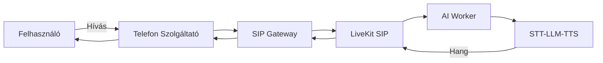
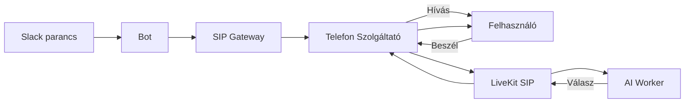

# Telefonos Integráció – Jövőbeli Terv (Placeholder)

> **⚠️ Fontos**: Ez a dokumentum **csak leírás és placeholder** a jövőbeli telefonos integrációhoz. Az [`docs/initial-plan.txt`](initial-plan.txt:1) szerint a telefonos rendszer **későbbi fázisban** kerül implementálásra – jelenleg NEM része a scope-nak.

## 🎯 A Funkció Célja

A jövőben a rendszernek képesnek kell lennie:

- **Kimenő hívások** kezdeményezésére (az AI felhív egy felhasználót)
- **Bejövő hívások** fogadására (a felhasználó felhív egy számot, és az AI válaszol)
- Ugyanazt az STT → LLM → TTS pipeline-t használni, mint a Slack esetében

## 📞 Telefonos Provider Opciók

Több szolgáltató is szóba jöhet a jövőbeli implementációhoz:

### 1. Twilio (Legelterjedtebb)

- **Előny**: Nagyon érett API, kiváló dokumentáció, megbízható
- **Hátrány**: Viszonylag drága, amerikai központú (magyar számok drágábbak)
- **Szolgáltatások**:
  - Voice (PSTN hívások)
  - Studio (visual flow)
  - TaskRouter (hívásirányítás)

#### Használat módjai

- **Twilio Voice + SIP**: A LiveKit SIP gateway-en csatlakozik
- **Twilio Media Streams**: A Twilio WebSocket-en streameli a hangot, az AI Worker dolgozza fel

### 2. Vonage (korábban Nexmo)

- **Előny**: Versenyképes árak, jó európai lefedettség
- **Hátrány**: API-ja kevésbé érett mint a Twilio

### 3. Magyar Szolgáltatók

- **Invitech**, **Vodafone Hungary**, **Yettel**: Magyar telefonszámokhoz
- SIP trunk szolgáltatás jellemzően elérhető
- Előny: Magyar nyelvű support, alacsonyabb költségek magyar számokra
- Hátrány: Általában kevésbé fejlett API

### 4. Saját SIP Szerver (Asterisk, FreeSWITCH)

- **Előny**: Teljes kontroll, alacsony üzemeltetési költség
- **Hátrány**: Magas üzemeltetési teher, bonyolult
- Csak haladó felhasználóknak ajánlott

## 🔌 Integrációs Pontok (Tervezett Architektúra)

### Bejövő hívás folyamata (jövőbeli)

### Kimenő hívás folyamata (jövőbeli)

## 🏗 Architektúra Változások (Jövőbeli)

A rendszer a telefonos integrációhoz a következő elemekkel bővülne:

### Új Konténerek

- **SIP Gateway** – SIP ↔ LiveKit átjáró
- **Telephony Provider Client** – Twilio/Vonage API integráció
- **Call Router** – Hívásirányítás és menedzsment

### Módosított Konténerek

- **AI Worker** – Képes kezelni a telefonos hangot (8kHz, keskeny sáv)
- **Slack Bot** – Új parancsok a hívások kezdeményezéséhez

## 📋 Szükséges Konfiguráció (Placeholder)

A [`configuration-env.md`](configuration-env.md:1)-ben már placeholder-ek vannak:

| Változó | Leírás | Státusz |
|---------|--------|---------|
| `TWILIO_ACCOUNT_SID` | Twilio fiók azonosító | placeholder |
| `TWILIO_AUTH_TOKEN` | Twilio hitelesítési token | placeholder |
| `TWILIO_PHONE_NUMBER` | A kimenő szám (E.164 formátumban) | placeholder |
| `TWILIO_WEBHOOK_URL` | Twilio webhook URL a státusz-frissítésekhez | placeholder |
| `SIP_HOST` | SIP szerver hosztnév | placeholder |
| `SIP_USERNAME` | SIP felhasználónév | placeholder |
| `SIP_PASSWORD` | SIP jelszó | placeholder |
| `SIP_PORT` | SIP port (alapértelmezetten 5060) | placeholder |

## 🎙 Audio Különbségek (Slack vs. Telefon)

A telefonos rendszer más audio formátumot használ, mint a Slack:

| Tulajdonság | Slack/LiveKit WebRTC | Telefon (PSTN) |
|-------------|---------------------|-----------------|
| Sávszélesség | Széles sáv (16-48 kHz) | Keskeny sáv (8 kHz) |
| Kodek | Opus | G.711 (µ-law/A-law) |
| Késleltetés | ~50-200 ms | ~150-400 ms |
| Zajszűrés | Jellemzően nincs | Szükséges (VAD, AGC) |

### Implementációs Kihívások

- Az AI Worker-nek alkalmazkodnia kell a keskeny sávú hanghoz
- Voice Activity Detection (VAD) agresszívebb beállítása
- A háttérzaj-szűrés fontosabb telefonon
- A turn-taking (beszélgetés váltás) érzékenyebb

## 📞 Magyar Telefonszám Követelmények

Magyar telefonszám használata esetén:

- **Szám formátum**: +36 XX XXX XXXX
- **Hordozhatóság**: A magyar szabályozás szerint hordozható
- **Dokumentáció**: A szolgáltató általában kér személyes azonosítást
- **Idő**: A szám aktiválása napokig is eltarthat

## 🧾 Jogi és Megfelelőségi Szempontok

A telefonos AI asszisztens használatához figyelembe kell venni:

- **GDPR**: Hívásrögzítés csak explicit beleegyezéssel
- **NIS2 / hazai szabályozások**: Hálózati és információbiztonsági előírások
- **NMHH (Nemzeti Média- és Hírközlési Hatóság)**: Magyarországi szabályozás
- **Hívásazonosítás**: A hívónak be kell mutatkoznia, hacsak nem kifejezetten rejtett szám
- **Robot hívások**: Számos jogrendszerben korlátozottak

## ⏱ Implementációs Fázis (Becsült, tervezés szinten)

A telefonos integráció **nem** a jelenlegi scope része. A hozzávetőleges későbbi fázisok:

1. **Fázis 1**: Provider kiválasztása és fiók létrehozása
2. **Fázis 2**: SIP gateway implementálása
3. **Fázis 3**: AI Worker módosítása (keskeny sávú hang)
4. **Fázis 4**: Slack parancsok kiegészítése (pl. `/call +36...`)
5. **Fázis 5**: Bejövő szám konfigurálása
6. **Fázis 6**: Tesztelés éles környezetben

## ❓ Nyitott Kérdések (Jövőbeli Döntéshez)

A telefonos integráció megkezdése előtt el kell dönteni:

- Melyik szolgáltatót használjuk (Twilio, Vonage, magyar szolgáltató)?
- Csak kimenő vagy bejövő hívás is kell?
- Milyen telefonszámot (magyar, nemzetközi, mobil, vezetékes)?
- Kell-e hívásrögzítés?
- Milyen költségkerettel gazdálkodhatunk?

## 🔗 Kapcsolódó Dokumentumok

- [`architecture.md`](architecture.md:1) – Az alap architektúra, amibe integrálódik
- [`configuration-env.md`](configuration-env.md:1) – A placeholder környezeti változók
- [`README.md`](README.md:1) – Vissza a főoldalra

> **Ne felejtsd el**: Ez a fájl jelenleg csak terv – a tényleges implementáció a jövőben készül, és a scope-ját, költségeit, valamint a szolgáltató-választást külön projektként kell kezelni.
