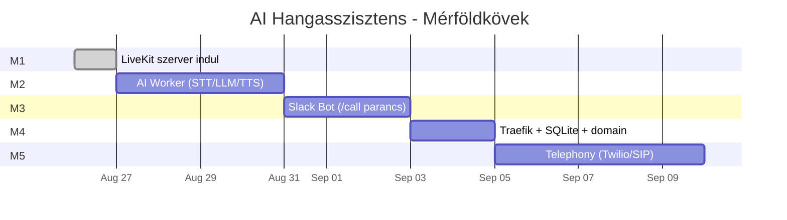

# Mérföldkövek (Milestones)

Ez a dokumentum az AI Hangasszisztens Rendszer fejlesztésének ütemezését írja le, mérföldkövekre bontva. Minden mérföldkő önállóan elfogadható és release-elhető, a dokumentumok és a kód ennek megfelelően iterálódnak.

## 🗺 Áttekintés

| # | Név | Fő tartalom | Belépési kritérium |
|---|-----|-------------|---------------------|
| [**M1**](#-m1--livekit-alap) | **LiveKit alap** | `livekit` konténer, dev `.env`, smoke teszt | A `scripts/smoke-test-livekit.sh` exit 0 |
| [M2](#-m2--ai-worker) | AI Worker | Python LiveKit Agents SDK, STT/LLM/TTS pipeline | Böngészőből `/call` nélkül is lehet beszélgetni az AI-val |
| [M3](#-m3--slack-bot) | Slack Bot | Node.js service, `/call` slash parancs, tokenek | Slack `/call` indít egy működő hívást |
| [M4](#-m4--reverse-proxy--db) | Reverse proxy + DB | Traefik, Let's Encrypt, SQLite volume, domain | Minden HTTPS-en keresztül is működik |
| [M5](#-m5--telephony-integráció) | Telefonos integráció | Twilio/SIP, kimenő és bejövő hívás | Telefonról is elérhető az AI |

---

## ✅ M1 – LiveKit alap

**Státusz**: Befejezve (2026-08-26)

A terv részletei: [`docs/memories/2026-08-26-milestone-1-livekit-on-pi-plan.md`](../memories/2026-08-26-milestone-1-livekit-on-pi-plan.md)

**Scope**:
- `docker-compose.yml` csak a `livekit` service-t tartalmazza.
- `livekit.yaml` minimális: `port 7880`, RTC `tcp_port 7881`, `udp_port 7882`, TURN/STUN, room limitek.
- `.env.example` + `.env`: DEV ONLY kulcsokkal (egyértelműen jelölve), `LIVEKIT_URL=ws://localhost:7880`.
- `scripts/`: `install-prerequisites.sh`, `setup-system.sh`, `setup-docker.sh`, `generate-env.sh`, `smoke-test-livekit.sh`, `lib/colors.sh`, `lib/logging.sh`, `lib/checks.sh`.
- Közvetlen port binding (`7880:7880`, `7881:7881`, `7882:7882/udp`, `7883-7892:7883-7892/udp`) – nincs reverse proxy.
- Health check a konténeren.

**Elfogadási kritériumok**:
- `docker compose up -d livekit` sikeresen elindítja a konténert
- A konténer 5 másodpercen belül `healthy` státuszba kerül
- `curl http://localhost:7880/` 200-at ad vissza
- `curl http://localhost:7880/rtc` JSON-t ad vissza `ice_servers` tömbbel
- `scripts/smoke-test-livekit.sh` kilépési kódja `0`
- A logokban nincs `ERROR` szintű bejegyzés
- ARM64-en (Raspberry Pi) is működik

**Explicit kimaradók (későbbi mérföldkövekbe tartoznak)**:
- Traefik / reverse proxy / HTTPS
- Slack Bot / `/call` parancs
- AI Worker (STT/LLM/TTS)
- Calendar service
- Database (SQLite/Postgres)
- Telefonos integráció

---

## 🔜 M2 – AI Worker

**Státusz**: Tervezés alatt

A `livekit` service „agya" – a felhasználó beszédét szöveggé alakítja, az LLM-mel választ generál, és a választ hangos szöveggé (TTS) alakítja vissza a [`livekit`](01-architecture.md:57) szobákba.

**Hozzáadandó**:
- `app/ai-worker/` mappa: Python LiveKit Agents SDK alapú service, `Dockerfile`, `requirements.txt`.
- `docker-compose.yml`-hez új `ai-worker` service.
- `.env` kiegészítése: `OPENAI_API_KEY`, `DEEPGRAM_API_KEY`, `OPENAI_MODEL`, `DEEPGRAM_LANGUAGE` (magyar).
- Resource limitek (CPU/RAM) a Pi 8GB-jához optimalizálva.
- `scripts/smoke-test-ai-worker.sh`: a worker csatlakozik egy teszt szobához, és válaszol egy egyszerű kérdésre.

**Elfogadási kritérium**:
- A böngészőből megnyitva egy LiveKit teszt szobát, az AI válaszol hangosan egy magyar nyelvű kérdésre.
- A M1 smoke teszt továbbra is átmegy.

**Dokumentáció frissítés**:
- `03-software-requirements.md` kiegészítése a Python/LiveKit Agents függőségekkel.
- `05-configuration-env.md` OpenAI/Deepgram szekciójának aktiválása.
- Új terv memória: `docs/memories/<dátum>-m2-ai-worker-plan.md`.

---

## 🔜 M3 – Slack Bot

**Státusz**: Tervezés alatt

A Slack `/call` slash parancsot fogadja, és LiveKit szobát + tokent generál a felhasználónak.

**Hozzáadandó**:
- `app/slack-bot/` mappa: Node.js + `@slack/bolt` SDK, `Dockerfile`, `package.json`.
- `docker-compose.yml`-hez új `slack-bot` service.
- `.env` kiegészítése: `SLACK_BOT_TOKEN`, `SLACK_SIGNING_SECRET`, `SLACK_APP_TOKEN`, `SLACK_ALLOWED_USERS`.
- A `livekit.yaml` `turn` szekció kibővítése (dinamusan a slack-bottól átadott `user_name` alapján).
- `scripts/smoke-test-slack.sh`: a slack-bot `/call` parancsot szimulálva kiadja a szoba URL-t.

**Elfogadási kritérium**:
- Slack `/call` kiadása után a bot válaszol egy DM üzenettel, ami tartalmazza a LiveKit szoba linket.
- A linkre kattintva a böngészőből csatlakozva az M2-beli AI Worker válaszol.

**Dokumentáció**:
- `08-configuration-slack.md` finalizálása (jelenleg csak referencia).
- Új terv memória: `docs/memories/<dátum>-m3-slack-bot-plan.md`.

---

## 🔜 M4 – Reverse proxy + DB

**Státusz**: Tervezés alatt

A belső hálózatot izoláljuk, és Traefik + Let's Encrypt + SQLite volume kerül bevezetésre.

**Hozzáadandó**:
- `docker-compose.yml`: `internal` + `external` hálózat, `traefik` service, `db` service (Postgres vagy SQLite mount).
- A `livekit.yaml` `webhook` szekció hozzáadása.
- `.env` kiegészítése: `PUBLIC_URL`, `PUBLIC_DOMAIN`, `LETSENCRYPT_EMAIL`, `DATABASE_URL`.
- `app/db/init.sql` séma a hívásnaplóknak.
- Resource limitek minden service-re.
- A `scripts/smoke-test-livekit.sh` kibővítése: HTTPS-en keresztüli elérés.

**Elfogadási kritérium**:
- A teljes stack Traefik-en keresztül, HTTPS-sel elérhető egy valós domainről.
- A Let's Encrypt tanúsítvány automatikusan megújul.
- A health check minden service-en `healthy`.
- A belső service-ek (DB, AI Worker) nem érhetők el kívülről.

**Dokumentáció**:
- `06-configuration-docker-compose.md` finalizálása network és profile szekciókkal.
- Új terv memória: `docs/memories/<dátum>-m4-reverse-proxy-db-plan.md`.

---

## 🔜 M5 – Telefony integráció

**Státusz**: Jövőbeli

A [`09-telephony-placeholder.md`](09-telephony-placeholder.md:1)-ben leírt Twilio (vagy SIP) integráció implementálása, kimenő és bejövő hívásokkal.

**Hozzáadandó**:
- `app/telephony-gateway/` mappa: SIP gateway vagy Twilio webhook handler.
- `docker-compose.yml`-hez új `telephony-gateway` service.
- `.env` kiegészítése: `TWILIO_ACCOUNT_SID`, `TWILIO_AUTH_TOKEN`, `TWILIO_PHONE_NUMBER`, `SIP_HOST`, `SIP_USERNAME`, `SIP_PASSWORD`.
- A `livekit.yaml` `rtc.use_external_ip: true` a WAN-ról jövő kliensekhez.
- A `livekit.yaml` `turn` szekció éles beállítása.

**Elfogadási kritérium**:
- Egy konkrét telefonszámról hívható az AI asszisztens.
- Az AI asszisztens indíthat kimenő hívást egy megadott számra.
- A hívás hangminősége elfogadható, a beszélgetés természetes.

**Dokumentáció**:
- `09-telephony-placeholder.md` átnevezése `09-telephony-implementation.md`-re.
- Új terv memória: `docs/memories/<dátum>-m5-telephony-plan.md`.

---

## 📐 Közös tervezési elvek (minden mérföldkőben)

- **Strict bash mód**: `set -euo pipefail` minden script tetején.
- **SOLID + Clean Code** ([`.roo/rules/general.coding-standards.md`](../../.roo/rules/general.coding-standards.md)).
- **Tervek memóriában**: minden mérföldkő kap egy `docs/memories/<YYYY-MM-DD>-<leírás>-plan.md` fájlt.
- **Egyetlen `.env`** minden szolgáltatáshoz – a konfiguráció nem szétszórt.
- **Gitignore-olt titkok** – `.env` soha nem kerül verziókezelésbe.
- **Smoke teszt minden mérföldkőhöz** – a mérföldkő nem tekinthető késznek automatizált teszt nélkül.
- **Dev → Staging → Production** gondolkodás – M1-M3 dev, M4 staging, M5 production-ready.

---

## 🔗 Kapcsolódó dokumentumok

- [`01-architecture.md`](01-architecture.md:1) – Az általános architektúra, amire a mérföldkövek építenek
- [`02-raspberry-pi-preparation.md`](02-raspberry-pi-preparation.md:1) – A Pi előkészítés (M0)
- [`03-software-requirements.md`](03-software-requirements.md:1) – Verzió-kompatibilitási mátrix
- [`06-configuration-docker-compose.md`](06-configuration-docker-compose.md:1) – A compose fájl, ahogy a mérföldkövek bővítik
- [`10-deployment-guide.md`](10-deployment-guide.md:1) – Az M1 quickstartot tartalmazó telepítési útmutató
- [`docs/memories/`](../memories/) – Az egyes mérföldkövek tervei
