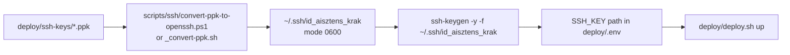

# `scripts/ssh/` — local SSH key tooling

This directory collects the small, **local-machine** helpers used to manage the
SSH key the deploy workflow authenticates with. They are intentionally not
part of the runtime shipped to the droplet; they only run on the operator's
laptop.

> **Scope**
> Everything here runs locally (WSL / Linux / PowerShell). None of these
> scripts touch the droplet. For the droplet-side user creation see
> [`deploy/bootstrap.sh`](../../deploy/bootstrap.sh) and
> [`deploy/ssh-keys/README.md`](../../deploy/ssh-keys/README.md).

---

## File index

| File | Language | Purpose |
| --- | --- | --- |
| [`convert-ppk-to-openssh.ps1`](convert-ppk-to-openssh.ps1:1) | PowerShell | Convert the PuTTY `.ppk` private key to OpenSSH format and install it into the WSL user's `~/.ssh/` with `0600` permissions. |
| [`_convert-ppk.sh`](_convert-ppk.sh:1) | Bash | Linux/WSL counterpart to `convert-ppk-to-openssh.ps1` — calls `puttygen.exe` from WSL. |
| [`_fix-ssh-key.sh`](_fix-ssh-key.sh:1) | Bash | Repair step: copy the key file into `~/.ssh/` and tighten permissions (`0700` dir, `0600` key). |
| [`_inspect-key.sh`](_inspect-key.sh:1) | Bash | Read-only diagnostic — show mode, size, first/last lines and file type of the local private key. |
| [`_install-puttygen.sh`](_install-puttygen.sh:1) | Bash | Install `putty-tools` (provides `puttygen`) on Debian/Ubuntu via `apt-get`. |
| [`_remove-ssh-passphrase.sh`](_remove-ssh-passphrase.sh:1) | Bash | Remove the passphrase from the key referenced in [`deploy/.env`](../../deploy/.env:14), with a backup and a verification step. |

The PowerShell / Bash wrappers for PPK conversion and the bash diagnostic
helpers are the scripts you actually invoke; the passphrase-removal script is
unrelated to the conversion chain and is documented at the bottom.

---

## Typical end-to-end workflow

The steps above correspond to the "first-time setup" path; if you only need
to debug an existing key, jump straight to [`_inspect-key.sh`](_inspect-key.sh:1).

---

## `convert-ppk-to-openssh.ps1`

**Use it when:** the private key committed under [`deploy/ssh-keys/`](../../deploy/ssh-keys/README.md)
is still a PuTTY `.ppk` file and you want it on the WSL side so `ssh` /
`rsync` (used by [`deploy/deploy.sh`](../../deploy/deploy.sh:57)) can consume
it.

- **Where to run:** PowerShell on Windows (no admin needed).
- **Inputs (hard-coded paths in the script):**
  - Source `.ppk`: `E:\projects\AI\2026-08-31-ai-sztens-dev\deploy\ssh-keys\id_aisztens_krak`
  - `puttygen.exe`: `C:\Progs\PuTTY\puttygen.exe`
- **What it does:**
  1. Ensures `~/.ssh` exists inside WSL with mode `0700`.
  2. Calls `puttygen.exe` to convert the `.ppk` to an OpenSSH private key,
     writing it first to a `%TEMP%` file (PuTTYgen is happiest on Windows
     paths).
  3. Copies the converted key into `~/.ssh/id_aisztens_krak` inside WSL and
     sets mode `0600`.
  4. Runs `ssh-keygen -y` to confirm the public half can be derived (this
     will prompt for the PPK passphrase again).
- **On success:** prints a green banner and prompts you to run
  `./deploy/deploy.sh bootstrap`.
- **Failure modes:**
  - `puttygen.exe` missing → exits 1 with a red error.
  - Source `.ppk` missing → exits 1 with a red error.
  - Non-zero exit from `puttygen` → propagated as the script exit code.

---

## `_convert-ppk.sh`

**Use it when:** you prefer to stay in the WSL shell end-to-end instead of
launching PowerShell.

- **Where to run:** WSL / Linux.
- **Inputs (hard-coded in the script):**
  - Source `.ppk`: `/mnt/e/projects/AI/2026-08-31-ai-sztens-dev/deploy/ssh-keys/id_aisztens_krak`
  - Destination: `/home/tkovari/.ssh/id_aisztens_krak`
  - `puttygen.exe`: `/mnt/c/Progs/PuTTY/puttygen.exe` (called from WSL).
- **What it does:**
  1. Ensures `~/.ssh` exists with mode `0700`.
  2. First tries to convert with an **empty** passphrase (no prompt) — works
     when the PPK was saved without one.
  3. On failure, falls back to an interactive `puttygen` call that will show
     PuTTYgen's native passphrase prompt.
  4. Sets mode `0600` on the destination and verifies with `ssh-keygen -y`.
- **Why two attempts:** PuTTYgen fails noisily (non-zero) when an empty
  passphrase is supplied to a key that has one; the wrapper treats that as a
  signal to retry interactively.

---

## `_fix-ssh-key.sh`

**Use it when:** the private key exists in `deploy/ssh-keys/` but
[`deploy/deploy.sh`](../../deploy/deploy.sh:57) keeps failing with
`Permission denied (publickey)` because the file ended up with wrong
permissions (e.g. copied from a FAT share that does not preserve `0600`).

- **Source (hard-coded):** `/mnt/e/projects/AI/2026-08-31-ai-sztens-dev/deploy/ssh-keys/id_aisztens_krak`
- **Destination:** `$HOME/.ssh/id_aisztens_krak`
- **What it does:**
  1. `mkdir -p ~/.ssh && chmod 700 ~/.ssh`.
  2. `cp` the source key into place.
  3. `chmod 600` the destination.
  4. Prints the final `ls -la` listing, then runs `ssh-keygen -y -f` so you
     can copy the public half into `authorized_keys` if you need to.
- **Note:** this script does **not** decrypt or re-encrypt the key; if it is
  passphrase-protected and you want deploys to be unattended, follow up with
  [`_remove-ssh-passphrase.sh`](_remove-ssh-passphrase.sh:1) or add the key to
  `ssh-agent` (see [`deploy/README.md`](../../deploy/README.md:23)).

---

## `_inspect-key.sh`

**Use it when:** something looks wrong with the local key file and you want
a quick read-only diagnostic before touching anything.

- **Target (hard-coded):** `/home/tkovari/.ssh/id_aisztens_krak`
- **What it prints:**
  - `stat` (size, mode, mtime)
  - first and last 5 lines (helpful to spot extra whitespace, BOM, or a
    pasted footer that breaks parsing)
  - line count
  - first 200 bytes as `od -c` (catches encoding issues, e.g. UTF-16 from a
    Windows paste)
  - `file` classification (e.g. `OpenSSH private key`, `RSA private key`,
    `PuTTY PPK`)
- **Read-only:** never modifies the file.

---

## `_install-puttygen.sh`

**Use it when:** you want to run [`_convert-ppk.sh`](_convert-ppk.sh:1) but
the Linux-side `puttygen` CLI is not installed.

- **Where to run:** Debian/Ubuntu (or WSL on top of one).
- **What it does:** if `puttygen` is not on `PATH`, runs
  `sudo apt-get update -y` and `sudo apt-get install -y putty-tools`.
- **Output:** the first two lines of `puttygen --version` and the resolved
  `which puttygen` path.

> **Why this exists:** the conversion scripts call `puttygen.exe` (the
> Windows binary) directly, so you usually do *not* need the Linux package.
> Install this only if you prefer the Linux CLI to the Windows GUI — the
> conversion scripts already abstract over which binary is used.

---

## `_remove-ssh-passphrase.sh`

**Use it when:** the key referenced in `deploy/.env` (`SSH_KEY=`) is
encrypted and you want unattended deploys. Read
[`docs/history/2026-09-23--19-16-40-ssh-key-config-in-deploy-sh.md`](../../docs/history/2026-09-23--19-16-40-ssh-key-config-in-deploy-sh.md)
for the context — `deploy.sh` always passes
`-o IdentitiesOnly=yes -i "$SSH_KEY"`, so without an agent every
`ssh`/`scp`/`rsync` call will prompt.

- **Where to run:** repo root, in WSL or Linux.
- **What it does:**
  1. Reads `SSH_KEY=` from [`deploy/.env`](../../deploy/.env:14), expands
     `~`, verifies the file exists and starts with one of the standard
     OpenSSH/PEM headers.
  2. Backs the original key up to `<key>.bak.<UTC-timestamp>` and `chmod
     600`s the backup.
  3. Calls `ssh-keygen -p -f <key> -N ""` to remove the passphrase. If
     `$SSH_KEY_PASSPHRASE` is set in the environment, it is passed via `-P`
     so the script can run unattended; otherwise the script lets
     `ssh-keygen` prompt.
  4. Verifies by re-running `ssh-keygen -y -f <key>` with an empty stdin —
     if the passphrase were still set, this step would fail.
- **Security note:** the resulting private key on disk is unprotected. The
  file's header explicitly calls out keeping it on `0600`, never committing
  it, and considering an encrypted volume for portable laptops.
- **Public key is unchanged:** removing the passphrase does **not** modify
  the public half, so the matching entry in
  `/root/.ssh/authorized_keys` (or any user's `authorized_keys` on the
  droplet) continues to work without update.

---

## What is NOT in this directory

- `deploy/ssh-keys/` — public key placeholders, see
  [`deploy/ssh-keys/README.md`](../../deploy/ssh-keys/README.md).
- `deploy/deploy.sh` — the deploy workflow itself, uses the key but does
  not manage it.
- `deploy/bootstrap.sh` — droplet-side user/key installation.

---

## Related documentation

- [`deploy/README.md`](../../deploy/README.md:23) — `SSH_KEY=` knob and
  `ssh-agent` workflow.
- [`docs/Specs/Production-Runbook.md`](../../docs/Specs/Production-Runbook.md)
  — operational procedures that depend on these helpers.
- [`docs/history/2026-09-23--19-16-40-ssh-key-config-in-deploy-sh.md`](../../docs/history/2026-09-23--19-16-40-ssh-key-config-in-deploy-sh.md)
  — the original investigation that produced the `SSH_KEY=` and
  `IdentitiesOnly=yes` choices.